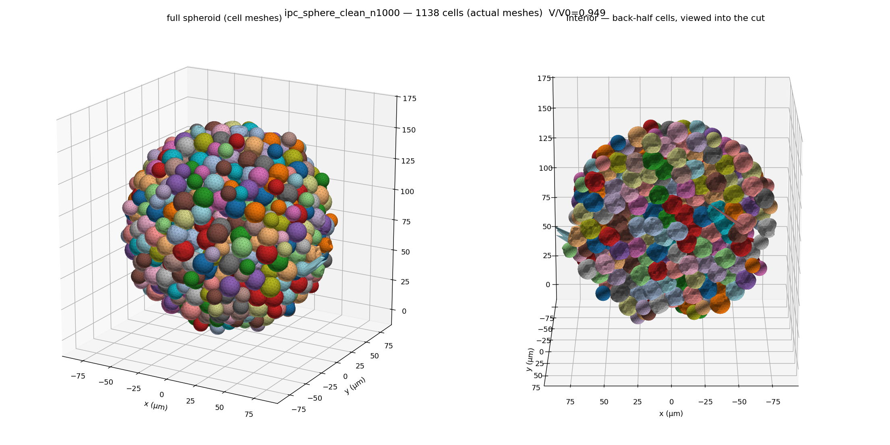
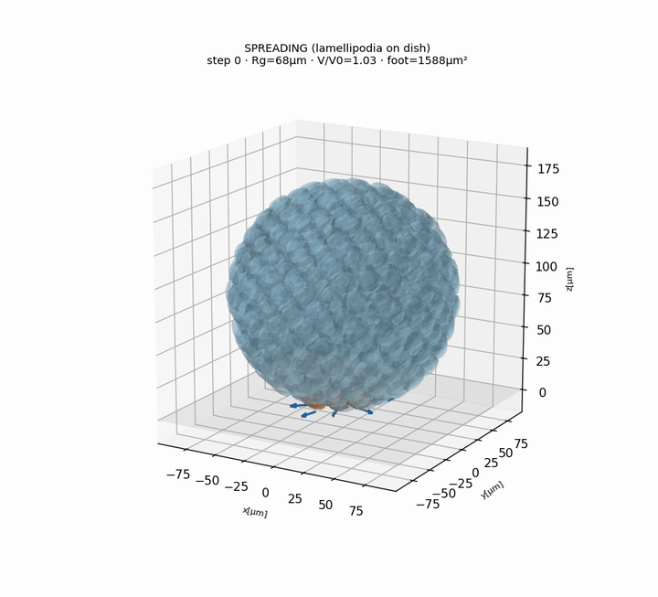
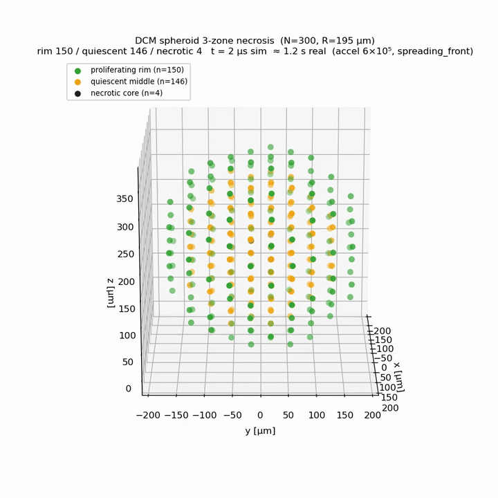
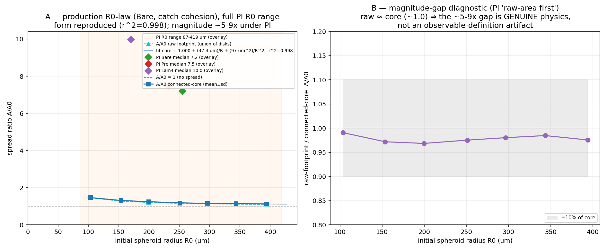
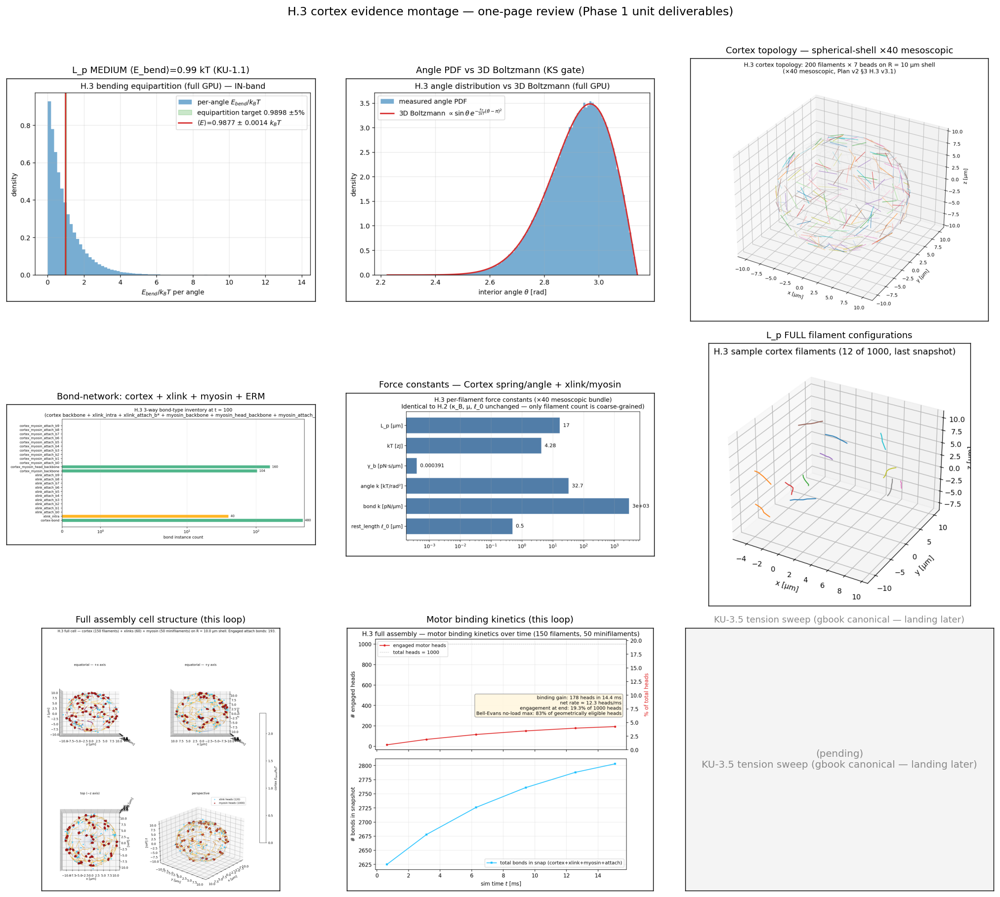
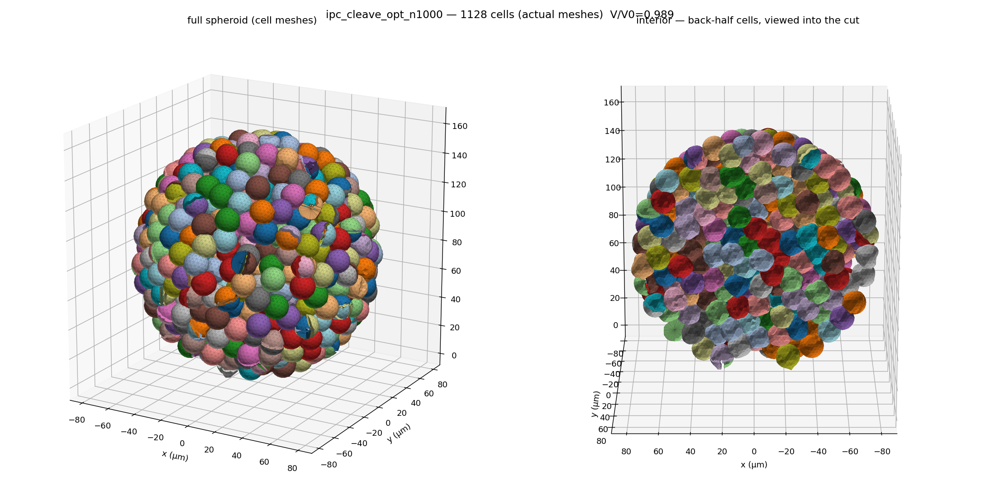

<div align="center">

# ffn_cellsim

### A fine-grained, mechanistic simulator of single-cell mechanobiology — where every filament, motor, adhesion, and cross-link is an explicit particle.



<sub><i>Emergent multicellular spheroid — 1,138 deformable cells, each with its own cortex, cytoplasm, and nucleus, GPU-native.</i></sub>


### ▶ [**Explore the interactive 3D gallery →**](https://sungwook9997.github.io/ffn_cellsim/)
<sub>rotate the cells, cut the spheroids, walk through the DCM & FF engines and the validation foundation</sub>

</div>

---

## What this is

Most published cell-mechanics simulations take a closed-form model from a paper — the Chan–Odde motor-clutch, a Bell–Evans off-rate, a Hill force–velocity curve — and run *that equation* as the mechanism. The macroscopic behavior is baked in.

**`ffn_cellsim` inverts that.** Here the runtime is raw, fine-grained particle-and-bond physics: individual actin filaments, myosin mini-filament heads, adhesion clutches, cadherin catch-bonds, and ECM cross-links, each an explicit degree of freedom integrated on the GPU. The published closed-forms are demoted to **acceptance oracles** — used *only* in validation tests to check that the right macroscopic law *emerges* from the microscopic dynamics, rather than being assumed.

> **Guiding rule (project charter):** for every design decision, pick the full-fidelity, fine-grained, mechanistic option over an abstracted or lumped one — even at higher implementation cost. No paper-model wrappers. No magic numbers: every constant must be literature-derived, grid-invariant, and never tuned to make a test pass.

This is the hard way to build a cell simulator. It is also the only way to get behavior you can *trust* as a prediction rather than a fit.

---

## It works — emergent, not scripted

Each clip below is behavior that **emerged** from microscopic physics, then was cross-checked against a literature oracle. Nothing here is hand-animated or curve-fit.

| Multicellular aggregation | Compaction & spreading | 3-zone necrosis |
|:---:|:---:|:---:|
|  |  |  |
| 400 cells self-assemble into a cohesive spheroid via explicit cadherin catch-bonds | 800-cell spheroid wets and compacts on a substrate | proliferating rim → quiescent shell → necrotic core, from diffusion + mechanical stress |

**Validated against the literature, not fitted to it:**

<div align="center">

&nbsp;&nbsp;

</div>

- **Spreading law** — the emergent cell-spreading area reproduces the published `A/A₀ = a + b/R + c/R²` form with **r² = 0.998**, *and* recovers the correct ligand-density ordering — without fitting to it.
- **Cortical tension, contact angle, and ECM remodeling** are cross-checked against Young–Dupré, Laplace, and Taeyoon-Kim fiber-network oracles (the ~1/r strain field is recovered in the clean intermediate regime).

---

## How it's built

Two GPU-resident, differentiable engines share one validation spine:

```
                    ┌─────────────────────────────────────────────┐
                    │      NVIDIA Warp runtime (GPU-native)         │
   ┌────────────────┴───────────────┐   ┌───────────────────────┐  │
   │  dcm/ — Deformable Cell Model   │   │  ff/ — Filament-FEM   │  │
   │  SimuCell3D physics: membrane,  │   │  Cytosim physics:     │  │
   │  cortex, cytoplasm (turgor+η),  │   │  explicit actin +     │  │
   │  nucleus; many-cell spheroids   │   │  motors + cross-links │  │
   └────────────────┬───────────────┘   └───────────┬───────────┘  │
                    └───────────────┬────────────────┘             │
                                    │  parity-gated, kernel-by-kernel
                    ┌───────────────┴────────────────┐             │
                    │  archive/hoomd_legacy/          │             │
                    │  frozen HOOMD-blue reference    │  ◄──────────┘
                    │  + custom BAOAB CUDA integrator │
                    └─────────────────────────────────┘

  validation/oracles/  —  published closed-forms (Bell-Evans, Hill, Young-Dupré,
                          Chan-Odde, WLC/Mikado) used ONLY as acceptance tests.
```

A dedicated **knowledge base** underpins every constant: a Notion "Contract-Graph" of 8 relational databases (SourceEvidence → KnowledgeClaim → ModelContract → ValidationGate), mirrored into an Obsidian graph and a queryable DuckDB / BM25 layer (~355 literature sources, ~160 knowledge claims, DOI-audited for citation integrity). Every physical parameter traces back through a validation gate to a peer-reviewed source.

---

## The scale of it

This has been a single, sustained build. The commit history is the honest record:

| | |
|---|---|
| **~1,233 commits** | over 10 weeks (2026-04-29 → 07-06): 40 → **357** → **711** → 125 per month |
| **177,000 lines** | of Python across 674 files |
| **148 test files** | validation-first: sanity gates written *before* each physics module runs |
| **156 design docs** | every non-trivial decision recorded with its literature anchor |
| **2 physics engines** | GPU-native Warp, parity-gated against an archived HOOMD reference |

<div align="center">

<br><sub><i>Engine scaling — native-resolution multicellular assemblies on a single RTX A5000.</i></sub>
</div>

---

## Getting started

```bash
conda activate ffn_sim
python -c "import hoomd; print(hoomd.version.version)"          # 7.0.1
python ffn_sim/scripts/hoomd_polymer_sanity.py --steps 50000 --bench

# GPU engines (RTX A5000 or better)
python ffn_sim/dcm/...     # Deformable Cell Model — see dcm/ENGINE.md
python ffn_sim/ff/...      # Filament-FEM — see ff/
```

**Stack:** Python 3.13 · NVIDIA Warp (GPU runtime) · HOOMD-blue 7.0.1 (archived parity reference) · custom Leimkuhler–Matthews BAOAB integrator · DuckDB + Obsidian knowledge layer.

**Map:** [`STRUCTURE.md`](STRUCTURE.md) is the authoritative file map; [`CLAUDE.md`](CLAUDE.md) is the full project charter and design vocabulary.

---

## Author

**Sungwook Yoon** — Shin Lab, Department of Mechanical Engineering, KAIST.

Designed and built as a from-scratch research framework: the scientific direction, the mechanistic-over-lumped charter, the validation contracts, and the literature knowledge base are the core of the work. Developed intensively with AI-assisted tooling (Claude Code) as a pair-programming partner.
