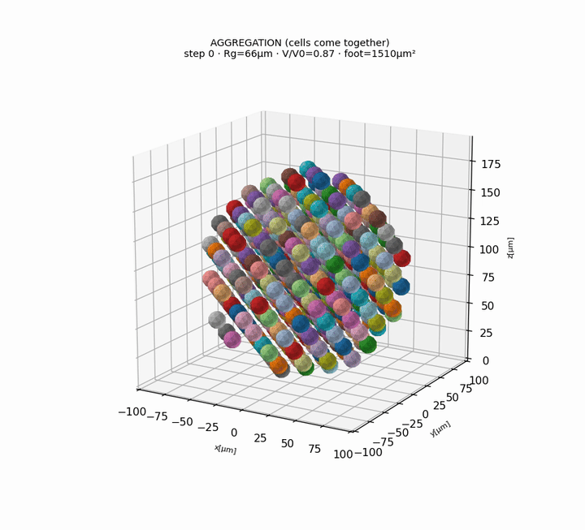

<div align="center">

# ffn_cellsim

### A fine-grained, mechanistic simulator of single-cell mechanobiology — where every filament, motor, adhesion, and cross-link is an explicit particle.



<sub><i>Emergent aggregation — 400 deformable cells self-assembling into a cohesive spheroid via explicit cadherin catch-bonds. GPU-native.</i></sub>


### ▶ [**Explore the interactive 3D gallery →**](https://sungwook9997.github.io/ffn_cellsim/)
<sub>rotate the cells, cut the spheroids, walk through the DCM & FF engines and the validation foundation</sub>

</div>

---

## What this is

Most published cell-mechanics simulations take a whole closed-form paper model — such as a Chan–Odde
motor-clutch wrapper — and run *that equation* in place of the microscopic mechanism. The macroscopic
behavior is then baked in.

**`ffn_cellsim` inverts that.** Here the runtime is fine-grained particle, bond, field, and event physics:
individual actin filaments, myosin mini-filament heads, adhesion clutches, cadherin catch-bonds, and ECM
cross-links, each an explicit GPU-resident degree of freedom. Whole paper models are demoted to **acceptance
oracles**. A sourced local constitutive/kinetic law may remain inside the explicit mechanism when the PI
ratifies it—for example, Hill force–velocity on each head-resolved NMII minifilament rather than a lumped
two-head motor.

> **Guiding rule (project charter):** for every design decision, pick the full-fidelity, fine-grained, mechanistic option over an abstracted or lumped one — even at higher implementation cost. No paper-model wrappers. No magic numbers: every constant must be literature-derived, grid-invariant, and never tuned to make a test pass.

This is the hard way to build a cell simulator. It is also the only way to get behavior you can *trust* as a prediction rather than a fit.

---

## It works — emergent, not scripted

Behavior here **emerges** from microscopic physics — nothing is hand-animated or curve-fit. The strongest demonstrations are the **interactive 3-D morphology viewers**: rotate the cells, cut the spheroids, and inspect membrane / cortex / cytoplasm / nucleus yourself.

### ▶ [**Open the interactive gallery →**](https://sungwook9997.github.io/ffn_cellsim/)

Full-compartment and faceted spheroids (N=400), cell division, emergent aggregation, and the filament (FF) engine's cortex and ECM protrusions — all live, GPU-native renders.

**Cross-checked against the literature, not fitted to it:** contact angle vs Young–Dupré, spheroid geometry vs Laplace, ECM fiber-network remodeling vs the Taeyoon-Kim oracle (the ~1/r strain field recovered in the clean intermediate regime), and a 6-material ECM library (collagen → Matrigel → agarose) validated to real moduli — with emergent stiffness-sensing and contact-guidance falling out of the fiber physics; single-filament and ECM sanity gates pass before any production run. Where the model falls short of a target — the active-cortical-tension magnitude, or single-cell spreading against the lab's collective-spheroid data — **that gap is reported honestly, not hidden.** Validation figures live in the gallery's *Quantitative validation* section.

---

## How it's built

The new Active Cell engine is one Warp-CUDA-only runtime that reuses audited Warp components:

```
                    ┌─────────────────────────────────────────────┐
                    │      ac/ — NVIDIA Warp runtime (CUDA only)    │
                    │  outer physical clock + Biot/RAD/KMC         │
   ┌────────────────┴───────────────┐   ┌───────────────────────┐  │
   │  dcm/ reusable Warp components │   │  ff/ reusable Warp     │  │
   │  membrane/nucleus geometry     │   │  filament/ECM kernels  │  │
   └────────────────┬───────────────┘   └───────────┬───────────┘  │
                    └───────────────┬────────────────┘             │
                                    │  analytic/manufactured gates
                    ┌───────────────┴────────────────┐             │
                    │ retired HOOMD tree — DELETED    │             │
                    │ 2026-07-29; git history only    │             │
                    │ NEVER imported or executed      │             │
                    └─────────────────────────────────┘

  validation/oracles/  —  published whole-model/macroscopic acceptance oracles;
                          local laws used by an explicit mechanism are separately contracted.
```

A dedicated **knowledge base** underpins every constant: a Notion "Contract-Graph" of 8 relational databases (SourceEvidence → KnowledgeClaim → ModelContract → ValidationGate), mirrored into an Obsidian graph and a queryable DuckDB / BM25 layer (~355 literature sources, ~160 knowledge claims, DOI-audited for citation integrity). Every physical parameter traces back through a validation gate to a peer-reviewed source.

---

## The scale of it

This has been a single, sustained build. The commit history is the honest record:

| | |
|---|---|
| **~1,530 commits** | over 11 weeks (2026-04-29 → 07-13): 40 → **357** → **711** → 422 per month |
| **193,000 lines** | of Python across 769 files |
| **167 test files** | validation-first: sanity gates written *before* each physics module runs |
| **500+ design docs** | every non-trivial decision recorded with its literature anchor |
| **1 runtime contract** | Active Cell simulation is Warp-CUDA-only; historical engines are components/source references |

Native-resolution multicellular assemblies (10²–10³ deformable cells, each ~42 nodes) run on a single RTX A5000 — see the interactive spheroids in the [gallery](https://sungwook9997.github.io/ffn_cellsim/).

---

## Getting started

```bash
conda activate ffn_sim
python -c "import warp as wp; wp.init(); print(wp.get_device())"

# Existing Warp components (RTX A5000 or better); ac/ is scaffolded at I1
python aleph/dcm/...     # Deformable Cell Model — see dcm/ENGINE.md
python aleph/laws/...      # Filament-FEM — see ff/
```

**Stack:** Python 3.13 · NVIDIA Warp/CUDA-only simulation runtime · outer physical-time loop with Warp
explicit/implicit inner mechanics · DuckDB + Obsidian knowledge layer. HOOMD is source-reading only and is
never imported or executed.

**Map:** [`STRUCTURE.md`](STRUCTURE.md) is the authoritative file map; [`CLAUDE.md`](CLAUDE.md) is the full project charter and design vocabulary.

---

## Author

**Sungwook Yoon** — Shin Lab, Department of Mechanical Engineering, KAIST.

Designed and built as a from-scratch research framework: the scientific direction, the mechanistic-over-lumped charter, the validation contracts, and the literature knowledge base are the core of the work. Developed intensively with AI-assisted tooling (Claude Code) as a pair-programming partner.
