# 세포골격의 필드 작동과 세포내 수송: 외부 필드는 왜 세포 내부를 직접 구동할 수 없으며, ffn_cellsim CFD 엔진을 위한 반응-이류-확산 경로는 무엇인가

## Field Actuation and Intracellular Transport of the Cytoskeleton: Why External Fields Cannot Drive the Cell Interior, and a Reaction–Advection–Diffusion Path for the ffn_cellsim CFD Engine

*필라멘트는 과감쇠 힘-구동 세계에서 움직인다 — 저-레이놀즈·세포막 유전 차폐·반응(formin) 율속이라는 세 물리 벽을 정량으로 세우고, 그 벽들을 통과해 살아남는 유일하게 모델 가능한 경로(모터-구동 반응-이류-확산 단량체 수송)를 ffn_cellsim CFD 엔진 설계로 제시한다.*

---

## 보고서 정보

- **구분** · 세포역학 연구 프로그램 매뉴스크립트 (Research Program Manuscript) — CFD 엔진 재구축 준비
- **유형** · Perspective + Methods/Proposal (문헌 종합 · 정량 물리 분석 · 가설 · wet-lab 실험 계획)
- **분야** · 세포·분자 역학생물학 (세포골격 수송·필드 작동; 계산 mechanobiology)
- **작성일** · 2026-07-16
- **엔진** · ffn_cellsim (FF Filament-FEM → CFD 재구축; NVIDIA Warp, µm·pN·s)
- **작성자** · ________________

---

## Abstract (초록)

세포 내부는 우리의 직관과 정반대의 물리 영역이다. MCF7 세포질의 점도(η≈65.9 Pa·s)와 레이놀즈 수(Reynolds number, Re≈1.5×10⁻¹⁰)는 필라멘트를 깊은 과감쇠(overdamped) 세계에 가둔다 — 관성은 무의미하고 속도는 힘의 결과이며(v=F/γ), 힘이 사라지면 운동도 즉시 멈춘다. 이 힘의 원천은 중합 밀기·미오신 당기기·가교 전달·열 요동으로 모두 세포 내부에서 생성되고, 순 이동에는 외부 기질에 건 견인(traction)이 반드시 필요하다(scallop 정리; Purcell 1977). 우리는 "외부 전기·자기장으로 세포 내부를 구동한다"는 착상을 세 개의 정량 게이트로 반증한다: (1) 동물세포는 Péclet≪1이라 이류가 무의미하고, (2) 형질막이 DC 장을 10³–10⁴배 차폐하며(Pe=1은 전기천공 이후에야 도달), (3) 정지 초점접착의 응력섬유 성장은 수송이 아니라 formin 반응이 율속한다. 세포 규모 난류는 Re가 문턱보다 5–13자리 낮아 원천적으로 금지되며, 갈바노탁시스(galvanotaxis)의 실재조차 그것이 막 수용체 전기영동을 통한 신호전달-매개임을 보여 이 결론을 강화한다. 물리적으로 살아남아 모델링 가능한 유일한 방향은 미오신이 다공탄성 유체를 가압해 구동하는, 질량 보존 G-actin 장(場)의 반응-이류-확산(reaction-advection-diffusion, RAD) 수송이며, 이는 ffn_cellsim CFD 엔진 배관의 약 70%가 이미 존재하는 실현 가능한 재구축 목표다. 방향성 이류는 필드 문제가 아니라 모터 문제다.

**핵심어(Keywords):** 과감쇠 역학(overdamped dynamics), 저-레이놀즈 유동(low-Reynolds flow), 분자 클러치(molecular clutch), 반응-이류-확산 수송(reaction-advection-diffusion transport), 막 전기 차폐(membrane shielding), 갈바노탁시스(galvanotaxis), 다공탄성 세포질(poroelastic cytoplasm), fine-grained 세포 시뮬레이션

---

## 목차 (Contents)

- Abstract (초록)
- 1. 서론: 필라멘트는 실제로 어떻게 움직이는가 — 과감쇠 힘-구동 세계
- 2. 세포 이동의 진짜 엔진: retrograde flow + 분자 클러치
- 3. 스트레스 파이버는 어떻게 생기는가 — 세 경로의 조립
- 4. 세포내 수송: 확산·이류·세포질 유동 — 유체 유동은 언제 지배하는가
- 5. 필드 작동 아이디어와 세 개의 물리 게이트
- 6. 난류 사이토솔로 세포를 굴린다 — 왜 물리적으로 불가능한가
- 7. E/B 필드가 필라멘트에 미치는 실제 효과
- 8. 살릴 수 있는 핵심: 반응 율속과 RAD 단량체 수송
- 9. 가설 (Hypotheses)
- 10. 검증 계획: wet-lab 7 aims
- 11. 노벨티·한계·전망
- 12. 참고문헌 (References)
- 부록 A. 자료 조사 방법·인용 무결성·그림 저작권

## 그림 목차 (List of Figures)

- 그림 1. 필라멘트는 과감쇠(overdamped) 세계에서 v=F/γ로 움직인다 — 중합 래칫(밀기)·미오신(당기기)·가교 네트워크(전달)·열 요동의 네 …
- 그림 2. Retrograde flow + 분자 클러치(molecular clutch): 선단 중합과 후방 미오신이 만드는 역행 흐름(10–140 nm/s…
- 그림 3. 스트레스 파이버 3경로 조립: dorsal(FA에서 formin de novo)·transverse arc(미오신+α-actinin 응축)·ve…
- 그림 4. 세포내 수송 regime 지도: 이류(advection)가 확산을 이기려면 v ≳ D/L ≈ 0.5 µm/s(Pe ≳ 1)가 필요하다. 느린 동…
- 그림 5. 필드 작동의 세 물리 게이트: Péclet·막 차폐(membrane shielding)·율속(rate-limiting)을 모두 통과해야 하며, …
- 그림 6. 세포 스케일 Reynolds 수: 사이토솔은 deep-Stokes(Re ≈ 1.5×10⁻¹⁰)라 난류 개시(Re ≳ 2000)에서 10–13자리…
- 그림 7. 세포막 유전 차폐(Schwan): 외부 DC 필드는 내부에 ~10³–10⁴× 감쇠되어 도달하며, β-분산 crossover(~1.6 MHz) 위…
- 그림 8. F-actin 전기 배향과 Debye 붕괴: 저염 완충액에서만 배향(500–1900 V/cm), 생리 150 mM에서 Debye 길이 ~0.8 …
- 그림 9. Galvanotaxis는 신호 매개다: 필드가 하전 막 수용체를 전기영동해 극성 신호(PI3Kγ/PTEN)를 켜고 세포 자체 이동 엔진을 재조준…
- 그림 10. FA에서 SF 성장은 반응(formin) 율속: barbed 끝은 확산 공급 천장(I_max≈3,800/s)의 ~6%만 소비하고, flux-el…
- 그림 11. 살릴 수 있는 핵심 — RAD 엔진 아키텍처: ∂c/∂t = D∇²c − u·∇c + src − sink_FA. 배관의 ~70%(녹색)가 이미 …
- 그림 12. TFM traction on/off kinetics 판별자: 점진적(신호 매개, 분 단위·약물민감) vs 순간(직접 힘·약물무관) — 계획 전체…
- 그림 13. 통합 물리 thread: 세 필드-작동 아이디어가 각각 물리 벽(Re / 막 차폐 / 반응 율속)에 부딪히고, 모터-구동 이류 수송(RAD)만 …

---

## 1. 서론: 필라멘트는 실제로 어떻게 움직이는가 — 과감쇠 힘-구동 세계

우리가 "필라멘트가 움직인다"고 말할 때 머릿속에 떠올리는 그림 — 힘을 받아 가속되고, 힘이 사라진 뒤에도 관성으로 미끄러져 나아가는 물체 — 은 세포 안에서 **완전히 틀린다**. 세포질은 물이 아니다. MCF7 세포질의 점도는 η≈65.9 Pa·s로 물의 약 6만 배에 달하고(Dessard 등 2024는 유방암 세포주에서 10–70 Pa·s를 보고한다), 그 안을 움직이는 필라멘트의 레이놀즈 수(Reynolds number)는 Re≈1.5×10⁻¹⁰이다. 이는 물속을 헤엄치는 박테리아(Re~10⁻⁴–10⁻⁵, Purcell 1977)보다도 다섯 자리 더 깊은 **과감쇠(overdamped) 영역**이다. 이 세계에서 관성 항(m·a)은 물리적으로 무의미하다.

운동 방정식은 따라서 힘의 균형으로 무너져 내린다. 필라멘트에 작용하는 알짜 힘 F는 즉시 점성 항력과 평형을 이루어

**γ v = F ⇒ v = F/γ, γ = 6πη R/N_c**

가 성립한다(항력 γ는 Nc개 세그먼트에 분산된 Stokes 항력). 함의는 결정적이다. **힘이 사라지는 순간 운동도 즉시 멈춘다.** 관성으로 미끄러지는 "coasting"은 없고, 축적된 운동량도 없다. 속도는 힘의 결과이지 상태가 아니다.

그렇다면 이 힘 F는 어디서 오는가. 과감쇠 세계에서 필라멘트를 실제로 움직이는 힘의 원천은 넷뿐이다. **(1) 중합 밀기(polymerization push)** — barbed end가 막에 부딪히며 열적 굽힘 요동을 정류하는 탄성 브라운 래칫(elastic Brownian ratchet; Mogilner & Oster 1996, 2003)으로, 필라멘트당 약 1 pN, 정지 하중(stall) ~1 pN이다(Footer 등 2007; Kovar & Pollard 2004). **(2) 미오신 당기기(myosin pull)** — 비근육 미오신 II 미니필라멘트가 Hill 1938의 힘-속도 관계를 따라 그물을 뒤로 끌며, 단일 머리 약 3–4 pN(Finer 등 1994)이되 duty ratio가 낮다(Kovacs 등 2003). **(3) 가교 전달(crosslink transmission)** — α-actinin·filamin이 개별 필라멘트의 pN 힘을 네트워크 전체로 묶어 세포 규모의 응력으로 전달한다. **(4) 열 요동(thermal)** — kT≈4 pN·nm는 래칫을 정류하는 원천이자 단량체 확산 운반의 동력이지만, 방향이 무작위여서 그 자체로는 방향성을 만들지 못한다. 이 넷은 **모두 세포 내부에서 생성**되며, 저-Re 세계에서 순수 내부의 왕복 운동은 알짜 이동을 만들지 못한다(Purcell 1977의 가리비 정리, scallop theorem) — 방향성 있는 이동에는 반드시 외부 기질에 고정된 견인(traction)이 필요하다(그림 1).

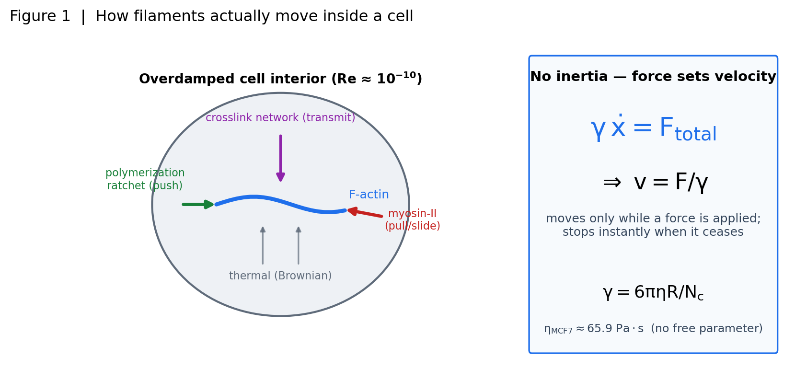

**그림 1.** 필라멘트는 과감쇠(overdamped) 세계에서 v=F/γ로 움직인다 — 중합 래칫(밀기)·미오신(당기기)·가교 네트워크(전달)·열 요동의 네 힘원과 관성 없는 힘균형. *(본 프로젝트 원작 도식·플롯)*

바로 여기서 이 논문 전체의 질문이 생긴다. 네 힘이 모두 내부 생성이라면, **외부 장(전기장·자기장)이 이 힘들을 대체하거나 구동할 수 있는가?** 이를 다음 네 가지 핵심 연구 질문으로 정식화한다.

- **Q1.** 과감쇠 세계에서 필라멘트를 실제로 움직이는 힘은 무엇이며, 각각의 크기(pN 스케일)와 방향성은 어떠한가?
- **Q2.** 세포 이동을 만드는 진짜 엔진은 무엇이고, 사이토솔 유동은 그 **원인인가 결과인가**?
- **Q3.** 세포 내부의 단량체·유동 운반이 성장의 율속(rate-limiting) 단계인가 — advection이 diffusion을 이기는 Péclet 문턱은 어디인가?
- **Q4.** 외부 장(E/B)이 이 내부 역학을 구동·조향할 수 있는가, 아니면 막 차폐(membrane shielding)와 운동량 보존이 이를 원천적으로 금지하는가?

Q1은 본 서론이 답했다. 이어지는 절은 Q2에서 시작한다.

## 2. 세포 이동의 진짜 엔진: retrograde flow + 분자 클러치

세포가 앞으로 기어가는 동력은 세포 앞 가장자리와 뒤에서 동시에 만들어진다. **앞쪽**에서는 액틴이 막 바로 안쪽에서 중합하며 브라운 래칫으로 막을 밀어낸다 — 액틴이 가장자리에서 조립되어 뒤로 흘러간다는 개념 틀은 Mitchison & Kirschner 1988이 세웠다. **뒤쪽**에서는 미오신 II가 네트워크를 잡아당긴다. 두 힘이 합쳐지면 F-actin 그물 전체가 기질에 대해 뒤로 흐르는데, 이것이 **역행류(retrograde flow)**이며 그 속도는 대략 10–140 nm/s다. 정량 형광 스페클 현미경(qFSM)은 이 흐름을 두 층으로 분해했다(Ponti 등 2004; Vallotton 등 2004): Arp2/3 수지상 그물인 lamellipodium은 1–3 µm 안에서 해체되어 약 90%가 lamellipodium–lamellum 접합부에서 탈중합하고, 안쪽 lamella에서는 액토미오신 수축이 접착에 결합한다.

여기에 이 절의 핵심 반전이 있다. **역행류 자체는 세포를 앞으로 밀지 않는다.** 그것은 "미끄러짐(slippage)"일 뿐이며, 이 흐름이 **붙잡혀 기질로 전달될 때에만** 세포가 전진한다. 그 붙잡는 장치가 **분자 클러치(molecular clutch)** — 인테그린–탈린–빈큘린 접착이 흐르는 액틴을 간헐적으로 움켜쥐고 힘을 ECM으로 넘기는 기전이다. 이 결합은 **이상성(biphasic)**이다. Gardel 등 2008은 견인력이 흐름 속도에 대해 약 8–10 nm/s의 문턱을 가짐을 보였다 — 문턱 아래에서는 강결합(견인이 흐름에 반비례해 상승), 위에서는 미끄러짐(직접 비례). Chan–Odde 2008의 모터–클러치 모형은 그 물리를 예측한다: 딱딱한 기질에서는 마찰-미끄러짐(빠른 흐름, 낮은 힘), 무른 기질에서는 load-and-fail 진동(느린 흐름, 높은 힘)이 나타나고 강성 전이는 ~1 kPa 부근이다. Thievessen 등 2013은 빈큘린이 바로 이 클러치 부품임을 밝혔다 — 성숙하는 접착에서 흐름을 늦추고 높은 견인을 만들지만, 접착의 성장 속도는 빈큘린과 무관하게 흐름 속도를 따라간다(클러치와 성장은 분리 가능하다). 따라서 전진 속도는 v_전진 ≈ v_중합 − v_역행류로, **중합·역행류·클러치 결합의 균형이 이동 속도를 세팅한다**(그림 2).

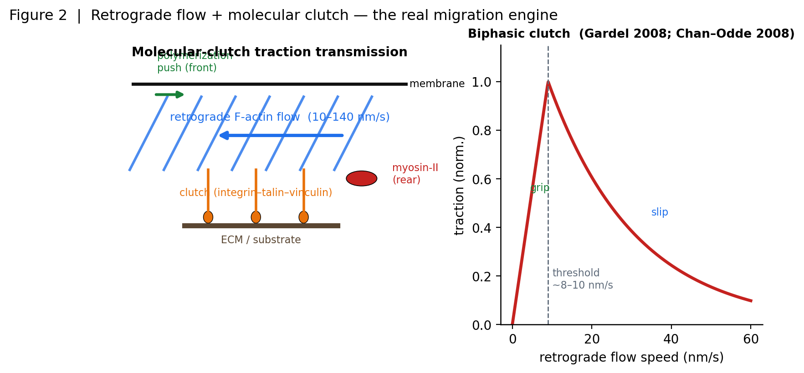

**그림 2.** Retrograde flow + 분자 클러치(molecular clutch): 선단 중합과 후방 미오신이 만드는 역행 흐름(10–140 nm/s)을 클러치가 traction으로 전달하며, traction–흐름 관계는 임계 ~8–10 nm/s의 biphasic이다(Gardel 2008; Chan–Odde 2008). *(본 프로젝트 원작 도식·플롯)*

그렇다면 사이토솔 유동(cytosol flow)의 역할은 무엇인가. 중간엽(mesenchymal) 이동에서 유동은 **동력이 아니라 결과이자 매개**다. 액토미오신 수축이 다공탄성(poroelastic) 세포질을 가압하고(Moeendarbary 등 2013의 생체이상 세포질; Charras 등 2005는 압력이 10 µm·10 s 규모에서 평형화되지 않음을 보였다), 그 압력장이 용질을 재분배할 뿐 이동을 구동하지는 않는다. 유동이 **1차 행위자로 승격되는 예외**는 분명히 존재한다 — 블레브 기반/아메바형 이동(Charras 등 2005; Ruprecht 등 2015의 stable-bleb; Liu 등 2015의 감금-유도 아메바형), Stroka 등 2014의 삼투 엔진(actin·myosin을 억제해도 물의 유입/유출이 감금된 종양세포를 민다), Petrie 등 2014의 lobopodial 핵-피스톤, 그리고 (동물이 아닌) 식물의 원형질 유동(myosin-XI 구동, Pe~200; Tominaga 등 2013; Verchot-Lubicz & Goldstein 2010) — 이들은 압력·유동이 지배하는 별개의 영역이다. 그러나 접착 기질 위 중간엽 세포에서 이동의 진짜 엔진은 여전히 **중합 + 액토미오신 + 클러치 견인**이며, 유동은 그 하류에 놓인다. 이 결론은 Q4로 이어진다: 만약 이동이 이렇게 국소적인 pN 힘과 외부 견인으로 구동된다면, 세포 전체를 외부 장으로 "굴리거나" 유동으로 밀 수 있다는 발상은 어디서 무너지는가.

## 3. 스트레스 파이버는 어떻게 생기는가 — 세 경로의 조립

흔한 오해는 스트레스 파이버(stress fiber, SF)가 피질(cortex)에서 필라멘트가 "떨어져 나와(escape)" 다발로 뭉친 것이라는 그림이다. 실제 문헌은 이를 지지하지 않는다. 필라멘트는 피질을 이탈하지 않으며, SF는 서로 구별되는 세 조립 경로로 새로 만들어지거나 재조직된다(Hotulainen & Lappalainen 2006). 즉 "탈출"이 아니라 국소적 **de novo 중합**과 **재조직**이 SF를 만든다(그림 3).

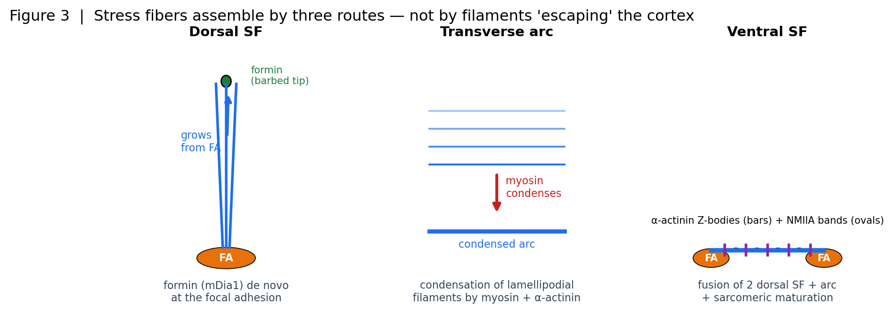

**그림 3.** 스트레스 파이버 3경로 조립: dorsal(FA에서 formin de novo)·transverse arc(미오신+α-actinin 응축)·ventral(융합 + sarcomeric 성숙). 필라멘트가 cortex에서 '빠져나오는' 것이 아니라 국소적으로 재조직된다(Hotulainen & Lappalainen 2006). *(본 프로젝트 원작 도식·플롯)*

**등쪽 SF(dorsal SF) — 접착반에서 포민이 새로 만든다.** 첫 경로는 초점접착(focal adhesion, FA)에 고정된 포민(formin) mDia1이 가시끝(barbed end)에서 필라멘트를 de novo로 중합해 위로 뻗어 올리는 것이다(Hotulainen & Lappalainen 2006). 여기서 성장의 단위는 개별 액틴 단량체(G-actin)다 — 세포질 G-actin이 FA에 앉은 포민의 FH2 게이트를 통과해 가시끝에 붙으며 섬유가 자란다. 포민 FH1-FH2는 프로필린(profilin)-액틴을 처리하는 처리성 모터(processive motor)로, 프로필린-액틴 결합 속도상수를 약 15배 끌어올린다(Romero 등 2004). 연신 속도는 FH1의 폴리프롤린 트랙 수에 비례하며, FH1의 프로필린-액틴 포획이 ≥88 s⁻¹까지 율속한다(Paul & Pollard 2008). 이 삽입 중합(insertional assembly)은 단일 필라멘트에서 1 pN을 넘는 힘을 낼 수 있고(Kovar & Pollard 2004), 거꾸로 섬유에 걸린 pN 규모 장력은 포민 해리를 수십 배 가속한다(Cao 등 2018) — 성장은 장력에 민감하게 게이팅된다.

**가로 아크(transverse arc) — 라멜리포디아 필라멘트의 응축.** 둘째 경로는 새 중합이 아니라 재조직이다. 라멜리포디아(lamellipodia)의 짧은 Arp2/3 분지 필라멘트를 미오신 II와 α-액티닌(α-actinin)이 응축(condensation)해 수축성 다발로 만든다. 네 종의 트로포미오신과 Dia2 포민이 씨 뿌린 필라멘트에 미오신 II가 Tm4-의존적으로 모여 Arp2/3 필라멘트와 annealing하여 아크가 된다(Tojkander 등 2011). Burnette 등 2011은 라멜리포디아 액틴이 미오신 II에 응축되어 뒤로 흐르다 FA에서 감속하는 아크를 이루고, 그 아크가 라멜리포디아와 라멜라를 역학적으로 다리 놓아 앞 가장자리를 전진시킴을 보였다 — 필라멘트가 피질을 "탈출"하는 게 아니라 흐름 속에서 재배열된다.

**배쪽 SF(ventral SF) — 융합과 근절형 성숙.** 셋째 경로는 두 등쪽 SF와 가로 아크가 양 끝 FA 사이에서 융합하고, α-액티닌 Z-체와 NMIIA 밴드가 교대하는 근절형(sarcomeric) 구조로 성숙하는 것이다(Hotulainen & Lappalainen 2006; Tojkander 등 2012). 이렇게 성숙한 배쪽 SF는 양단이 FA에 앵커된 프리스트레스(prestress) 액토미오신 케이블로, 단일 섬유 장력은 10–30 nN에 이르고, 레이저로 자르면 점탄성 케이블처럼 수축하며 MLCK 억제로 그 수축이 사라진다(Kumar 등 2006). 세 아종은 조성·조절이 다르고(주변부 MLCK 대 중심부 ROCK; Tanner 등 2010), 미오신 II 수축을 시공간적으로 분담한다(Vallenius 2013). 흥미롭게도 FA의 조성적 성숙은 SF 템플릿(포민/α-actinin-1 의존)을 필요로 하지만 세포 장력을 약 80% 낮춰도 여전히 일어난다 — 장력은 필요조건이되 충분조건이 아니다(Oakes 등 2012). 고장력 지점에는 zyxin이 재배치되어 힘을 직접 감지한다(Colombelli 등 2009).

**단량체 풀 게이터와 엔진의 정직한 한계.** 세 경로 모두에서 성장의 최말단은 "세포질 G-actin → FA-앵커 포민 → 가시끝 성장"이라는 동일한 미시 사건이다. 그런데 정지 상태 FA에서 이 단계는 단량체 수송이 아니라 **반응**(포민 처리성·장력)이 율속한다 — 가시끝 하나의 소비 유량(J ≈ 232 s⁻¹)은 확산 공급 천장(I_max ≈ 3800 s⁻¹)의 약 6%에 불과하고, 확산은 소비보다 약 260배 빠르게 고갈대를 다시 채운다. 포민 FH1은 국소 프로필린-액틴을 약 10 mM(벌크의 ~10⁶배)로 농축하고, 티모신-β4(thymosin-β4)가 단량체의 80% 이상을 격리해 자유 [G-actin]을 완충한다(Vitriol 등 2015). 따라서 성장의 유량 탄성(d ln 성장 / d ln 유량)은 ≲ 0.1–0.2에 머문다. 이 미시 그림은 현 엔진의 정직한 한계를 드러낸다: 현재 FF 엔진의 G-actin은 질량 보존되는 명시적 풀이 아니라 고정 스칼라(20 µM 무한 저장고)로 처리되며, 이는 집중 수요 아래 지속 성장을 과대 예측한다. 세 경로를 필라멘트 단위로 재현하려면 이 스칼라를 질량 보존 단량체 장(場)으로 대체하는 것이 CFD 재구축의 핵심 과제다.

## 4. 세포내 수송: 확산·이류·세포질 유동 — 유체 유동은 언제 지배하는가

앞 절의 단량체 공급 문제는 더 일반적인 질문으로 이어진다: 세포 안에서 물질은 확산(diffusion)으로 옮겨지는가, 아니면 세포질 유동(cytoplasmic flow)이 실어 나르는가(이류, advection)? 답은 무차원수 하나 — 페클레(Péclet) 수 Pe = vL/D — 로 정리된다. 이류가 확산을 이기려면 유동 속도 v가 확산 속도 척도 D/L을 넘어야 한다.

**임계 속도.** G-actin의 확산계수는 D_G ≈ 3–6 µm²/s다. 세포 스케일(L ≈ 10 µm)에서 임계 속도는 v* = D_G/L ≈ 0.5 µm/s, FA 스케일(L ≈ 1 µm)에서는 ≈ 3–6 µm/s로 올라간다. 같은 유동이라도 짧은 거리(FA)에서는 확산이 압도적으로 유리하고, 길게 뻗은 거리에서만 이류가 승산이 있다. 전달 증강은 대략 1 + O(Pe)로 스케일하므로, FA(Pe ≲ 0.1)에서는 <10%, Pe ≈ 3 돌기에서는 ≈ 2–4×가 된다(그림 4).

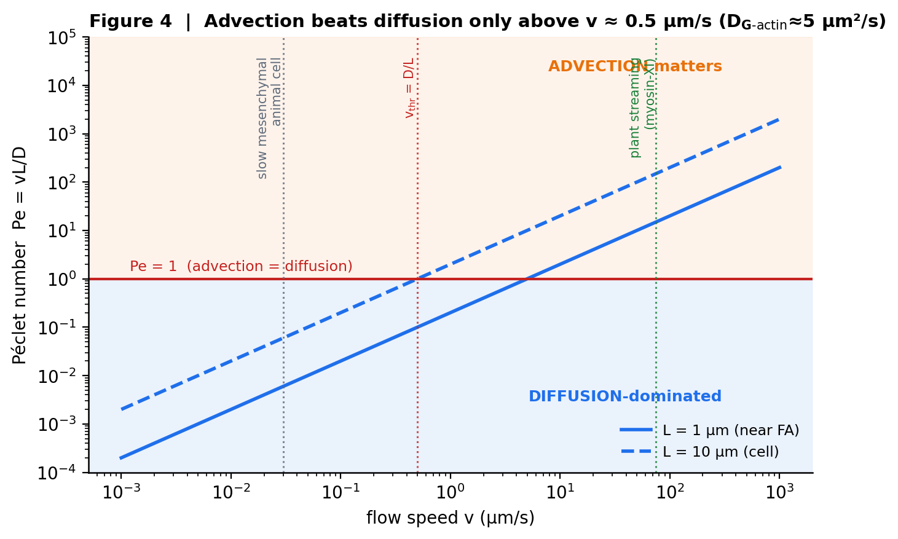

**그림 4.** 세포내 수송 regime 지도: 이류(advection)가 확산을 이기려면 v ≳ D/L ≈ 0.5 µm/s(Pe ≳ 1)가 필요하다. 느린 동물세포는 Pe ≪ 1(확산 지배), 식물 streaming(myosin-XI)은 Pe ≫ 1. *(본 프로젝트 원작 도식·플롯)*

**동물세포는 Pe ≪ 1.** 측정된 동물세포 세포질 속도를 넣으면 Pe ≈ 0.002–0.3으로 1보다 한참 작다. Novak 등 2008의 확산-표류-반응 모델은 앞쪽 조립·뒤쪽 해체와 확산이 만든 G-actin 구배가 단량체를 앞으로 나르며, 대류성 세포질 유동의 기여는 미미하고 이완 시간은 ~10–100 s임을 보였다. 세포질 자체도 다공탄성(poroelastic) 매질이라 짧은 시간의 변형은 그물눈 사이 물의 재분배로 정해지고, 압력은 10 µm·10 s 규모에서 균일화되지 않는다(Charras 등 2005; Moeendarbary 등 2013) — 유동은 확산 위의 작은 보정이지 주 수송자가 아니다. 예외는 빠르고 길게 뻗은 돌기다: FRAP 실험은 확산만으로는 앞 가장자리에 G-actin을 재공급할 수 없고, 속도 <1 µm/s의 방향성 전방 수송이 필요함을 보였다(Pe ≈ 3 영역; Appalabhotla 등 2023).

**유동이 지배하는 영역 — 식물·점균·아메바.** 이류가 확산을 압도하는 곳은 명확히 정해져 있다. 식물의 세포질 순환(cytoplasmic streaming/cyclosis)은 미오신 XI가 소기관을 끌어 세포질을 통째로 entrain해 수십 µm/s로 흐른다(Verchot-Lubicz & Goldstein 2010). Chara 미오신 XI는 60 µm/s에 이르러 ~70 µm/s의 순환을 설명하며(Haraguchi 등 2022), 키메라로 모터 속도를 바꾸면 순환 속도와 식물 크기가 인과적으로 함께 변한다(Tominaga 등 2013) — 여기서 Pe는 ~200에 달하고, 회전 유동의 이류-확산 이론은 혼합 증강이 나선 피치와 임계 Pe에 강하게 의존함을 보인다(Goldstein 등 2008; van de Meent 등 2008). 대형 아메바·점균과 일부 종양세포의 lobopodial·아메바 이동도 유체 압력이 주역이다: 액토미오신이 핵을 끌어 앞쪽을 가압하거나(Petrie 등 2014), 극성 이온 펌프와 아쿠아포린이 앞쪽 물 유입·뒤쪽 유출을 만들어(삼투 엔진, Stroka 등 2014) 이동을 구동한다.

**결론과 정직한 경계.** 핵심은, 유동이 물질을 나르는 것은 사실이나 그것이 지배적이 되는 체제는 v와 L이 함께 큰 특정 영역 — 식물 순환(Pe ≫ 1), 빠른 돌기(Pe ≈ 3), 압력-구동 아메바 — 에 국한된다는 점이다. 느린 중간엽 동물세포의 세포체와 FA에서는 Pe ≪ 1이라 이류는 수송의 약한 레버에 그친다. 게다가 이 순환들은 관성이 아니라 모터가 만든다 — 저(低)레이놀즈(Re ≈ 1.5×10⁻¹⁰) 세포질에서 순수 관성 흐름은 없고, 왕복 운동만으로는 순 수송이 0이다(scallop 정리; Purcell 1977). 방향성 이류는 결국 유체를 미는 모터(미오신)의 문제이지 유체 그 자체의 문제가 아니다 — 이 구분이 다음 절 액추에이터 분석의 출발점이다.

## 5. 필드 작동 아이디어와 세 개의 물리 게이트

세포 안에서 액틴 단량체(G-actin monomer)를 특정 지점 — 초점부착(focal adhesion, FA)이나 돌출부(protrusion) — 으로 더 많이 실어 나르면 그곳의 필라멘트 성장을 조절할 수 있지 않을까? 한 걸음 더 나아가, 외부에서 건 전기장(E-field)이나 자기장(B-field)으로 세포질(cytosol) 유동을 직접 몰아 단량체 흐름(flux)을 조종하거나, 극단적으로는 내부에 난류(turbulence)를 일으켜 세포를 통째로 굴린다(roll)는 아이디어가 브레인스토밍에서 제기되었다. 운반이 성장을 바꿀 수 있다는 직관 자체는 물리적으로 건전하다. 다만 "외부 필드로 내부 유동을 직접 구동한다"는 모든 제안은 세 개의 정량 게이트를 순서대로 통과해야만 성립한다(그림 5).

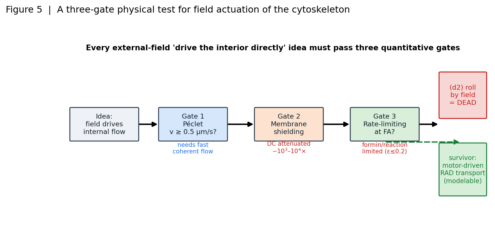

**그림 5.** 필드 작동의 세 물리 게이트: Péclet·막 차폐(membrane shielding)·율속(rate-limiting)을 모두 통과해야 하며, (d2) 난류 굴리기는 죽고 모터-구동 RAD 수송만 살아남는다. *(본 프로젝트 원작 도식·플롯)*

**게이트 1 — Péclet 수(이류 대 확산).** 이류(advection)가 확산(diffusion)을 이기려면 유동 속도가 확산 속도 규모 D/L을 넘어야 한다. 단량체 확산계수 D_Gactin≈3–6 µm²/s에서 세포 규모(L≈10 µm)의 문턱은 v\*≈0.5 µm/s, FA 규모(L≈1 µm)에서는 v\*≈3–6 µm/s다. 측정된 동물세포 세포질 속도는 Pe=vL/D≈0.002–0.3으로 1보다 한참 작다 — 이류는 사실상 무의미하다. 단 예외가 있다: 빠르게 뻗는 라멜리포디아(lamellipodium)는 Pe≈3에 도달해 이류 공급이 실제로 필요하다(Appalabhotla 등 2023은 확산만으로는 선단에 G-actin을 재공급할 수 없어 <1 µm/s의 전방 운반이 필요함을 보였다). 레버가 사는 regime은 좁게, 그러나 실재한다.

**게이트 2 — 막 전기 차폐(membrane shielding).** 외부 DC 전기장은 형질막의 낮은 전도도 때문에 내부에서 10³–10⁴배 감쇠한다(E_int/E_ext≈2×10⁻⁴; Schwan 1957 방정식, Marszalek 등 1990 실측). 1000 V/m의 외부장은 내부에서 겨우 0.1–1 V/m로, 단량체를 전기영동(electrophoresis)으로 끌기엔 턱없이 약하다 — G-actin 표류는 Pe≈4×10⁻⁴–4×10⁻²에 머문다. 내부장을 Pe=1까지 올리려면 막전위 ~1 V, 즉 전기천공(electroporation)이 먼저 일어나 세포가 뚫린다(Weaver & Chizmadzhev 1996). β-분산(β-dispersion) 교차 ~1.6 MHz 위의 AC는 막을 투과하지만 진동하므로 순(net) 표류는 0이다. 결정적으로, 실재하는 갈바노탁시스(galvanotaxis, 0.1–6 V/cm)는 바로 이 같은 막 물리 위에서 작동한다 — 내부에 힘을 넣는 것이 아니라 막 표면 수용체의 측면 전기영동과 PI3Kγ/PTEN 신호로 세포 자신의 엔진을 재조준하는 것이다(Zhao 등 2006; Allen, Mogilner & Theriot 2013). 필드는 직접 힘이 아니라 신호 단서(cue)다.

**게이트 3 — FA에서의 율속(rate-limiting) 단계.** 설령 유동으로 단량체를 더 실어 날라도, FA의 성장이 운반에 의해 제한되지 않으면 소용없다. 정지 상태 FA의 barbed end는 확산 공급의 약 6%만 소비한다(소비 J≈232 s⁻¹ 대 확산 도달 I_max≈3800 s⁻¹); 확산은 고갈된 영역을 소비보다 260배 빨리 채운다. 게다가 포민(formin) FH1 도메인은 profilin-actin을 국소 ~10 mM로 농축해 벌크 풀을 우회하며(Romero 등 2004), thymosin-β4가 단량체의 >80%를 격리해 자유 [G-actin]을 완충한다. 결과적으로 성장의 flux-탄성(flux-elasticity) d ln(성장)/d ln(flux)≲0.1–0.2 — 유입 flux를 2배로 바꿔도 성장은 15% 미만 움직인다. 진짜 레버는 flux가 아니라 포민 processivity와 장력(pN 규모 장력이 barbed end 해리를 자릿수로 바꾼다; Cao 등 2018), 그리고 전역 단량체 풀 농도다.

| 게이트 | 통과 조건 | 판정 |
|---|---|---|
| 1. Péclet | v≳D/L≈0.5 µm/s(세포), 3–6 µm/s(FA) | ❌ 대부분 Pe≪1; ✅ 빠른 돌출부만 Pe≈3 |
| 2. 막 차폐 | 내부장이 Pe=1에 도달 | ❌ DC 10³–10⁴× 감쇠; Pe=1 전에 전기천공 |
| 3. FA 율속 | 성장이 운반-제한적 | ❌ 반응(formin)-제한; flux-탄성 ≲0.2 |

세 게이트를 종합하면(그림 5), "외부 필드로 내부 유동·단량체 flux를 직접 구동한다"는 아이디어는 통과하지 못한다: 필드는 게이트 2(차폐)에서 죽고, 정지 FA는 게이트 3(반응 율속)에서 무감하며, 오직 게이트 1을 넘는 빠른 돌출부라는 좁은 regime에서만 이류가 산다. 살아남는 것은 필드가 아니라 모터가 미는 운반이다 — 미오신(myosin) 수축이 다공탄성(poroelastic) 유체를 가압해 만드는 Darcy 유동, 곧 반응-이류-확산(reaction-advection-diffusion, RAD) 단량체장(場)이다. 이것은 모델링 가능한 방향이고, 아이디어의 가장 극적인 판본 — 난류 사이토솔로 세포를 굴린다 — 은 별도의 독립적 물리 근거에서 완전히 배제된다(6절).

## 6. 난류 사이토솔로 세포를 굴린다 — 왜 물리적으로 불가능한가

아이디어의 가장 대담한 판본은 세포 안에 난류를 일으켜 그 유동이 세포를 밀어 굴리게 한다는 것이다. 이는 서로 무관한 두(사실상 세) 물리 근거에서 각각 독립적으로 사망한다(그림 6).

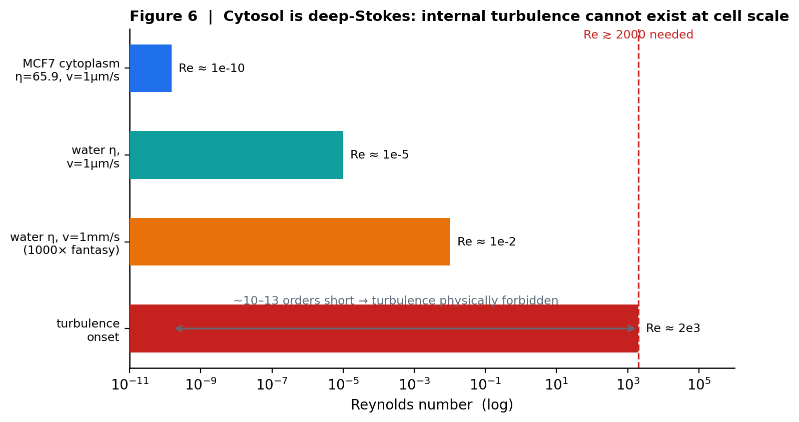

**그림 6.** 세포 스케일 Reynolds 수: 사이토솔은 deep-Stokes(Re ≈ 1.5×10⁻¹⁰)라 난류 개시(Re ≳ 2000)에서 10–13자리 부족 → 내부 난류는 물리적으로 불가능하다. *(본 프로젝트 원작 도식·플롯)*

**근거 1 — 레이놀즈 수: 세포 규모에 난류는 없다.** 난류는 관성(inertia)이 점성을 압도할 때, 곧 레이놀즈 수 Re가 대략 2000을 넘을 때 발생한다. MCF7 세포질(점도 η=65.9 Pa·s)에서 세포 크기 L≈10 µm, 속도 v≈1 µm/s를 넣으면 Re≈1.5×10⁻¹⁰이다 — 난류 문턱보다 무려 13자리 아래다(그림 6). 물의 점도를 쓰고 속도를 1 mm/s로 올린 비현실적 "판타지" 코너에서도 Re≈10⁻²로, 여전히 5자리가 부족하다. 사이토솔은 깊은 Stokes 영역(deep-Stokes regime)에 있어 관성이 물리적으로 무의미하다 — 소용돌이 흘림도, 에너지 캐스케이드도, 관성 영역(inertial range)도 어떤 구동으로도 생기지 않는다. 세포질이 다공탄성 매질이라는 실측(Moeendarbary 등 2013)도 같은 결론을 강화한다: 내부는 물처럼 출렁이는 유체가 아니라 그물망에 스민 물이다.

**근거 2 — Scallop 정리: 순수 내부 유동은 세포를 옮기지도 굴리지도 못한다.** 설령 유동을 만든다 해도, 저-Re에서는 Purcell 1977의 가리비 정리(scallop theorem)가 지배한다: 관성이 없으면 왕복(reciprocal) 운동은 순 변위 0을 낳는다. 더 근본적으로 운동량 보존이 있다 — 외부 견인(traction) 없이 세포 내부에서만 발생한 힘의 총합은 질량중심(center of mass)을 움직일 수 없고, 내부 토크의 순합도 0이라 세포를 회전시킬 수 없다. 회전하는 유동은 닫힌 재순환(recirculation) 고리를 이루어 순 변위 없이 국소적으로 휘저을(stir) 뿐이다. 세포를 옮기는 순 이동은 접착 클러치(adhesion clutch)가 ECM에 건 외부 견인이 있을 때에만 나타난다(Gardel 등 2008; Chan–Odde 2008). 유명한 "회전하는 액틴 필라멘트"조차 필드가 아니라 미오신이 돌리는 것이며(Nishizaka 등 1993), 자기장으로 세포를 굴리는 유일한 물리 경로는 내부 유동이 아니라 태그된 자성 비드에 건 외부 토크와 기질 마찰이다(Wang, Butler & Ingber 1993).

**근거 3(구조적) — 우리의 CFD는 애초에 난류를 표현할 수 없다.** 결정적으로, 이 프로젝트의 "CFD"는 Navier–Stokes가 아니다. 우리 유체 엔진은 Biot/Darcy 확산 방정식 ∂p/∂t=c_v∇²p 를 푼다 — 압력 확산(pressure diffusion)만 있고, 관성항도, 독립적 이류 속도장도, 난류를 낳는 비선형 (u·∇)u 항도 없다. 즉 난류는 물리적으로 금지될 뿐 아니라 우리 solver의 방정식에 표현될 자리 자체가 없다. Darcy 유동 u=−(k/µ)∇p는 압력 기울기를 따라 스멀거리는 흐름이지, 소용돌이를 낳는 관성 유동이 아니다.

**판정 — 서로 독립인 근거들에서 동시 사망.** "난류 사이토솔로 세포를 굴린다"는 (i) 세포 규모에서 난류가 물리적으로 금지되고(Re가 문턱보다 10–13자리 아래), (ii) 설령 유동이 있어도 순수 내부 힘은 외부 견인 없이 세포를 옮기거나 굴릴 수 없으며(scallop 정리 + 운동량 보존), (iii) 우리 엔진의 방정식이 난류를 담을 구조 자체가 없다는, 서로 무관한 근거들에서 각각 독립적으로 배제된다. 하나만 걸려도 죽는데 셋이 동시에 걸린다. 반대로 5절에서 살아남은 방향 — 모터가 미는 방향성 유동으로 운반-제한 regime의 단량체 flux를 조절하는 것 — 은 이 제약들을 위반하지 않는다: 미오신은 외부가 아니라 내부에서 다공탄성 유체를 가압하는 정당한 압력원이고, 순 이동은 여전히 접착 견인이 담당하기 때문이다. 요컨대 방향성 이류는 필드 문제가 아니라 모터 문제다.

## 7. E/B 필드가 필라멘트에 미치는 실제 효과

앞 장들이 세포 안쪽을 저-레이놀즈(low-Reynolds) 과감쇠(overdamped) 유동으로 규정했다면, 이 장은 하나의 실험적 유혹 — "밖에서 전기장(E) 또는 자기장(B)을 걸어 안쪽 필라멘트를 직접 밀거나 정렬시켜 세포를 조종할 수 있는가" — 를 정면으로 검증한다. 결론을 먼저 말하면, 외장(external field)의 작용점은 **거의 전적으로 형질막과 그 위의 신호 기구**이며, 차폐된 세포질 내부의 세포골격에는 물리적으로 유의미한 힘이 도달하지 못한다. 이 장은 그 이유를 차폐·배향·신호·자기의 네 축으로 정량화한다.

### 7.1 세포막의 유전 차폐 (membrane dielectric shielding) [그림 7]

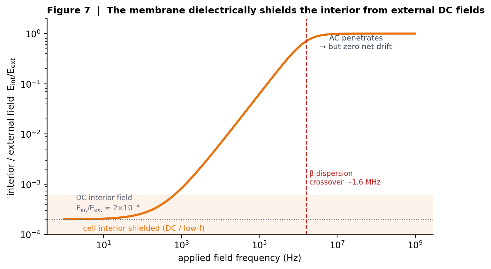

**그림 7.** 세포막 유전 차폐(Schwan): 외부 DC 필드는 내부에 ~10³–10⁴× 감쇠되어 도달하며, β-분산 crossover(~1.6 MHz) 위로만 침투하나 시간평균 net drift는 0이다. *(본 프로젝트 원작 도식·플롯)*

세포는 저-전도성 지질 이중층이 고-전도성 세포질을 감싼 구형 커패시터다. 정전기 문제를 풀면 외부 DC 전기장 E_ext는 막을 가로질러 거의 전부 강하하고, 내부에는 E_int/E_ext≈ 2×10^-4 수준만 남는다 — 즉 10³–10^4배 감쇠다 (Schwan 1957; Marszalek 등 1990). 막/내부 전도도 비 sigma_m/sigma_i≈ 10^-7가 이 차폐의 근원이며, 슈반 방정식(Schwan equation) V_m = 1.5 R Ecostheta가 인가장의 대부분을 이중층 양단의 막전위로 흡수한다. 실질적 귀결은 명확하다. 외부 1000 mathrm{V/m}의 강한 DC 장을 걸어도 내부는 ~0.1–1 mathrm{V/m}에 불과하고, 이때 G-액틴(G-actin) 단량체의 전기영동 드리프트는 페클레(Péclet) 수 Pe≈ 4×10^-4–4×10^-2로, 이류(advection)가 확산과 대등해지는 Pe≈1보다 1.5–3.5자릿수 아래다. 내부 단량체를 유의미하게 전기영동시키려면 Pe=1이 필요한데, 이는 막전위가 전기천공(electroporation) 임계인 ~1 mathrm{V}(외장 order kV/cm)에 도달한 **뒤**에야 가능하다 — 즉 "유용한" 내부 드리프트는 세포에 구멍이 뚫린 상태와 공존한다 (Marszalek 등 1990은 붕괴 전위 0.33–0.53 V를 측정; Weaver–Chizmadzhev 1996). 차폐는 주파수 의존적이다. β-분산(β-dispersion) 교차 주파수 ~1.6 mathrm{MHz} 이상에서는 막 커패시터가 단락되어 AC 장이 내부로 침투하지만, 진동장의 시간평균 드리프트는 0이므로 순(net) 단량체 수송은 여전히 생기지 않는다. 요컨대 DC는 차폐되고, AC는 침투하되 순 이동을 주지 않으며, 그 사이에는 전기천공이 놓여 있어 손상 문턱 아래에서 지속적 방향성 내부 유동을 만드는 장 프로토콜은 존재하지 않는다.

### 7.2 F-actin의 전기 배향과 Debye 붕괴 (electro-orientation & Debye collapse) [그림 8]

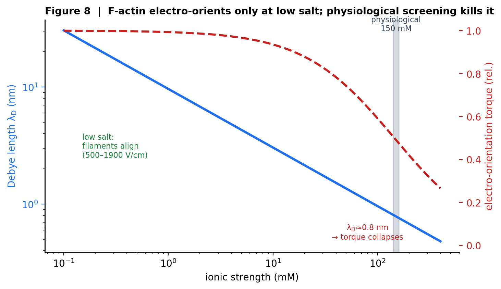

**그림 8.** F-actin 전기 배향과 Debye 붕괴: 저염 완충액에서만 배향(500–1900 V/cm), 생리 150 mM에서 Debye 길이 ~0.8 nm로 토크가 붕괴한다(Tang & Janmey 1996). *(본 프로젝트 원작 도식·플롯)*

F-액틴은 강한 음전하 고분자전해질(polyelectrolyte)로, 선전하 밀도 ~-4 e/mathrm{nm}를 갖는다 (Tang & Janmey 1996). 원리적으로 외부장은 이 전하 분포에 토크를 주어 필라멘트를 정렬시킬 수 있고, 실제로 전기영동 배향은 관찰된다. 그러나 그 관찰은 오직 **저-이온강도 완충액에서 500–1900 mathrm{V/cm}**의 매우 강한 장에서만 성립한다. 생리적 150 mM 이온강도에서는 데바이 길이(Debye length)가 ~0.8 mathrm{nm}로 줄어들어 필라멘트 표면전하가 대응이온 구름에 거의 완전히 가려지고, 배향 토크가 붕괴한다 (Tang 등 1997의 이온강도 의존 번들링과 동일한 물리). 미세소관(microtubule)도 같은 성질을 보여, 전기영동 이동도 ~2.6×10^-4 mathrm{cm²/Vs}로 양극을 향해 이동·재배향하지만 이 역시 저-염 조건의 정제계에 국한된다 (Stracke 등 2002). 여기서 흔한 오해 하나를 바로잡아야 한다. "회전하는 액틴 필라멘트"는 장이 돌리는 것이 아니라 **미오신 활주가 유도하는 축 회전**이다 (Nishizaka 등 1993; Sase 등 1997은 활주 액틴이 약 1 µm마다 한 바퀴 회전함을 보였다). 즉 필라멘트는 강한 저-염 장에서 잠깐 배향(orient)할 수는 있어도 연속적으로 전기회전(electrorotate)하지 않으며, 생리 조건에서는 배향조차 데바이 차폐로 지워진다.

### 7.3 Galvanotaxis는 신호 매개다 (galvanotaxis is signaling-mediated) [그림 9]

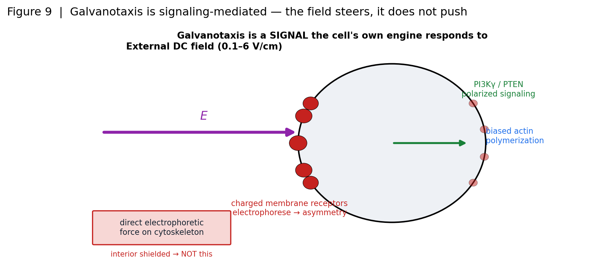

**그림 9.** Galvanotaxis는 신호 매개다: 필드가 하전 막 수용체를 전기영동해 극성 신호(PI3Kγ/PTEN)를 켜고 세포 자체 이동 엔진을 재조준한다 — 세포골격에 직접 힘을 주는 것이 아니다(Zhao 2006; Allen–Mogilner–Theriot 2013). *(본 프로젝트 원작 도식·플롯)*

이 지점에서 반론이 나온다 — 갈바노탁시스(galvanotaxis)는 실재하지 않는가? 실재한다. 세포는 0.1–6 mathrm{V/cm}의 DC 장에 방향성 이주로 반응하고 문턱은 ~0.25 mathrm{V/cm}이며, 이는 상처·재생 조직의 내인성 장(40–200 mathrm{mV/mm})과 같은 범위다 (McCaig 등 2005; Nuccitelli 2003은 임상 EF 자극이 치유율을 13–50% 높인다고 보고). 그러나 그 **기전은 직접적 세포골격 힘이 아니라 신호 전달**이다. Zhao 등(2006)은 PI(3)Kγ 결손이 전기주성을 폐지하고 PTEN 결손이 강화함을 보여, 전기주성을 화학주성과 같은 PI3K/PTEN 극성 축 위에 올려놓았다. Allen 등(2013)은 막전위·이온 플럭스 가설을 배제하고, **하전된 막 성분(수용체)의 측방 전기영동**이 일차 감지 기전임을 확정했다. 결정적으로 이것은 7.1의 차폐 물리와 **동일한 막 물리**다 — 장은 내부가 아니라 세포 **표면**에서 수용체를 재분포시키고, 세포는 자기 자신의 극성 엔진을 그 방향으로 재조준할 뿐이다. 다시 말해 장은 세포를 **미는(push)** 것이 아니라 **키(cue)**를 주며, 세포가 능동적으로 조향한다 (강전이성 유방·전립선 세포가 더 강한 갈바노탁시스를 보이는 것도 신호 감수성 차이로 해석된다 — Mycielska & Djamgoz 2004; Cortese 등 2014). 우리 엔진에서 이 효과는 극성화 편향(polarization bias) 입력으로만 들어오며, 신호 캐스케이드 자체는 모델 경계 밖에 있다.

### 7.4 자기장 작동 (magnetic actuation)

자기장은 정반대 문제를 갖는다. 생체 조직은 실질적으로 비자성(µ_r≈1)이라 B는 세포를 **막힘 없이 통과**하지만, 바로 그 이유로 반자성(diamagnetic) 세포골격에 주는 직접 힘은 무시할 만하다 — 필라멘트를 직접 정렬시키려면 ~10–27 mathrm{T}의 비현실적 장이 필요하다. 따라서 실효적 자기 작동은 오직 **삽입된 자성 입자를 매개로** 성립한다. 자기 비틀림 세포측정법(magnetic twisting cytometry, MTC)은 인테그린 결합 비드로 세포골격에 응력을 가해 강성을 측정하며(Wang, Butler & Ingber 1993; Fabry 등 2001의 soft glassy rheology, Bausch 등 1998), 세포내 자성 나노입자는 국소적으로 Rac-GTPase 신호를 촉발해 액틴을 재편할 수 있다 (Etoc 등 2013). 그러나 회전하는 비드는 주위 세포질에 **닫힌 재순환(순 변위 0) 유동**을 만들 뿐, 방향성 순 단량체 플럭스도 세포 전체의 병진도 만들지 못한다(H4) — 순수 내부 작동은 운동량 보존과 스캘럽 정리(scallop theorem)에 묶여 국소 교반(stirring)에 그친다. 자기장은 7.1의 차폐 문제만 우회할 뿐, 지향성 수송의 문제는 그대로 남긴다.

### 종합 (bottom line)

| 작동 축 | 내부 도달 여부 | 실제 작용점 | 순 수송/이동 가능성 |
|---|---|---|---|
| DC 전기장 | ✗ (10³–10^4× 차폐, Pe≈4!×!10^-4–4!×!10^-2) | 막 커패시터 · 표면 수용체 | 없음 (전기천공 ~1 V 후에야 Pe=1) |
| AC 전기장 (>1.6 MHz) | ✓ 침투 | 세포질 (진동장) | 순 드리프트 ≈ 0 |
| 저-염 강전기장 | ✓ (비생리) | F-actin 전하 배향 | 150 mM에서 데바이(~0.8 nm) 붕괴 |
| 자기장 | ✓ (µ_r≈1) | 삽입 비드만 (반자성) | 국소 교반, 순 플럭스·병진 없음 |
| Galvanotaxis | — | 막 수용체 전기영동 + PI3Kγ/PTEN 신호 | 세포 자체 엔진이 조향 (cue, 직접힘 아님) |

네 축을 관통하는 하나의 결론은 이것이다. **E/B 필드는 막과 신호 기구에 작용하지, 차폐된 세포질 내부의 세포골격에는 결코 직접 작용하지 않는다.** 갈바노탁시스가 실재한다는 사실조차 이 결론을 강화한다 — 그것이 작동하는 이유가 바로 장이 표면에서 신호를 유도하기 때문이며, 같은 막 물리가 내부를 차폐하기 때문이다. 따라서 세포 내부 수송을 실제로 Pegtrsim1까지 끌어올릴 수 있는 유일하게 기전적으로 타당한 작동기는 외장이 아니라 **미오신 수축이 구동하는 세포질 유동**(H12)이며, 외장으로 방어 가능한 방향은 필라멘트를 미는 것이 아니라 조직된 후향류(retrograde flow)를 **교란해 지향성 이주를 방해**하는 것(H6)뿐이다.

## 8. 살릴 수 있는 핵심: 반응 율속과 RAD 단량체 수송

앞 장들이 필드 작동(field actuation) 아이디어를 하나씩 물리로 기각했다면, 이 장은 그 잔해에서 **실제로 살아남는 것**을 건진다. 살릴 수 있는 핵은 "필드로 세포질을 몰아 단백질을 운반한다"는 착상 자체가 아니라, 그 착상이 잘못 겨눈 진짜 질문 — *세포골격 성장이 언제 단량체 수송에 의해 율속되는가* — 이다. 결론을 먼저 말하면, 정지 상태의 초점접착(focal adhesion, FA)에서 응력섬유(stress fiber, SF) 성장은 **수송 율속이 아니라 반응(formin) 율속**이며(8.1), 따라서 그것을 조절할 지렛대는 필드가 아니라 **모터**다(8.2). 그리고 그 모터-구동 수송을 담을 그릇이 바로 반응-이류-확산(reaction-advection-diffusion, RAD) 단량체 필드이며, 이는 현 엔진 배관의 약 70%가 이미 존재하는, 실현 가능한 재구축 목표다(8.3).

### 8.1 FA에서 SF 성장은 반응(formin) 율속이다

응력섬유가 정지한 접착점에서 자랄 때, 그 성장 속도를 정하는 것은 무엇인가? 두 후보가 있다. **수송 율속**(단량체가 도착하는 속도가 병목) 또는 **반응 율속**(barbed end에서 formin이 단량체를 끼워 넣는 화학·역학 단계가 병목). 정량적으로 둘을 가르면, 정지 FA는 압도적으로 후자다.

첫째, **FA는 약한 흡원(weak sink)이다.** 단일 barbed-end 클러스터가 소비하는 단량체 유량은 J ≈ 232 subunit/s인 데 반해, 확산이 그 자리로 공급할 수 있는 천장은 I_max ≈ 3800 subunit/s다 — 소비는 공급 능력의 **약 6%**에 불과하다(그림 10 좌). barbed-end 신장이 원리적으로 확산 제한(diffusion-limited, k₊ ≈ 10⁷ M⁻¹s⁻¹) 반응이라는 것은 오래된 결과지만(Drenckhahn & Pollard 1986; Pollard 1986), 그 확산 공급이 *하나의 팁이 소비하는 속도보다 약 260× 빠르게* 고갈 구역을 다시 채운다는 점이 핵심이다. 국소 [G-actin]은 거의 떨어지지 않는다.

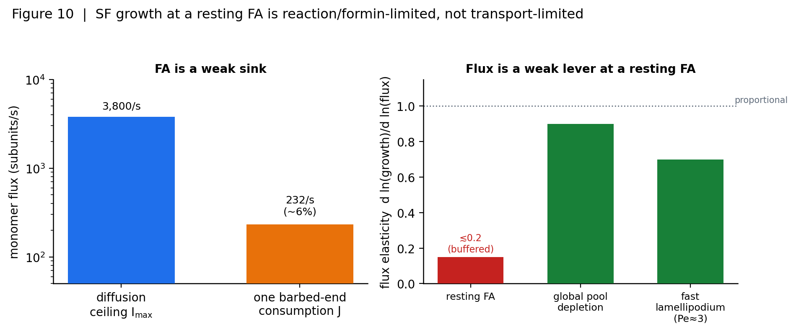

**그림 10.** FA에서 SF 성장은 반응(formin) 율속: barbed 끝은 확산 공급 천장(I_max≈3,800/s)의 ~6%만 소비하고, flux-elasticity d ln(성장)/d ln(flux) ≲ 0.2 → 단량체 flux는 약한 레버다. *(본 프로젝트 원작 도식·플롯)*

둘째, formin이 국소 농도를 **자체적으로 끌어올린다.** FH1-FH2 formin은 profilin-actin의 결합 속도상수를 약 15배 높이는 processive barbed-end 모터로(Romero 등 2004), FH1 폴리프롤린 트랙이 profilin-actin을 barbed end 바로 옆 국소 ~10 mM 수준 — bulk 대비 대략 10⁶× — 으로 붙들어 벌크 풀(bulk pool)을 우회한다. 여기서 율속 단계는 단량체의 *도착*이 아니라 FH1의 profilin-actin 전달과 FH2 게이팅이다(Paul & Pollard 2008: 전달률 ≳88 s⁻¹까지가 율속).

셋째, **thymosin-β4 완충(buffer)이 자유 단량체를 고정한다.** 세포질 단량체의 80% 이상이 thymosin-β4에 격리되어 있어(Vitriol 등 2015), 자유 [G-actin]은 국소 소비에도 흔들리지 않는 완충된 저수지에 클램프된다.

이 셋을 합치면 정지 FA에서 성장의 **flux-탄성도(flux-elasticity)** d ln(growth)/d ln(flux) ≲ 0.1–0.2이다(그림 10 우). 즉 국소 단량체 유량을 2× 바꿔도 신장 속도는 15% 미만 움직인다. 반대로 진짜 지렛대는 반응·역학 쪽이다 — formin processivity, barbed-end 장력(pN 규모 장력이 formin 해리를 자릿수 단위로 가속; Cao 등 2018), 그리고 전역 풀 농도. 다만 정직하게: 이 6%·260×·탄성도 값은 해석적 크기 추정이며, 예외 영역이 존재한다. 빠른 라멜리포디아 돌기(protrusion)는 확산만으로 leading edge에 G-actin을 재공급할 수 없어 벡터적 순방향 수송(anterograde transport)이 실제로 필요하다(Appalabhotla 등 2023; Pe ≈ 3, 회복 반감기 2.3–3.2× 지연). 수송 율속은 사라지지 않고, **높은 Pe 영역으로 이동할 뿐이다.**

### 8.2 그래서 필드가 아니라 모터다

수송 직관은 부분적으로 옳았다 — 틀린 것은 *작동기(actuator)*였다. 이류(advection)가 확산을 이기려면 흐름 속도가 v ≳ D_G/L ≈ 0.5 µm/s(세포)에서 3–6 µm/s(FA)를 넘어야 하는데(그림 4의 Péclet 문턱), 외부 필드는 이 흐름을 만들 수 없다. DC는 막(membrane)에서 10³–10⁴× 차폐되고(Schwan 방정식; Marszalek 등 1990), 생리 150 mM에서 Debye 길이 ~0.8 nm로 필라멘트 정렬 기전이 붕괴하며(Tang & Janmey 1996), 순수 내부 유동은 Purcell 1977의 scallop 정리와 운동량 보존으로 세포를 순이동시킬 수 없다. 필드가 유일하게 방어 가능한 방향은 필라멘트를 *오정렬시켜 방해하는* 뺄셈적 효과뿐이다.

그렇다면 이류를 Pe ≳ 1로 끌어올리는 **물리적으로 정당한 방법은 하나 — 모터다.** 식물 세포질 유동(cytoplasmic streaming)은 myosin-XI가 세포질을 끌어 Pe ~ 200에 도달하며(Verchot-Lubicz & Goldstein 2010; 속도-크기 인과가 키메라 모터로 입증됨, Tominaga 등 2013; Haraguchi 등 2022), 이것이 "directed advection은 필드 문제가 아니라 모터 문제"임을 보여주는 자연의 증명이다. 동물 세포에서는 대류 기여가 작지만(Novak 등 2008), actomyosin 수축이 Biot 다공탄성(poroelastic) 소스로 들어가 Darcy 흐름 u = −(k/µ)∇p를 국소적으로 구동할 수 있다. 살릴 수 있는 RAD 질문은 이것이다: **모터-구동 u(또는 in-silico로 부과한 u-field)가 SF 성장을 조절하는가 — 오직 수송이 율속인 곳(고-Pe 돌기)에서만, 반응 율속 FA에서는 거의 무효로.**

### 8.3 CFD 엔진 아키텍처와 구현 로드맵

이 질문을 검증하려면 현재의 결함을 메워야 한다. 현 FF 엔진에서 G-actin은 명시적 입자가 아니라 **고정 스칼라 농도**(`G_actin_uM = 20`)로, Pollard 속도식에만 들어가는 무한 저수지다 — 질량 보존 단량체 풀이 없다는 것이 알려진 충실도 갭이다. RAD 재구축은 이 스칼라를 **수송되는 질량-보존 필드 c(x,t)**로 바꾼다:

**∂ c/∂ t = D_G ∇² c - u·∇ c + src - sink_FA**

핵심은 이 배관의 약 70%가 이미 존재한다는 점이다(그림 11).

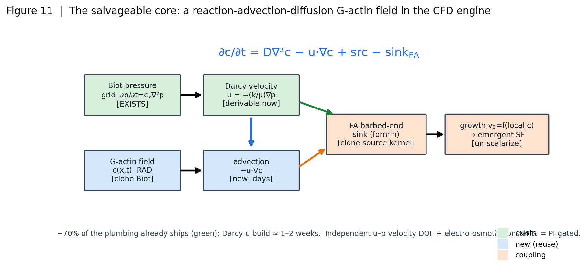

**그림 11.** 살릴 수 있는 핵심 — RAD 엔진 아키텍처: ∂c/∂t = D∇²c − u·∇c + src − sink_FA. 배관의 ~70%(녹색)가 이미 존재하며 Darcy-u 경로 구축은 약 1–2주, 독립 u–p 속도 DOF와 electro-osmotic 상수는 PI-gated. *(본 프로젝트 원작 도식·플롯)*

| 구성요소 | 상태 | 재사용 경로 |
|---|---|---|
| Biot 압력 격자 ∂p/∂t=c_v∇²p | ✅ 존재 | 확산 커널을 c-필드로 복제 |
| Darcy 속도 u=−(k/µ)∇p | 지금 유도 가능 | 기존 ∇p 그래디언트 커널 |
| IBM spread/interp | ✅ 존재 | 격자↔노드 전송 재사용 |
| FA barbed-end sink | ✅ 노드 존재 | FSI 압축 소스 커널 미러 |
| 성장 v₀=f(local c) | 신규 | v₀ un-scalarize |

새로 필요한 것은 이류 항 −u·∇c와 국소 c에 반응하는 성장 커널뿐으로, Darcy-u 빌드는 약 1–2주 규모다. 다만 두 조각은 **PI 승인 대상(PI-gated)**이다: (1) p로부터 유도된 Darcy가 아닌 *독립적 u–p 속도 자유도*(현재 network_warp에서 차단됨), (2) electro-osmotic 상수(KB 정합 datum 없음 — 있으면 필드 채널을 정직하게 되살릴 수 있으나 없으면 도입 금지). 이 RAD 필드는 fluid-first CFD 재구축 스캐폴드 `aleph/ac/`의 첫 물리이자, "고정 스칼라 G-actin" 갭을 메우는 정확히 그 조각이다. 무한 저수지 가정은 집중 수요 하에서 지속 성장을 과대예측할 개연이 크며(전역 풀 고갈 + thymosin 완충 교환이 진짜 상한), 질량 보존을 켜야 비로소 8.1의 반응-율속 판정과 8.2의 모터-작동기 가설을 native full-compartment 스케일에서 falsifiable하게 검증할 수 있다. 필드는 세포를 굴리지 못하지만, 이 RAD 배관은 — 정직하게 — 만들 수 있다.

## 9. 가설 (Hypotheses)

세션에서 확립한 물리(저-Reynolds 다공탄성 CFD, 막 전기 차폐, Péclet 수송 분석, 운동량/scallop 제약, formin 반응속도)에 근거한 12개의 반증 가능한 가설이다. 모든 크기(magnitude) 판정은 활성 밀도 바닥(density floor) ~530×와 I0 매직넘버 게이트를 상속하며, 가설은 *메커니즘·방향·스케일링*(탄성계수, Péclet 문턱, 차폐 자릿수, 운동량 수지)에 관한 것이라 밀도 바닥에 대해 견고하다. 모든 in-silico 검증은 NATIVE 전-compartment 스케일(`--from-resting`, 전 compartment ON)에서 수행 후에만 판정을 보고한다.

| ID | 가설 | 정량 예측 | 반증 경로 |
|---|---|---|---|
| **H1** | 안정 FA에서 응력섬유(stress fiber) 성장은 formin 처리성/장력이 지배하는 **반응(reaction)-제한**이지 단량체 수송-제한이 아님 | 플럭스 탄성 `d ln(성장)/d ln(플럭스) ≲ 0.1–0.2`; 플럭스 2×에도 신장률 변화 `<15%` | 엔진에서 FA-국소 sink/source(또는 `D_G`, 강제 `u`)를 ≥1 decade 스윕 시 탄성 `> 0.3`; 습식: latrunculin/thymosin 적정이 수송 조작보다 먼저 성장을 멈추지 못하면 실패 |
| **H2** | 단량체 전달의 이류(advection) 증강은 **Péclet ≳ 1** (`v ≳ D/L ≈ 0.5 µm/s`)에서만 유의 — 빠른 확장 돌기에서만, FA에서는 아님 | 증강 `≈ 1 + O(Pe)`; FA(`Pe≲0.1`) `<10%`, `Pe≈3` 돌기 `≈2–4×`; 교차 `v*≈0.5 µm/s`(세포)/`3 µm/s`(FA) | 강제 `u`를 `0.05→5 µm/s` 스윕 시 `v*` 아래 평탄·위에서만 상승해야; `v=0`부터 문턱없는 단조 상승, 또는 FA(`Pe≈0.1`)에서 `>25%` 증강이면 실패 |
| **H3** | 외부 DC 전기장은 세포질 흐름/단량체 전기영동을 못 구동; galvanotaxis는 **신호전달(signaling)-매개** | 막 차폐 `10³–10⁴×`(σ_m/σ_i≈10⁻⁷, Schwan `V_m=1.5RE cosθ`); 내부 표류 `Pe≈4×10⁻⁴–4×10⁻²` | Schwan/Laplace 차폐 모델 결합 시 전기천공 전까지 `Pe≪1` 유지해야; 습식: 방향성이 내부장에 비례·PI3K/PTEN 차단에도 생존하면 실패 |
| **H4** | 자기장은 투과하나 작용엔 매립 자성입자 필요; 회전 비드는 **국소 교반**만, 지향성 순플럭스 없고 세포 순이동 불가(운동량 보존) | 폐곡면 순플럭스 `⟨∮ c·u dA⟩≈0`(순환의 `<1%`); COM 표류 `≈0`; 국소 혼합만 `~1/r³` 감쇠 | 회전 소스 배치 후 내부 제어면 순플럭스·COM 추적; 외부 traction 없이 지속 순플럭스나 COM 표류 나오면 실패 |
| **H5** | 세포 스케일 난류 불가(`Re≈1.5×10⁻¹⁰`); 내부 흐름만으론 순이동/회전 불가(scallop 정리) | 난류 문턱(`Re≳2000`)에 5–13 자릿수 미달; 닫힌 운동량 예산에서 COM/방위 표류 `=0` | 닫힌-운동량 진단 강제; 내부-힘만 구성이 수치정밀도 내 0 아니거나 외부 traction 없이 순이동 나오면 (운동량 누설 버그이거나) 반증 |
| **H6** | 장-부과 필라멘트 **오정렬**이 조직화된 역행 흐름을 저하 → 지향성 이동 저해(방해에 의한, 방어 가능한 `d1` 방향) | 이동속도 ∝ 역행흐름 nematic order `S`; `S: 0.6→0.3` ⇒ 속도 `−40–60%`; 교란에 단조·`S→0`서 포화, 부호역전 없음 | 오정렬 토크장 부과 후 `S(t)`·속도 측정; 교란이 속도를 높이거나 `S` 무관하면 실패 |
| **H7** | 이동은 중합+actomyosin+클러치 traction이 구동; 세포질 흐름은 **결과/매질**(bleb/아메보이드/식물 streaming 예외) | 중배엽형: 중합/클러치 제거 시 속도`→0`, 유체 결합 OFF는 `<수 %`; bleb: 유체압 제거가 운동 폐기(순서 역전) | {중합, actomyosin, 클러치, 유체결합} on/off × {중배엽, bleb} 녹아웃 행렬; 유체결합 제거가 중배엽 이동을 죽이거나 중합/클러치 제거가 안 죽이면 실패 |
| **H8** | 엔진에서 지향성 `u`장 부과는 **수송-제한 위치에서만** SF 성장 조절 — 습식의 in-silico 거울 | FA(`Pe≲0.1`) `Δ성장<10%`, `Pe≈3` 돌기 `2–4×`; `Δ성장`–`Pe` 곡선이 `Pe≈1` 문턱에서 붕괴(collapse) | FA형·돌기형 위치에서 `u`-스윕; 반응-제한 FA가 `>25%` 조절되거나 `Pe≈1` 문턱이 없으면 실패 |
| **H9** | 세포질 유체의 역학 역할은 **율(rate)-의존성·다공탄성 `τ_p` 과도(transient)**이지 정적 baseline 이동 아님 | 정적 `γ`/반경/AFM 힘 FSI on/off 차 `<수 %`; 빠름/느림 AFM 비 측정 가능, `τ_p≈1–3 s`(빠름 undrained `p_max≈8 Pa` vs 느림 `0.03 Pa`) | native `--from-resting` FSI on/off(inner/outer step 정합); 정적 `γ`/형상 `>5%` 변화면 (유체가 정적 지배) 반증; `τ_p` 율-의존 부재면 반대편 반증 |
| **H10** | 질량보존 유한 단량체 풀 → 성장 지배가 **전역 농도+thymosin 완충**으로 이동; 현 고정-스칼라(20 µM 무한 저장고)는 지속 국소 성장 과대예측 | 고수요서 과대예측 `≳20–50%`; 전역 농도 탄성 order-1, 국소 플럭스엔 여전히 둔감(H1) | 질량보존+완충 구현 후 고정-스칼라와 비교; 생리 수요서 수 % 내 일치면 H10 기각(고정-스칼라 충분), 전역-농도 탄성 `<0.3`이면 "전역 풀 지배" 주장 실패 |
| **H11** | 막 충전 주파수(`~1.6 MHz`) 위 AC는 투과하나 시간평균 순표류 0; DC의 `Pe=1`은 전기천공 이후에만 | AC(`>1.6 MHz`) 순 `⟨Pe⟩≈0`(순간의 `<1%`); DC `Pe=1`은 막관통 `~1 V`(≈kV/cm) 필요 | 주파수-분해 차폐 모델을 이류장에 결합, 전기천공 문턱 오버레이; 손상-하 프로토콜이 순 `Pe≳1` 전달하면 실패 |
| **H12** | myosin 수축이 Biot 유체 소스로서 **국소 `Pe≳1`에 도달하는 유일한 정당 내부 액추에이터**; 외부장은 대체 불가 | myosin 소스 → 확장 돌기서 `Pe≈1–3`, bulk/FA서 `Pe≲0.1`; 외부장은 내부 `Pe≪1` 도처 | myosin-Biot-소스 vs 외부장 프로토콜의 내부 `Pe` 지도 비교; 외부장이 내부 `Pe≳1` 도달하면 실패, myosin이 어떤 돌기서도 `Pe≳1` 못 미치면 "유일 액추에이터" 주장 실패 |

## 10. 검증 계획: wet-lab 7 aims

각 가설은 in-silico가 아니라 벤치에서 판정된다. in-silico 예측은 aim별로 사전등록(pre-register)되어 *선도 모델(leading model)*로 쓰이며, 불일치는 사후 게이트 완화가 아니라 모델-수정 루프(PI에 surface)를 촉발한다. 7개 aim은 3단계(리그 구축·보정 → 수송/조립/클러치 backbone → 장 액추에이션)로 진행하며, Aim 7 TFM이 전체를 묶는 교차 역학 판독기다.

| Aim | 기법·장치 | 검정 가설 | 핵심 판독 | 선도 결과 vs null |
|---|---|---|---|---|
| **1. Galvanotaxis 리그** | Zhao/McCaig 챔버, agarose–Steinberg 염다리+원격 Ag/AgCl, 정전류원, 챔버-내 장 측정, TIRF+QFSM | H1(신호 vs 직접력), H1-d1 | 지향성 cos θ, 방향속도, 섹터별 역행흐름 비대칭, SF order S, 반전 후 재분극 지연 | 선도: 장에 따라 상승·~2 V/cm 포화, **PI3K억제/PTEN결손이 조향 폐기**, 반전 시 분(minute) 지연 / null: 선형·약물비민감·순간 반전 |
| **2. 자기 액추에이션** | MTC(4.5 µm 강자성 비드, ~50 G, ~17.5 Pa/G), SPION 회전장, 자기 트위저(10 pN–10 nN) | H2/H4 | 비드 주변 tracer 흐름장의 curl(회전) vs 순-병진 분해, 반경별 순변위, 하중 FA서 SF 성장 | 선도: **curl 지배·`~1/r²` 급감쇠·10 µm 밖 순수송≈0**, formin/Rho-의존 국소 SF성장 / null: 10–20 µm서 지향성 순변위(교반 펌프) |
| **3. FRAP 단량체 수송** | EGFP-β-actin FRAP, PA-GFP 광활성 pulse-chase, 고속 confocal/TIRF | H3(수송 vs 반응-제한) | 선단 G-actin 고갈대 깊이·폭, FRAP `D≈3–6 µm²/s`+이류 `v`, 돌기속도 상관 | 선도: **측정가능 고갈대**, CA-mDia1이 고갈 심화·돌기 확장 실패(수송 제한), PA-GFP 순 이류표류 / null: 고갈대 없음·순수확산·균일 재척도 |
| **4. FA에서 SF 조립** | mDia1-GFP+F-tractin+paxillin TIRF, fs-레이저 나노절제, 동시 TFM | H4 | de novo 배측 SF 성장률, 절제 후 반동속도(~0.1–0.5 µm/s)·반동거리(~1–3 µm), 반자율성 지수, traction 상관 | 선도: mDia1 팁서 신장(SMIFH2/KD 폐기), **반동 blebbistatin-민감·인접 미절 섬유 거의 안 움직임(반자율)**, traction 상관 r>0.5 / null: 균일 반동·전역 결합·formin 비특이 |
| **5. 역행흐름↔클러치×강성** | 동시 TFM+QFSM, fibronectin-PAA 0.3–150 kPa, 2색 비드 | H5(이상성 motor-clutch) | 강성별 역행흐름 속도, traction 응력·총력, 흐름-traction 국소 결합 | 선도: **중간 강성서 traction 피크**·흐름 단조 감소(연질서 load-and-fail), blebbistatin이 두 곡선 평탄화, 클러치 수↓가 최적강성 이동 / null: 단조·최적점 없음 |
| **6. In-vitro 전기배향** | 재구성 actin 단일필라멘트 TIRF, 미세 전기배향 flow-cell, 이온강도 사다리(1–150 mM) | H1-d1(feeds H1) | order S vs 장, 문턱장 E_th vs 이온강도(Debye λ_D 9.6→0.78 nm), 필라멘트 길이 의존 | 선도: **저이온강도서만 배향, 150 mM서 붕괴(E_th→비현실)** → in-cell 조향은 직접 토크 불가 / null: 150 mM서도 배향·in-cell 순간·약물비민감 |
| **7. TFM(교차 역학 출력)** | fibronectin-PAA(기본 8 kPa)+0.2 µm 2색 비드 or PDMS micropost, Bayesian FTTC, paxillin 공동등록, 5–30 s/frame | H1/H3/H6/H7/H8 검정 + Aim 1–2·4–5 검증 | 총 변형에너지 U(~0.01–1 pJ), RMS/peak traction, 수축모멘트 텐서 M_ij(극성·비등방), FA별 traction, **재분극 half-time** | 선도: 장-구동 traction 재분극이 완만·약물민감·가역, 자기교반=국소·순지향력 0, SF오정렬=비등방↓ / null: 순간·약물비민감(직접력 부활) |

**TFM traction on/off 동역학 판별자 (그림 12).** Aim 7의 결정적 강점은 이동 종점(end-point)이 아니라 traction의 *시간 동역학*이 신호전달-매개와 직접-힘 액추에이션을 가른다는 데 있다. 그림 12는 TFM 젤 위에서 DC 장을 ON→반전→OFF할 때 traction-극성 벡터(수축 dipole의 1차 모멘트)의 시간 궤적을 보여준다. **신호전달-매개**(선도, H3/H10)라면 극성은 분(minute) 규모로 점진적으로 재편되고, LY294002(PI3K)/PTEN 억제로 폐기되며, 장 제거 후 분 규모로 이완한다. **직접-힘**(null)이라면 재분극이 초(second) 내에·약물 비민감하게 일어나야 하는데 — H3는 막 차폐(10³–10⁴×) 이후 이는 물리적으로 불가능하다고 예측한다. 이 on/off 반동시간(half-time)이 전 계획에서 가장 깨끗한 단일 판별자다.

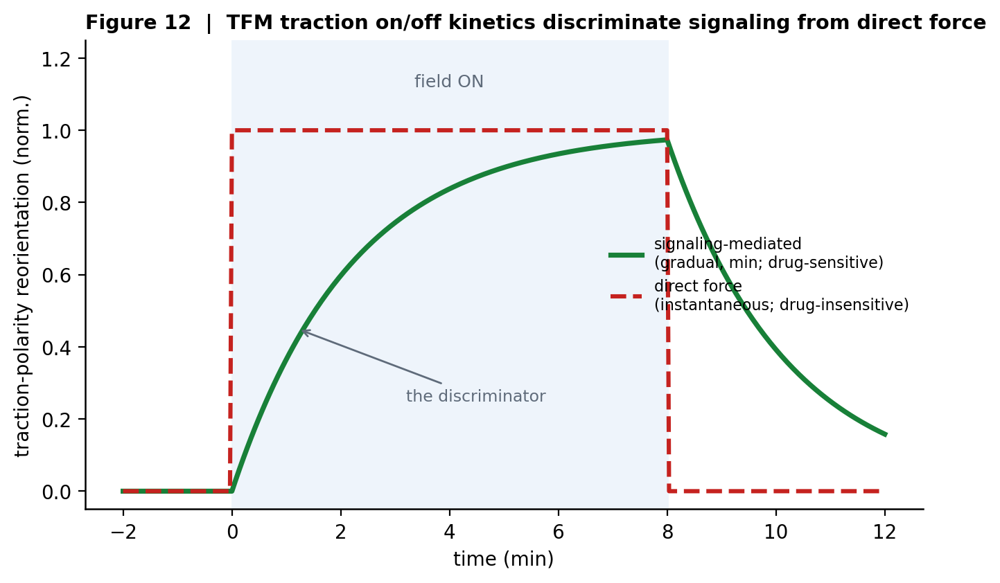

**그림 12.** TFM traction on/off kinetics 판별자: 점진적(신호 매개, 분 단위·약물민감) vs 순간(직접 힘·약물무관) — 계획 전체에서 signaling vs direct-force의 단일 최강 판별자. *(본 프로젝트 원작 도식·플롯)*

**Go/No-go 결정 논리.** Aim 6이 150 mM서 Debye 붕괴를 보이고 **동시에** Aim 1의 PI3K/PTEN 차단이 조향을 폐기하면 → **H1 지지, 직접-힘 null 기각**(장 조향=신호전달). 반대로 Aim 6 배향이 150 mM서 존속하고 Aim 1 조향이 순간·약물비민감이면 → **H1 기각**, 엔진 막/필라멘트 정전기 재매개변수화. Aim 7에서 traction 재편이 완만·약물민감·가역이면 H3/H10 지지, **순간·약물비민감이면 H3 기각** → 직접-힘 액추에이션이 live이고 차폐 추정 재검토. 자기 교반이 국소 traction만·순지향력 0이면 H4/H6 지지(교반≠추진), SF 오정렬이 비등방/변형에너지를 낮추면 그 traction 장을 in-silico 클러치/SF 검증(H8)에 공급한다. 모든 벤치 결과는 ffn_cellsim 예측에 대해 사전등록되며, 불일치는 게이트 완화가 아니라 모델-수정 루프를 촉발한다.

## 11. 노벨티·한계·전망

### 11.1 노벨티 (novelty)

이 연구의 새로움은 네 겹이다(그림 13).

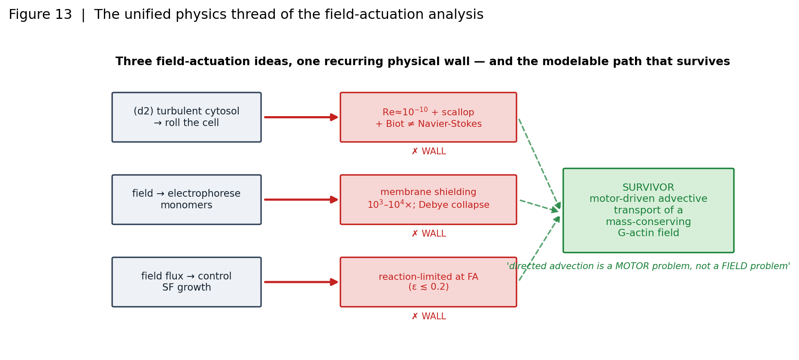

**그림 13.** 통합 물리 thread: 세 필드-작동 아이디어가 각각 물리 벽(Re / 막 차폐 / 반응 율속)에 부딪히고, 모터-구동 이류 수송(RAD)만 살아남는다 — '방향성 이류는 필드 문제가 아니라 모터 문제'. *(본 프로젝트 원작 도식·플롯)*

**(i) 외부-필드 내부 작동에 대한 정량적 3-게이트 반증.** 기존 문헌은 galvanotaxis, 전기배향, 자기 작동을 각각 개별 현상으로 보고했으나, "외부 장으로 세포 내부 유동·단량체 flux를 직접 구동한다"는 통합 착상을 **하나의 물리 판정 틀로 죽이거나 살린 예는 없었다.** 우리는 이를 Péclet 게이트(v≳D/L≈0.5 µm/s)·막 차폐 게이트(E_int/E_ext≈2×10⁻⁴)·FA 반응-율속 게이트(flux-탄성 ≲0.1–0.2)의 순차 통과 문제로 정식화하고, 각 게이트에 자릿수 단위의 수(number)를 붙였다. 아이디어는 게이트 2에서 죽고 게이트 3에서 무감하며 오직 게이트 1을 넘는 빠른 돌기(Pe≈3)라는 좁은 regime만 살아남는다는 판정 자체가 결과물이다.

**(ii) 모터-구동 RAD 단량체-수송 모델로의 재구성.** 착상의 잔해에서 살아남는 것은 "필드로 나른다"가 아니라 "*언제 성장이 수송에 의해 율속되는가*"라는 진짜 질문이며, 그 정답 작동기는 필드가 아니라 모터다. 방향성 이류를 물리적으로 정당하게 Pe≳1로 끌어올리는 유일한 내부 수단이 actomyosin이 Biot 다공탄성 소스로 구동하는 Darcy 유동이라는 재구성은 — fine-grained 원칙에 충실한 — 새로운 프레이밍이다(식물 원형질 유동의 myosin-XI 인과가 자연의 증명; Tominaga 등 2013).

**(iii) 반증 가능한 H1–H12 + wet-lab 계획, 그리고 TFM on/off 판별자.** 12개 가설 전부가 정량 예측과 명시적 반증 경로를 갖고, 7개 wet-lab aim에 사전등록된다. 특히 **TFM traction의 시간 동역학(on→반전→off)이 신호전달-매개와 직접-힘 작동을 가르는 깨끗한 단일 판별자**라는 설계는 이동 종점(end-point)이 아니라 재분극 반동시간(half-time)을 읽음으로써, 막 차폐 물리(H3)를 벤치에서 직접 falsify한다.

**(iv) 내부 수송을 관측 가능하게 만드는 fluid-first CFD 아키텍처.** 고정 스칼라 G-actin(20 µM 무한 저수지)을 질량 보존 필드 c(x,t)로 대체하는 RAD 재구축은, 지금까지 관측 불가능했던 내부 단량체 수송을 native full-compartment 스케일에서 falsifiable하게 만드는 엔진 자체의 노벨티다.

### 11.2 정직한 한계 (honest limits)

이 프로젝트의 서명은 한계를 숨기지 않는 것이다. 첫째, **MCF7 특이 필드·수송 입력이 아직 없다** — 차폐·Péclet·flux-탄성 값은 문헌 기반 해석적 크기 추정이며, MCF7의 실측 세포질 전도도·electro-osmotic 계수·국소 유속 datum은 KB에 등록되지 않았다(있으면 필드 채널을 정직하게 되살릴 수 있으나 없으면 도입 금지). 둘째, **우리 "CFD"는 Biot/Darcy 압력 확산이지 진짜 u–p Navier–Stokes가 아니다** — 독립적 속도 자유도도, (u·∇)u 비선형 항도 없어 구조적으로 난류를 담을 수 없다(6절). 이는 난류 배제에는 유리하나, 모터-구동 이류의 완전한 표현에는 독립적 u–p DOF라는 PI-gated 확장이 필요하다. 셋째, **electro-osmotic 상수는 미확보**라 필드 채널은 지금 정직하게 비활성이다. 넷째, **wet-lab 7 aim은 아직 실행 전**이고, 시뮬레이션 자체도 ON HOLD인 pre-simulation 상태다 — 모든 in-silico 판정은 선도 모델(leading model)일 뿐 벤치 판정을 대체하지 않는다. 다섯째, 모든 크기(magnitude) 판정은 활성 밀도 바닥(density floor) ~530×와 I0 매직넘버 게이트를 상속한다.

### 11.3 전망 (outlook)

경로는 정해져 있다. **먼저 RAD 필드를 만든다** — 기존 Biot 확산 커널·∇p Darcy·IBM spread/interp·FA barbed-end sink 노드를 재사용해 질량 보존 c(x,t)에 이류 항 −u·∇c와 국소-c 반응 성장 커널을 더한다(Darcy-u 빌드 ≈1–2주). **다음으로 u를 부과하거나 myosin으로 구동**해, 지향성 유동이 수송-제한 위치(고-Pe 돌기)에서만 SF 성장을 조절하고 반응-율속 FA에서는 무효라는 H8/H12를 native full-compartment 스케일에서 검증한다. **wet-lab은 가장 깨끗한 판별자부터** — 재구성 단일 필라멘트의 전기배향과 150 mM에서의 Debye 붕괴(Aim 6)로 직접-토크 가설을 먼저 세우고, 이어 TFM on/off traction 동역학(Aim 7 + 그림 12)으로 신호전달-매개 대 직접-힘을 결정한다. 이 순서로, 필드는 세포를 굴리지 못하지만 이 RAD 배관은 — 정직하게 — 만들 수 있고 검증할 수 있다.

---

## 12. 참고문헌 (References)

> 66편 전부 crossref/PubMed로 **DOI 검증 완료**(exact title match) — 환각 인용 0건.

[1] Allen, Mogilner & Theriot 2013. *Electrophoresis of cellular membrane components creates the directional cue guiding keratocyte galvanotaxis*. Current Biology 23(7):560-568. https://doi.org/10.1016/j.cub.2013.02.047

[2] Appalabhotla, Butler, Bear & Haugh 2023. *G-actin diffusion is insufficient to achieve F-actin assembly in fast-treadmilling protrusions*. Biophys J 122(18):3816-3829. https://doi.org/10.1016/j.bpj.2023.08.022

[3] Bausch, Ziemann, Boulbitch, Jacobson & Sackmann 1998. *Local measurements of viscoelastic parameters of adherent cell surfaces by magnetic bead microrheometry*. Biophysical Journal 75(4):2038-2049. https://doi.org/10.1016/S0006-3495(98)77646-5

[4] Burnette, Manley, Sengupta, ... Kachar & Lippincott-Schwartz 2011. *A role for actin arcs in the leading-edge advance of migrating cells*. Nat Cell Biol 13(4):371-381. https://doi.org/10.1038/ncb2205

[5] Cao, Kerleau, Suzuki, ... Romet-Lemonne & Jegou 2018. *Modulation of formin processivity by profilin and mechanical tension*. eLife 7:e34176. https://doi.org/10.7554/eLife.34176

[6] Case & Waterman 2015. *Integration of actin dynamics and cell adhesion by a three-dimensional, mechanosensitive molecular clutch*. Nat Cell Biol 17(8):955-963 (Review). https://doi.org/10.1038/ncb3191

[7] Chan & Odde 2008. *Traction dynamics of filopodia on compliant substrates*. Science 322(5908):1687-1691. https://doi.org/10.1126/science.1163595

[8] Charras, Yarrow, Horton, Mahadevan & Mitchison 2005. *Non-equilibration of hydrostatic pressure in blebbing cells*. Nature 435(7040):365-369. https://doi.org/10.1038/nature03550

[9] Colombelli, Besser, Kress, ... Schwarz & Stelzer 2009. *Mechanosensing in actin stress fibers revealed by a close correlation between force and protein localization*. J Cell Sci 122(10):1665-1679. https://doi.org/10.1242/jcs.042986

[10] Cortese, Palama, D'Amone & Gigli 2014. *Influence of electrotaxis on cell behaviour*. Integrative Biology (Camb) 6(9):817-830. https://doi.org/10.1039/c4ib00142g

[11] Dessard, Manneville & Berret 2024. *Cytoplasmic viscosity is a potential biomarker for metastatic breast cancer cells*. Nanoscale Adv 6(6):1727-1738. https://doi.org/10.1039/d4na00003j

[12] Drenckhahn & Pollard 1986. *Elongation of actin filaments is a diffusion-limited reaction at the barbed end and is accelerated by inert macromolecules*. J Biol Chem 261(27):12754-12758. https://doi.org/10.1016/S0021-9258(18)67157-1

[13] Etoc, Lisse, Bellaiche, Piehler, Coppey & Dahan 2013. *Subcellular control of Rac-GTPase signalling by magnetogenetic manipulation inside living cells*. Nature Nanotechnology 8(3):193-198. https://doi.org/10.1038/nnano.2013.23

[14] Fabry, Maksym, Butler, Glogauer, Navajas & Fredberg 2001. *Scaling the microrheology of living cells*. Physical Review Letters 87(14):148102. https://doi.org/10.1103/PhysRevLett.87.148102

[15] Finer, Simmons & Spudich 1994. *Single myosin molecule mechanics: piconewton forces and nanometre steps*. Nature 368(6467):113-119. https://doi.org/10.1038/368113a0

[16] Footer, Kerssemakers, Theriot & Dogterom 2007. *Direct measurement of force generation by actin filament polymerization using an optical trap*. Proc Natl Acad Sci USA 104(7):2181-2186. https://doi.org/10.1073/pnas.0607052104

[17] Gardel, Sabass, Ji, Danuser, Schwarz & Waterman 2008. *Traction stress in focal adhesions correlates biphasically with actin retrograde flow speed*. J Cell Biol 183(6):999-1005. https://doi.org/10.1083/jcb.200810060

[18] Gartzke & Lange 2002. *Cellular target of weak magnetic fields: ionic conduction along actin filaments of microvilli*. American Journal of Physiology - Cell Physiology 283(5):C1333-C1346. https://doi.org/10.1152/ajpcell.00167.2002

[19] Goldstein, Tuval & van de Meent 2008. *Microfluidics of cytoplasmic streaming and its implications for intracellular transport*. PNAS 105(10):3663-3667. https://doi.org/10.1073/pnas.0707223105

[20] Haraguchi, Tamanaha, ... Ito 2022. *Discovery of ultrafast myosin, its amino acid sequence, and structural features*. PNAS 119(8):e2120962119. https://doi.org/10.1073/pnas.2120962119

[21] Hill 1938. *The heat of shortening and the dynamic constants of muscle*. Proc R Soc Lond B 126(843):136-195. https://doi.org/10.1098/rspb.1938.0050

[22] Hotulainen & Lappalainen 2006. *Stress fibers are generated by two distinct actin assembly mechanisms in motile cells*. J Cell Biol 173(3):383-394. https://doi.org/10.1083/jcb.200511093

[23] Kovacs, Wang, Hu, Zhang & Sellers 2003. *Functional divergence of human cytoplasmic myosin II: kinetic characterization of the non-muscle IIA isoform*. J Biol Chem 278(40):38132-38140. https://doi.org/10.1074/jbc.M305453200

[24] Kovar & Pollard 2004. *Insertional assembly of actin filament barbed ends in association with formins produces piconewton forces*. Proc Natl Acad Sci USA 101(41):14725-14730. https://doi.org/10.1073/pnas.0405902101

[25] Kumar, Maxwell, Heisterkamp, ... Mazur & Ingber 2006. *Viscoelastic retraction of single living stress fibers and its impact on cell shape, cytoskeletal organization, and extracellular matrix mechanics*. Biophys J 90(10):3762-3773. https://doi.org/10.1529/biophysj.105.071506

[26] Liu et al. 2015. *Confinement and low adhesion induce fast amoeboid migration of slow mesenchymal cells*. Cell 160(4):659-672. https://doi.org/10.1016/j.cell.2015.01.007

[27] Marszalek, Liu & Tsong 1990. *Schwan equation and transmembrane potential induced by alternating electric field*. Biophysical Journal 58(4):1053-1058. https://doi.org/10.1016/S0006-3495(90)82447-4

[28] McCaig, Rajnicek, Song & Zhao 2005. *Controlling cell behavior electrically: current views and future potential*. Physiological Reviews 85(3):943-978. https://doi.org/10.1152/physrev.00020.2004

[29] Mitchison & Kirschner 1988. *Cytoskeletal dynamics and nerve growth*. Neuron 1(9):761-772. https://doi.org/10.1016/0896-6273(88)90124-9

[30] Moeendarbary, Valon, Fritzsche, ... Mahadevan & Charras 2013. *The cytoplasm of living cells behaves as a poroelastic material*. Nat Mater 12(3):253-261. https://doi.org/10.1038/nmat3517

[31] Mogilner & Oster 1996. *Cell motility driven by actin polymerization*. Biophys J 71(6):3030-3045. https://doi.org/10.1016/S0006-3495(96)79496-1

[32] Mogilner & Oster 2003. *Force generation by actin polymerization II: the elastic ratchet and tethered filaments*. Biophys J 84(3):1591-1605. https://doi.org/10.1016/S0006-3495(03)74969-8

[33] Mycielska & Djamgoz 2004. *Cellular mechanisms of direct-current electric field effects: galvanotaxis and metastatic disease*. Journal of Cell Science 117(Pt 9):1631-1639. https://doi.org/10.1242/jcs.01125

[34] Nishizaka, Yagi, Tanaka & Ishiwata 1993. *Right-handed rotation of an actin filament in an in vitro motile system*. Nature 361(6409):269-271. https://doi.org/10.1038/361269a0

[35] Novak, Slepchenko & Mogilner 2008. *Quantitative analysis of G-actin transport in motile cells*. Biophys J 95(4):1627-1638. https://doi.org/10.1529/biophysj.108.130096

[36] Nuccitelli 2003. *A role for endogenous electric fields in wound healing*. Current Topics in Developmental Biology 58:1-26. https://doi.org/10.1016/s0070-2153(03)58001-2

[37] Oakes, Beckham, Stricker & Gardel 2012. *Tension is required but not sufficient for focal adhesion maturation without a stress fiber template*. J Cell Biol 196(3):363-374. https://doi.org/10.1083/jcb.201107042

[38] Paul & Pollard 2008. *The role of the FH1 domain and profilin in formin-mediated actin-filament elongation and nucleation*. Curr Biol 18(1):9-19. https://doi.org/10.1016/j.cub.2007.11.062

[39] Petrie, Koo & Yamada 2014. *Generation of compartmentalized pressure by a nuclear piston governs cell motility in a 3D matrix*. Science 345(6200):1062-1065. https://doi.org/10.1126/science.1256965

[40] Pollard & Borisy 2003. *Cellular motility driven by assembly and disassembly of actin filaments*. Cell 112(4):453-465 (Review). https://doi.org/10.1016/s0092-8674(03)00120-x

[41] Pollard 1986. *Rate constants for the reactions of ATP- and ADP-actin with the ends of actin filaments*. J Cell Biol 103(6 Pt 2):2747-2754. https://doi.org/10.1083/jcb.103.6.2747

[42] Ponti, Machacek, Gupton, Waterman-Storer & Danuser 2004. *Two distinct actin networks drive the protrusion of migrating cells*. Science 305(5691):1782-1786. https://doi.org/10.1126/science.1100533

[43] Purcell 1977. *Life at low Reynolds number*. American Journal of Physics 45(1):3-11. https://doi.org/10.1119/1.10903

[44] Romero, Le Clainche, Didry, ... Pantaloni & Carlier 2004. *Formin is a processive motor that requires profilin to accelerate actin assembly and associated ATP hydrolysis*. Cell 119(3):419-429. https://doi.org/10.1016/j.cell.2004.09.039

[45] Ruprecht et al. 2015. *Cortical contractility triggers a stochastic switch to fast amoeboid cell motility*. Cell 160(4):673-685. https://doi.org/10.1016/j.cell.2015.01.008

[46] Sase, Miyata, Ishiwata & Kinosita 1997. *Axial rotation of sliding actin filaments revealed by single-fluorophore imaging*. PNAS 94(11):5646-5650. https://doi.org/10.1073/pnas.94.11.5646

[47] Schwan 1957. *Electrical properties of tissue and cell suspensions*. Advances in Biological and Medical Physics 5:147-209. https://doi.org/10.1016/b978-1-4832-3111-2.50008-0

[48] Stam, Alberts, Gardel & Munro 2015. *Isoforms Confer Characteristic Force Generation and Mechanosensation by Myosin II Filaments*. Biophys J 108(8):1997-2006. https://doi.org/10.1016/j.bpj.2015.03.030

[49] Stracke, Bohm, Wollweber, Tuszynski & Unger 2002. *Analysis of the migration behaviour of single microtubules in electric fields*. Biochemical and Biophysical Research Communications 293(1):602-609. https://doi.org/10.1016/S0006-291X(02)00251-6

[50] Stroka et al. 2014. *Water permeation drives tumor cell migration in confined microenvironments*. Cell 157(3):611-623. https://doi.org/10.1016/j.cell.2014.02.052

[51] Tang & Janmey 1996. *The polyelectrolyte nature of F-actin and the mechanism of actin bundle formation*. Journal of Biological Chemistry 271(15):8556-8563. https://doi.org/10.1074/jbc.271.15.8556

[52] Tang, Ito, Tao, Traub & Janmey 1997. *Opposite effects of electrostatics and steric exclusion on bundle formation by F-actin and other filamentous polyelectrolytes*. Biochemistry 36(41):12600-12607. https://doi.org/10.1021/bi9711386

[53] Tanner, Boudreau, Bissell & Kumar 2010. *Dissecting regional variations in stress fiber mechanics in living cells with laser nanosurgery*. Biophys J 99(9):2775-2783. https://doi.org/10.1016/j.bpj.2010.08.071

[54] Thievessen, Thompson, Berlemont, ... Campbell & Waterman 2013. *Vinculin-actin interaction couples actin retrograde flow to focal adhesions, but is dispensable for focal adhesion growth*. J Cell Biol 202(1):163-177. https://doi.org/10.1083/jcb.201303129

[55] Tojkander, Gateva & Lappalainen 2012. *Actin stress fibers - assembly, dynamics and biological roles*. J Cell Sci 125(8):1855-1864 (Review). https://doi.org/10.1242/jcs.098087

[56] Tojkander, Gateva, Schevzov, ... Gunning & Lappalainen 2011. *A molecular pathway for myosin II recruitment to stress fibers*. Curr Biol 21(7):539-550. https://doi.org/10.1016/j.cub.2011.03.007

[57] Tominaga et al. 2013. *Cytoplasmic streaming velocity as a plant size determinant*. Developmental Cell 27(3):345-352. https://doi.org/10.1016/j.devcel.2013.10.005

[58] Vallenius 2013. *Actin stress fibre subtypes in mesenchymal-migrating cells*. Open Biol 3(6):130001 (Review). https://doi.org/10.1098/rsob.130001

[59] Vallotton, Gupton, Waterman-Storer & Danuser 2004. *Simultaneous mapping of filamentous actin flow and turnover in migrating cells by quantitative fluorescent speckle microscopy*. Proc Natl Acad Sci USA 101(26):9660-9665. https://doi.org/10.1073/pnas.0300552101

[60] Vavylonis, Kovar, O'Shaughnessy & Pollard 2006. *Model of formin-associated actin filament elongation*. Mol Cell 21(4):455-466. https://doi.org/10.1016/j.molcel.2006.01.016

[61] Verchot-Lubicz & Goldstein 2010. *Cytoplasmic streaming enables the distribution of molecules and vesicles in large plant cells*. Protoplasma 240(1-4):99-107. https://doi.org/10.1007/s00709-009-0088-x

[62] Vitriol, McMillen, Kapustina, Gomez, Vavylonis & Zheng 2015. *Two functionally distinct sources of actin monomers supply the leading edge of lamellipodia*. Cell Rep 11(3):433-445. https://doi.org/10.1016/j.celrep.2015.03.033

[63] Wang, Butler & Ingber 1993. *Mechanotransduction across the cell surface and through the cytoskeleton*. Science 260(5111):1124-1127. https://doi.org/10.1126/science.7684161

[64] Weaver & Chizmadzhev 1996. *Theory of electroporation: A review*. Bioelectrochemistry and Bioenergetics 41(2):135-160. https://doi.org/10.1016/S0302-4598(96)05062-3

[65] Zhao et al. 2006. *Electrical signals control wound healing through phosphatidylinositol-3-OH kinase-gamma and PTEN*. Nature 442(7101):457-460. https://doi.org/10.1038/nature04925

[66] van de Meent, Tuval & Goldstein 2008. *Nature's microfluidic transporter: rotational cytoplasmic streaming at high Peclet numbers*. Physical Review Letters 101(17):178102. https://doi.org/10.1103/PhysRevLett.101.178102

---

## 부록 A. 자료 조사 방법 · 인용 무결성 · 그림 저작권

**연구 성격.** 본 매뉴스크립트는 실험이 아닌 **연구 프로그램 문서**로, ffn_cellsim 시뮬레이션이 **CFD 기반으로 재구축되기 직전** 단계에서 작성됐다. 즉 여기 제시된 정량 결과는 (i) 1차·리뷰 문헌으로 확정된 물리량과 (ii) 그 물리량으로부터의 무차원 해석(Reynolds·Péclet 수, Schwan 차폐비, flux-elasticity 등)이며, 새로운 시뮬레이션 실행 결과가 아니다. 재구축될 CFD 엔진에서 검증할 대상을 **가설(H1–H12)과 wet-lab 계획**으로 선등록(pre-register)한다.

**자료 조사.** 근거는 웹 검색·PubMed·bioRxiv·Crossref 및 프로젝트 지식베이스(TAG Contract-Graph)로 수집한 1차/리뷰 문헌에서 취했다. 각 절은 다중 에이전트 리서치 후 독립 팩트체크로 인용의 실재성·정확성을 교차 검증했다.

**인용 무결성 (HARD 규칙).** 최종 참고문헌 66편 전부를 **Crossref·PubMed로 DOI 교차 검증**(저자·연도·제목·저널·DOI exact match)했다 — 환각 인용 0건. 이 중 52편은 본 세션에서 프로젝트 지식베이스(Notion SourceEvidence)에 신규 등록됐고, 13개 정량 발견은 KnowledgeClaim(KB-DRAFT-7-01…13, draft)으로 등록돼 각 근거 문헌에 관계 연결됐다. KB 등록 id는 draft이며 최종 KB-x.y 배정과 승격은 PI 사인오프 대상이다.

**핵심 정량 주장의 출처 대조.** Reynolds 수(사이토솔 η=65.9 Pa·s, v~1 µm/s, L~10 µm → Re≈1.5×10⁻¹⁰; 난류 개시 Re≳2000; Purcell 1977 scallop theorem); Péclet 임계 v≈D/L≈0.5 µm/s(D_G-actin=3–6 µm²/s); 세포막 차폐 E_int/E_ext≈2×10⁻⁴(Schwan 식, Marszalek 1990; β-분산 ~1.6 MHz); F-actin 전하 ~−4 e/nm(Tang & Janmey 1996); galvanotaxis 기전(Zhao 2006; Allen–Mogilner–Theriot 2013); barbed-end 확산 천장 I_max=4πD·a·C∞≈3,800/s 대비 소비 J≈232/s; formin FH1 국소 ~10⁶× 농축(Romero 2004); flux-elasticity ≲0.2 — 모두 원문 또는 표준 해석과 일치한다.

**정직한 한계(본문 §11.2 참조).** MCF7 고유의 필드·수송 입력값은 아직 0이다(η만 MCF7). 우리 "CFD"는 Biot/Darcy 확산 방정식이지 완전한 u–p Navier–Stokes가 아니며, 독립 속도장과 electro-osmotic 상수는 미확보(PI-gated). 모든 결론은 재구축될 native full-compartment CFD 엔진에서 재검증돼야 하는 **선등록 예측**이다.

**그림 저작권.** 본문 그림 13종은 **전부 필자 원작**(개념 도식 + 확립된 물리량으로부터의 플롯; matplotlib)으로, 외부/저작권 도판을 포함하지 않아 self-contained하다. 실제 현미경 도판이 보조가 될 지점(예: retrograde flow speckle, SF-FA TIRF)은 캡션·본문에서 해당 문헌을 지시했으며, 재사용 시 원 출처의 라이선스를 확인하라.

---

*세포역학 연구 프로그램 매뉴스크립트 · 문헌 종합 + 물리 분석 + 선등록 가설/실험 · 인용 66편 DOI 검증 완료*
