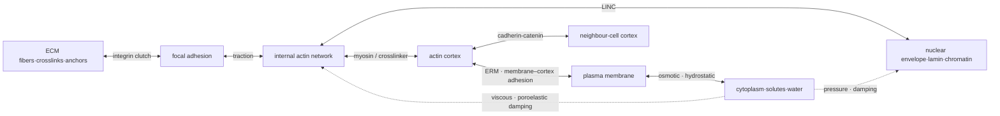

# Cell-mechanics engineering framework (PI, 2026-07-15) — the authoritative build spec

> Verbatim intent captured from the PI. This supersedes the ad-hoc "cortex + nucleus + membrane +
> cytoplasm" list: the cell is organised by **dimension + load-transfer role**, not by material, and
> every force term must be **generated from actual filaments / motor-heads / bonds**, never lumped into
> one effective spring. This is the mechanistic-fidelity rule (CLAUDE.md) made concrete.

## 0′. Engine paradigm (PI clarification, 2026-07-15) — **FEM + CFD at the mesoscale**

The engine is **NOT** a molecular simulator. We do **not** implement ion channels, Na⁺/K⁺ pumps,
mechanosensor conformational cycles, or aquaporin drainage as explicit molecular mechanisms. The thesis
is the opposite: **show that cell behaviour + mechanical properties can be captured at the MESOSCALE —
without descending to the molecular scale.** Two coupled continua/discrete solvers do that:

- **FEM = the FIBER structural network** (fine-grained filaments/bonds/motors/crosslinks). This is the
  part we do well. Under a well-built fiber platform, the "molecular" behaviours (mechanosensing, volume
  regulation, adhesion dynamics) should **EMERGE from fiber movement + fluid flow** — not be hand-coded
  as molecular mechanisms. E.g. mechanosensing = fiber/junction tension crossing a threshold; regulatory
  volume change = osmotic/poroelastic fluid flux redistributing under load. Represent them *well*, do not
  model them *deeply*.
- **CFD = the FLUID** (cytoplasm, plasma membrane as a 2-D fluid shell, osmotic/interstitial water flow,
  and the fluid–structure interaction between the fluid and the fiber network). **This is what we are
  currently doing badly.** Today the cytoplasm is a *lumped* 6πηR drag smeared on cortex nodes + a scalar
  osmotic volume-ratio pressure, and the membrane is a *lumped* inward Laplace tension — there is NO real
  fluid: no velocity/pressure field, no intracellular Stokes/Darcy pore-flow, no membrane in-plane fluid
  flow, no genuine fluid–structure coupling. **"FEM" today means fibers only; the target is a real
  FEM+CFD engine.**

**Consequence for the audit + build:** the priority gap is NOT the missing molecular mechanisms (they
should emerge) — it is the **CFD side: give the cytoplasm and membrane REAL fluid mechanics** (a fluid
domain with velocity/pressure, poroelastic pore-flow, membrane 2-D shell + fluid, two-way FSI with the
fibers), so mesoscale mechanics is expressed faithfully instead of faked by lumped drag/pressure terms.

## 0. Taxonomy — by dimension + load-transfer role (NOT by material)

| Class | Members |
|---|---|
| **3D bulk** | cytoplasm, nucleus, osmotic fluid |
| **2D shells** | plasma membrane, actin cortex, nuclear envelope |
| **1D networks** | actin, microtubules, intermediate filaments, ECM fibers |
| **Discrete connectors** | motors, crosslinkers, integrin, cadherin |
| **Boundary conditions** | ECM anchor points, neighbour cells, external pressure/fluid |

## 1. Governing equation — force balance (cell-scale = inertialess)

At the cell scale inertia is negligible, so the governing law is force **balance**, not acceleration:

    0 ≃ F_elastic + F_active + F_pressure + F_adhesion + F_viscous + F_thermal

Particle level (overdamped Langevin):

    γ_i · ṙ_i = −∇_i U + F_i^active + F_i^thermal

**In `ffn_cellsim` each term is generated from real filaments / motor heads / bonds — NOT collapsed
into a single effective spring.** (This is why we run fine-grained HOOMD/Warp particles, not paper
closed-forms — the closed-forms are acceptance oracles only.)

## 2. The ten mechanical compartments (role · law · state · validation · KB)

1. **Plasma membrane — fluid thin shell.** Helfrich: U_mem = ∫[½κ_m(2H−C₀)² + σ_m]dA + (K_A/2A₀)(A−A₀)².
   κ_m≈0.4–1.2×10⁻¹⁹ J; K_A≈0.24 N/m; T_apparent≈0.03–0.3 mN/m. Soft in bending, VERY stiff in area →
   shape change unfolds reservoir/wrinkles, does not stretch bilayer. Interface = ERM membrane–cortex
   adhesion (NOT a fixed BC, or blebs/tethers can't form). Validate: tether force/radius, area-change
   rate, curvature distribution. **KB-3.B1.1–1.4.**
2. **Actin cortex — active contractile surface network.** ~200 nm sub-membrane actin+xlink+myosin.
   Per-filament U_f = Σ ½k_s(l−l₀)² + Σ (κ_f/2l₀)(θ−θ₀)², κ_f = k_BT·ℓ_p, ℓ_p≈17 µm. γ_cortex =
   γ_passive + γ_myosin but **measured from filaments/xlinks/motors, not imposed.** State: actin density
   / mesh size, filament length/orientation/branch, xlink bound-state, force-bearing myosin-head count,
   membrane–cortex coupling density, cortex turnover. Elastic short-time, fluid past turnover (~30 s,
   **KB-3.13**). ⚠️ *Authoritative caveat:* physiological NMIIA stall × measured myosin density gives
   active tension well BELOW the observed band; buckling/connectivity/axial-extensibility do NOT close
   it → **report tension as f(load-bearing motor density), never tune myosin density to the band.**
3. **Internal cytoskeleton — distributed load frame.**
   - *Actin structures* differ by role: stress-fiber (tension), lamellipodium (Arp2/3 branched
     protrusion), filopodium (parallel-bundle bend/buckle + sensing), cortical (surface tension/pressure).
     Arp2/3 branch = ANGLE-HARMONIC (thermal), not a rigid 72°.
   - *Microtubules*: stiff polar beams, Euler-buckle under compression F_crit ≈ π²κ_MT/L²; + dynamic
     instability, kinesin/dynein transport, centrosome↔cortex coupling.
   - *Intermediate filaments* (keratin/vimentin): tough strain-stiffening tension net between nucleus
     and membrane; distributes load, prevents local→global failure.
   Validate: filament tension/compression distribution, buckling sites, alignment, connectivity,
   retrograde flow, force-chain length.
4. **Myosin + crosslinkers — actuators + dynamic fasteners.** Myosin-II = multi-head bipolar
   minifilament (NOT a "contractile stress term"); head cycle unbound→weak→strong→power-stroke→detached;
   vars: binding rate, force-dependent off-rate, step size, stall force, ATP cycle, backbone compliance;
   **Hill force–velocity, not linear stall.** Crosslinkers = transient bolts, slip-bond
   k_off(F)=k_off,0·exp(F·Δx/k_BT); their bind/unbind gives network viscoelasticity + stress relaxation.
5. **Cytoplasm — dashpot + pressure-transmitting medium.** NOT a uniform viscous fluid — biphasic
   (solvent through cytoskeleton/organelles). Model varies by scale: slow whole-cell = viscoelastic
   fluid; fast local indentation = **poroelastic**; very local = crowded non-Newtonian; water-transport
   = solvent–solid biphasic. MCF7: η≈56 Pa·s, relaxation ~3.2 s; poroelastic D≈40–60 µm²/s
   (**KB-3.B3.1–3.2**). ⚠️ **Do NOT double-count the same dissipation in both particle drag AND a
   background fluid.**
6. **Nucleus — composite shell + internal polymer net.** Nuclear envelope (bend/area shell) + lamin-A/C
   & lamin-B (tensile lamina) + chromatin (internal polymer net) + nucleoplasm (viscous medium) + LINC
   (nucleus↔cytoskeleton force transfer). Small strain → chromatin; large strain/stiffening → lamin-A/C.
   E_nuc ≈ 1–10 kPa (method-dependent). Often the largest steric bottleneck in pore transit; over-strain
   → envelope rupture + DNA damage. Validate: aspect ratio, strain rate, envelope tension, pore transit
   time, rupture threshold (**KB-3.B2.1–2.3**).
7. **Volume / osmotic compartment — the PRE-STRESS generator.** Internal pressure is NOT an optional
   add-on at 0 — it sets the physiological baseline. dV/dt = L_p·A(ΔΠ − ΔP); sphere ΔP ≈ 2γ/R. ⚠️ **Do
   NOT re-add ΔP's Young–Laplace partner as an independent "passive cortex tension" — double-counts the
   same pre-stress.** Observe: volume, pressure, membrane tension, water flux, bleb growth.
8. **Cell–ECM adhesion — force-dependent molecular clutch.** Series device
   actin→talin/vinculin→integrin→ECM-ligand→ECM-fiber (NOT a fixed spring). State: integrin
   conformation, ligand binding, talin unfolding, vinculin recruitment, clutch displacement/force.
   P_break = 1−exp[−k_off(F)Δt]; slip OR catch–slip per integrin. Per-clutch few–tens pN; mature FA
   ~1–10 nN. Output: traction map, clutch-force distribution, retrograde flow, FA growth/collapse, ECM
   strain (**KB-2.1–2.3, KB-2.12**).
9. **Cell–cell junction — series link between two active cortices.** actin_A→α-cat→β-cat→E-cad_A ↔
   E-cad_B→…→actin_B. E-cadherin trans-bond is a **catch-bond** k_off(F)=k_s·e^{F/F_s}+k_c·e^{−F/F_c};
   α-catenin unfolds ~5–10 pN (mechano-switch exposing vinculin site). A junction is an ACTIVE interface
   coupling neighbour cortical tension + rearrangement, not a scalar adhesion. Validate: junction
   tension, contact angle, cadherin density/lifetime, sliding velocity (**KB-4.1–4.3, KB-4.18**).
10. **ECM — part of the whole mechanical circuit, not an external substrate.** Fibers + bend + axial
    stiffness + crosslinks + anchors. U_ECM = U_stretch + U_bend + U_xlink + U_EV. Collagen =
    bend-dominated at low strain, strain-stiffens via alignment + fiber-tension transition; compressed
    fibers buckle → replacing ECM by a uniform linear substrate loses directional force transfer +
    long-range force chains. Validate: G₀, critical strain, differential modulus, alignment,
    crosslink connectivity, traction decay (**KB-1.1–1.3, KB-1.15**).

## 3. Double-counting pitfalls (the integration hazards)

- membrane tension + cortex tension merged into one surface tension, then both added again
- turgor's Young–Laplace partner re-added as a separate passive tension
- an active-stress term on top of explicit actin/myosin forces
- cytoplasm viscosity applied in BOTH particle drag AND a background fluid
- explicit integrin clutches AND a fixed FA boundary condition together
- an explicit ECM fiber net AND a separate continuum substrate elasticity in the same direction

## 4. Production initial condition — a PRE-STRESSED physiological state

The production baseline is **NOT a force-free relaxed cell**: it is a pre-stressed equilibrium with
physiological osmotic pressure, membrane–cortex coupling, real cytoplasm viscosity, an attached ECM,
and basal adhesion **all ON**. Only from that equilibrium do we perturb myosin / adhesion / external
stimulus so that each compartment's contribution is physically interpretable. (= CLAUDE.md
physiological-baseline HARD rule, expressed as a whole-cell force-balance state.)
