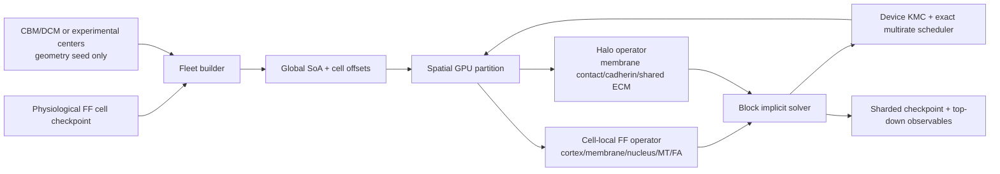

# FF Fleet vNext 계획서 — N=1000 spheroid 2D spreading

**문서 상태:** IMPLEMENTATION PLAN — 코드 변경 전 계약서

**작성일:** 2026-07-14

**기준 브랜치 / 커밋:** `dcm/main` / `dc25d528b5f1f10d922c6c912803fae1da1f43c7`

**대상 엔진:** `aleph/laws/` — full-fidelity filament-FEM + device KMC

**목표:** 1,000개의 완전한 FF cell이 compact spheroid에서 시작해 substrate 위에서 2D로 spreading하는 collective run

**우선 완료선:** 물리 수렴이 확인된 mesoscopic N=1000을 8-GPU cloud node에서 real-time 또는 그 이상으로 실행

**최종 완료선:** native N=1000 offline production과, native real-time의 별도 rack-scale feasibility 판정

**대체 대상:** `ENGINE_ACCELERATION_PLAN_2026-07-07.md`의 FF 부분을 확장·수정한다. DCM 부분은 대체하지 않는다.

---

## 0. 결론

N=1000 FF spreading은 **지금의 코드를 그대로 큰 GPU에 올려서는 실행할 수 없다.** 그러나 아래의
구조 변경을 완료하면 현실적인 목표다.

1. **Mesoscopic N=1000:** 한 대의 8×B200/H200급 노드에서 현실적으로 가능하며, real-time
   (`simulated_seconds / wall_seconds >= 1`)을 첫 성능 목표로 둔다.
2. **Native N=1000:** 분산 FF 엔진이 완성되면 offline production은 가능하다. 단일 8-GPU 노드의
   real-time 목표는 현재 계측으로 정당화되지 않으며, multi-node/rack-scale 과제로 분리한다.
3. **런타임 hybrid는 채택하지 않는다.** CBM/DCM은 초기 cell-center 배치와 독립 비교 oracle로만
   사용할 수 있다. 전개 중 세포 내부, cell-cell contact, junction, substrate coupling은 모두 FF의
   명시적 입자/요소/KMC 상태로 계산한다.

이 계획의 본질은 GPU 구매가 아니라 **single-cell FF를 distributed FF fleet engine으로 바꾸는 것**이다.

---

## 1. 변경 불가 계약

### 1.1 물리 fidelity

- 모든 actin filament, myosin head/minifilament, crosslink, FA clutch, membrane element,
  E-cadherin trans-dimer, ECM crosslink는 명시적 상태로 남긴다.
- DCM의 active area-growth term, continuum surface tension, node-node cohesion, CBM의 cell-level
  force law를 FF runtime에 넣지 않는다.
- 빠른 solver, batched data layout, matrix-free operator, spatial partition, exact multirate는 허용한다.
  이는 자유도를 없애지 않고 동일한 방정식을 더 효율적으로 푸는 변경이다.
- active/inactive cell LOD, homogenized junction patch, representative filament bundle, continuum
  cortex proxy는 허용하지 않는다.
- cell division은 이번 N=1000 spreading의 필수 범위가 아니다. 시작 시점에 N=1000을 구성한다.
  division을 추가할 때에는 spindle, cortex remodeling, membrane topology change를 명시적으로 다루는
  별도 PI-ratified 계획이 필요하다.

### 1.2 생리적 baseline

- 각 cell은 production run 시작 전에 cytoplasm viscosity, osmotic pressure/turgor, membrane area
  reservoir, cortex prestress, nucleus, MT, FA/clutch, ECM anchoring을 생리적 operating point에 둔다.
- 편의를 위한 zero-turgor, water-viscosity, relaxed bag, unanchored ECM 시작은 금지한다.
- compact spheroid에서 발생하는 초기 overlap은 임의 soft relaxation으로 지우지 않는다. 명시적
  membrane steric contact와 junction kinetics가 활성화된 FF 상태에서 해소한다.

### 1.3 수치·검증

- 새 physics/numerics module의 첫 실행 전 Sanity Gate 문서를 쓴다.
- gate tolerance는 결과를 통과시키기 위해 고르지 않는다. 기존 solver tolerance, machine precision,
  측정 불확실성 또는 사전 등록한 ensemble uncertainty에서 유도한다.
- 단순히 wall-time을 줄이려고 CG residual, KMC event, contact candidate 또는 filament를 버리지 않는다.
- bit parity가 수학적으로 불가능한 reduction/RNG 변경은 동일 fixed-seed trajectory가 아니라 사전 등록한
  distributional equivalence로 검증한다.

### 1.4 P0에서 ratify해야 하는 현재 계약 충돌

이 문서는 최신 active `ff/` 코드의 방향을 따라 **Warp/CuPy implicit filament-FEM + device KMC**를
vNext runtime으로 제안한다. 그러나 저장소의 상위 hard contract에는 여전히 **HOOMD-blue explicit
particle/bond dynamics + custom BAOAB-limit integrator**가 initial framework의 runtime이라고 적혀 있다.
두 설명을 동시에 authoritative라고 둘 수 없다.

| 충돌 | 현 상태 | 이 계획의 제안 |
|---|---|---|
| runtime integrator | `AGENTS.md`: HOOMD/BAOAB; `ff/ENGINE.md`: MD-free implicit FF | 개별 자유도·constitutive law·KMC를 보존하는 implicit FF를 ratify하거나, 거부 시 본 계획을 HOOMD fleet로 다시 산정 |
| coarse-graining | 상위 계약: ×40만 허용; active FF 문서 일부: ×40은 conclusion에서 retired | ×40은 P6 bring-up/수렴점으로만 사용하고 conclusion 권한은 P5 후 PI가 결정 |
| native density | 약 38k와 70,686이 공존 | P7 전 하나의 Parameter/ModelContract로 통일 |

따라서 P1 이후의 구현을 authoritative production engine으로 승격하기 전에 PI가 첫 행을 명시적으로
ratify해야 한다. ratification 전 작성되는 P1 prototype은 architecture proof이지 production 승인본이 아니다.

---

## 2. 현재 상태와 실제 blocker

### 2.1 현재 가능한 것

- 단일 cell FF는 Warp/CuPy GPU path에서 cortex, membrane, nucleus, MT, FA, polymerization,
  motility, ECM coupling까지 실행한다.
- `aleph/laws/implicit_ff.py`는 현재 구성의 bending + crosslink stiffness를 매 step CuPy CSR로
  조립하고 device CG로 푼다.
- `aleph/laws/membrane_surface.py`에는 triangulated membrane, Skalak in-plane elasticity,
  Helfrich bending, volume force, ERM tether가 있다.
- archived H.4 junction에는 한 cadherin당 최대 한 개의 trans-dimer를 갖는 full Rakshit catch-bond
  KMC 계약이 있다. 이는 새 Warp 구현의 physics reference이지 runtime import 대상은 아니다.
- 현재 단일-cell A5000 run의 실제 속도는 workload에 따라 대략 real-time의 0.05–0.61배다.
  근거 artifact는 `outputs/ff/figs/{hour1,ff_ecm_s6_twoway,ff_dev_S1_native}.json`의 `wall_s`와
  이를 생성한 crawl driver의 timestep/run horizon이다. 따라서 N을 1,000배 늘리고 GPU만 8배
  늘리는 식의 선형 외삽으로는 충분하지 않다.

### 2.2 현재 불가능한 것

| blocker | 코드 증거 | 결과 |
|---|---|---|
| fleet state 부재 | hot path가 한 cell의 arrays를 직접 소유 | Python cell loop 또는 1,000개 process가 필요해짐 |
| multi-GPU 부재 | `cuda:0` 단일 device 관례, MPI/NCCL domain decomposition 없음 | 8×B200 HBM/compute를 한 run에 사용할 수 없음 |
| per-step sparse assembly | `assemble_K_current_cupy()`가 COO→CSR을 매 step 생성 | N이 커지면 allocator/assembly/SpMV가 지배 |
| 무전처리 CG | `ff_implicit_step_gpu()`가 unpreconditioned CG | native cell에서 113–171 iterations가 이미 관측됨 |
| collective contact 부재 | FF의 soft contact는 주로 node-node/local network 용도 | membrane끼리 접촉하는 spheroid를 표현하지 못함 |
| FF cadherin fleet 부재 | explicit cadherin 구현은 archive HOOMD에만 존재 | junction을 FF runtime에서 유지할 수 없음 |
| distributed checkpoint/I/O 부재 | 단일 run-oriented scripts | spot preemption, multi-rank restart 불가 |
| resolution contract 충돌 | 문서상 native 약 38k filament, 현재 default 70,686 | native N1000의 크기와 완료 정의가 불명확 |
| branch/SoT drift | DCM active spreading commit `1cb927c`는 `ff/kim-repro`에만 포함, CBM은 별도 worktree | 기준 결과와 코드 계보가 일치하지 않음 |

### 2.3 기존 가속 계획에서 폐기할 항목

`ENGINE_ACCELERATION_PLAN_2026-07-07.md`의 FF Jacobi 1.5–3× 예상은 최신 계측으로 superseded다.
현재 `implicit_ff.py`의 주석과 계측은 diagonal Jacobi가 iteration을 오히려 늘린다고 기록한다.
따라서 본 계획은 Jacobi를 구현 milestone으로 두지 않는다. 후보는 다음과 같다.

- topology-aware block incomplete Cholesky 또는 sparse approximate inverse;
- cell-local additive Schwarz;
- membrane/cortex/nucleus/MT block decomposition;
- inter-cell contact/junction을 분리한 Schur complement 또는 outer Krylov.

후보는 동일 operator/tolerance에서 iteration, time-to-solution, memory를 계측한 뒤 선택한다.

---

## 3. 문제 크기 계약

현재 저장소에는 두 개의 native 정의가 공존한다.

| 해상도 | filament/cell | 대략적 node/cell | N=1000 총 node | 지위 |
|---|---:|---:|---:|---|
| 기존 ×40 mesoscale | 1,000 | 약 10,000 | 약 10 million | 유일하게 과거 명시 승인된 coarse-graining |
| current-native/40 | 약 1,767 | 약 15,000 | 약 15 million | sizing probe; 자동 승인 아님 |
| cloud convergence probes | 2k–5k | 약 17k–38k | 약 17–38 million | 수렴 사다리의 중간점; tuning 값 아님 |
| 문서 native | 약 38,000 | 약 270,000 | 약 270 million | 과거 native 계약 |
| 코드 default native | 70,686 | 약 498,000 | 약 498 million | `CortexParams`의 현재 문헌밀도 구현 |

위 node 수는 capacity planning estimate이며 acceptance datum이 아니다. P0에서 실제 arrays,
topology, membrane/cadherin/ECM state를 포함한 bytes/cell을 측정한다.

**PI 결정 전까지:**

- mesoscopic production은 1,000 filament/cell을 첫 bring-up point로 사용한다.
- 2k, 5k, 10k, 20k, native는 물리 수렴 사다리다.
- native 완료를 선언하기 전에 38k와 70,686 중 authoritative 정의를 하나로 정하고 Notion
  ModelContract/Parameter와 코드 default를 동시에 맞춘다.

---

## 4. 목표 아키텍처



핵심 설계는 **한 cell = 한 Python object**가 아니라, 모든 cell의 같은 종류 자유도를 연결한
global structure-of-arrays(SoA)와 cell-offset tables다. 물리는 cell별로 분리하지 않지만, solver의
preconditioner와 GPU ownership은 cell-local block을 활용한다.

---

## 5. 코드 변경 명세

새 코드는 `aleph/laws/fleet/` 아래에 한 파일 한 개념으로 추가한다. 기존 single-cell API는 parity
oracle 및 dev path로 유지한다.

### 5.1 data model과 build

| 새 파일 | 책임 |
|---|---|
| `ff/fleet/state.py` | typed global SoA, `cell_id`, `compartment_id`, element owner, offsets, generation counters |
| `ff/fleet/layout.py` | filament/node/triangle/bond/event index ranges와 packing/unpacking 계약 |
| `ff/fleet/builder.py` | validated single-cell components를 N-cell pooled arrays로 생성 |
| `ff/fleet/init_spheroid.py` | compact spheroid center/axis seed를 FF cells로 변환 |
| `ff/fleet/physiology.py` | 시작 전 compartment별 physiological setpoint audit |
| `ff/fleet/device.py` | local-rank 기반 device discovery; hard-coded GPU ID 금지 |

`FleetState`가 최소한 명시적으로 소유할 상태:

- position, previous position, force, mobility/drag, node type, cell/compartment ownership;
- filament offsets, segment rest length, bending triples, polarity, branch angles;
- crosslink/myosin/Hand endpoints, contour coordinates, kinetic state, event counters;
- membrane vertices/faces/edges/rest metric, Helfrich/Skalak/volume state, ERM tethers;
- nucleus mesh, lamina/LINC/MT endpoints;
- integrin/FA clutch state, substrate/ECM attachment state;
- cadherin particle, trans-dimer endpoint, spring rest length, catch-state and RNG counter;
- ECM nodes/elements/crosslinks and partition ownership;
- per-cell physiological parameter IDs and immutable config hash.

hot path에는 cell별 Python loop, Python object allocation, host-side KDTree를 두지 않는다.

### 5.2 명시적 cell-cell contact

| 새 파일 | 책임 |
|---|---|
| `ff/fleet/broadphase.py` | cell AABB + uniform grid/Morton broad phase, 인접 cell pair 생성 |
| `ff/fleet/membrane_contact.py` | membrane vertex–triangle narrow phase와 equal/opposite barycentric force |
| `ff/fleet/contact_ccd.py` | step 중 triangle crossing을 막는 numerical safety guard |
| `ff/fleet/halo.py` | partition boundary의 membrane/contact state 교환 |

물리는 DCM의 aggregate penalty가 아니라 명시적 membrane steric exclusion이다.

- membrane thickness/element resolution에서 유도된 WCA/LJ-repulsive law를 vertex–triangle gap에 적용한다.
- vertex force의 반대 힘을 triangle vertices에 barycentric weight로 분배해 선형·각운동량을 보존한다.
- two-sided candidate를 canonical pair ID로 deduplicate한다.
- CCD는 crossing 방지용 수치 guard이며 접촉 force를 대체하지 않는다.
- self-contact와 inter-cell contact를 구분하되 동일한 steric law를 사용한다.
- broad-phase skin은 누락이 없음을 displacement bound로 증명하고, overflow는 silent clip이 아니라 hard fail이다.

DCM의 closest-point/CCD 구현은 geometry algorithm reference로 포팅할 수 있지만 DCM force term이나
state를 호출하지 않는다.

### 5.3 명시적 E-cadherin junction

| 새 파일 | 책임 |
|---|---|
| `ff/fleet/cadherin_state.py` | membrane-associated cadherin particles와 one-dimer occupancy |
| `ff/fleet/cadherin_force.py` | trans-dimer elastic force, Newton pair accumulation |
| `ff/fleet/cadherin_kmc.py` | full Rakshit sliding-rebinding catch-slip off-rate + bind KMC |
| `ff/fleet/cadherin_neighbors.py` | free cadherin capture 후보를 GPU에서 생성 |

archive의 `junction/cadherin.py`를 그대로 import하지 않고 physics contract를 Warp/device arrays로
재구현한다.

- 한 cadherin은 동시에 최대 한 trans-dimer만 형성한다.
- force sharing은 patch-level rule이 아니라 개별 trans-dimer들의 실제 force에서 emergent해야 한다.
- `p = 1-exp(-k*Δt_event)`를 사용하며 batch interval은 kinetic CFL에서 유도한다.
- contact가 끊긴 뒤 dimer를 임의 latch time 동안 유지하지 않는다.
- cadherin 수와 membrane density는 검증된 Parameter/SourceEvidence에서만 가져온다.
- archived validator/oracle은 runtime import가 아니라 독립 acceptance oracle로 유지한다.

### 5.4 matrix-free FF operator와 block solver

| 새 파일 | 책임 |
|---|---|
| `ff/fleet/operator.py` | element별 `K·p`를 CSR materialization 없이 계산 |
| `ff/fleet/operator_terms.py` | bending/WLC/link/volume/membrane/contact/junction 항별 operator |
| `ff/fleet/preconditioner.py` | topology-aware cell/compartment blocks |
| `ff/fleet/solver.py` | inner block solve + inter-cell outer solve, residual/guard 관리 |
| `ff/fleet/workspace.py` | persistent GPU buffers와 allocation-free iteration |

구현 원칙:

1. fixed topology의 bending, membrane edge/face, ERM, nucleus/MT index는 한 번 build한다.
2. crosslink, KMC bond, contact candidate처럼 바뀌는 sparse topology만 generation counter로 갱신한다.
3. `K·p`를 element kernel에서 직접 accumulate한다. 매 step COO→CSR은 parity/reference path로만 남긴다.
4. 우선 single-cell matrix-free result를 현재 assembled CSR과 같은 tolerance에서 비교한다.
5. preconditioner는 block별 실측 condition을 사용해 선택한다. failed Jacobi를 다시 기본값으로 넣지 않는다.
6. `pAp` floor, non-finite, residual growth, max-iteration guard는 host sync를 줄여도 유지한다.
7. contact/junction coupling을 outer Krylov/Schur block으로 분리해도 최종 residual은 전체 coupled equation에
   대해 평가한다.

초기 후보 순서:

1. per-cell additive Schwarz + cell-local IC(0)/block factorization;
2. cortex/membrane/nucleus/MT sub-block triangular preconditioner;
3. contact graph coarse correction;
4. multi-GPU에서 communication-avoiding outer Krylov.

후보 채택 기준은 iteration 감소가 아니라 **동일 residual까지의 wall-time과 HBM**이다.

### 5.5 device KMC와 exact multirate

| 새 파일 | 책임 |
|---|---|
| `ff/fleet/rng.py` | counter-based RNG `(run, cell, object, event_epoch)` |
| `ff/fleet/events.py` | myosin/xlink/cadherin/FA/polymerization event queue |
| `ff/fleet/multirate.py` | force/event timescale별 update schedule와 error estimator |

- RNG는 rank나 GPU 수가 바뀌어도 물리 object ID에 대해 재현 가능해야 한다.
- event-free interval은 rate upper bound에서 유도하고, load가 바뀌면 bound를 갱신한다.
- slow compartment를 덜 자주 update할 수 있지만 자유도와 constitutive law는 그대로 둔다.
- active-set 판단은 이전 step의 속도가 아니라 force/residual/event hazard bound로 한다.
- 최종 monolayer처럼 모든 cell이 active한 구간도 별도 benchmark한다. interior-inactive 가정에 기대어
  real-time을 주장하지 않는다.

### 5.6 multi-GPU 분산

| 새 파일 | 책임 |
|---|---|
| `ff/fleet/partition.py` | spatial/Morton ownership과 cost-weighted repartition |
| `ff/fleet/distributed.py` | one process/GPU, MPI bootstrap, NCCL/RDMA-capable array exchange |
| `ff/fleet/migration.py` | cell/ECM elements가 partition을 넘을 때 state migration |
| `ff/fleet/reduction.py` | deterministic/compensated global observables와 solver reductions |

분할 단위는 기본적으로 whole cell이지만, native cell 한 개의 block solve가 한 GPU를 과도하게 점유하면
membrane/ECM halo와 cell-internal block을 분리하는 2단 분할을 허용한다. 첫 구현에서는 whole-cell ownership이
state migration과 KMC ownership을 단순화한다.

- contact graph cut와 element count를 함께 고려해 repartition한다.
- shared ECM은 spatial ownership을 사용하고 FA endpoint는 halo reference를 갖는다.
- 통신은 membrane boundary, free cadherin candidate, shared ECM halo, outer-solver vector에 한정한다.
- global position gather는 visualization/checkpoint cadence에만 허용한다.
- rank failure/preemption 후 sharded checkpoint에서 GPU 수를 바꾸어 재시작할 수 있어야 한다.

### 5.7 checkpoint, metrics, scripts

| 새 파일 | 책임 |
|---|---|
| `ff/fleet/checkpoint.py` | rank-sharded full-state save/load, schema version, config/commit hash |
| `ff/fleet/metrics.py` | A/A0, height, V/V0, traction, contact, junction, tension channels |
| `ff/fleet/profiler.py` | operator/KMC/contact/comm/I/O별 wall-time과 bytes |
| `scripts/ff_fleet_spread.py` | production CLI |
| `scripts/ff_fleet_bench.py` | strong/weak scaling과 memory dry-run |
| `scripts/ff_fleet_convergence.py` | resolution/seed ladder |
| `scripts/ff_fleet_restart.py` | checkpoint integrity/repartition test |

checkpoint에는 위치만 저장하지 않는다. filament contour/rest length, all KMC occupancy, RNG counters,
membrane rest metric, ERM, FA maturation, ECM remodeling, solver generation counters를 모두 저장한다.

---

## 6. 초기 spheroid 생성 계약

### 6.1 허용되는 초기화

- experimental segmentation 또는 validated CBM/DCM packing에서 **cell center와 orientation만** 가져올 수 있다.
- 각 center에 동일한 production-grade FF resting-cell checkpoint를 clone하지 않고 seed별 explicit
  architecture를 생성한다.
- cell type/zone 차이가 필요하면 사전 등록된 parameter preset으로 생성한다.
- junction과 contact가 활성화된 full FF에서 physiological equilibration을 수행한다.

### 6.2 금지되는 초기화

- CBM/DCM의 cell pressure, surface force, active T2/T3 force를 FF node force로 복사;
- 겹침을 제거하기 위한 근거 없는 radius shrink 또는 temporary soft potential;
- 모든 cell에 같은 RNG realization을 복제;
- substrate/ECM을 나중에 켜는 방식;
- equilibration 후 rest configuration을 현재 변형 상태로 덮어써 prestress를 지우는 방식.

### 6.3 시작 gate

spreading clock `t=0` 전에 다음을 기록한다.

- cell별 V/V0, membrane area reserve, turgor, cortex tension channel, nucleus deformation;
- contact penetration/gap distribution과 cadherin bound fraction;
- FA/clutch bound state와 substrate/ECM prestress;
- net force/torque, solver residual, compartment별 energy;
- cell별 physiological config hash.

이 baseline이 gate를 통과하기 전에는 spreading trajectory로 계산하지 않는다.

---

## 7. 구현 단계와 gate

### P0 — 계보 고정, 계약 정리, baseline profile

**변경**

- `dcm/main`, `ff/kim-repro`, `dcm/cbm-hybrid`의 branch ancestry와 산출물 commit을 정리한다.
- `1cb927c` DCM spreading 결과가 어떤 branch의 어떤 코드로 생성됐는지 dashboard와 disk에 맞춘다.
- native filament count 38k vs 70,686을 PI decision item으로 등록한다.
- A5000에서 current native single-cell profile을 operator/assembly/CG/KMC/contact/I/O로 분해한다.
- 실제 bytes/node, bytes/filament, bytes/cell과 peak workspace를 측정한다.

**gate**

- 모든 benchmark artifact가 commit/config/device/seed를 기록한다.
- 현재 single-cell output과 restart가 재현된다.
- branch/Notion status가 같은 commit을 가리킨다.

**stop condition**

- 기준 commit을 특정할 수 없거나 native 정의가 capstone 전에 정해지지 않으면 native P7을 시작하지 않는다.

### P1 — single-GPU FleetState

**변경**

- N=1을 `FleetState`로 재구성하고 current single-cell path와 parity를 맞춘다.
- N=2, 8, 64를 한 GPU의 pooled SoA로 실행한다.
- device buffer allocation을 initialization/repartition 시점으로 제한한다.

**gate**

- N=1 force/operator/KMC/observable parity.
- cell order permutation 후 label-restored observables invariant.
- N개의 멀리 떨어진 cell이 N개의 독립 single-cell 결과와 일치.
- memory가 측정된 linear model을 따르며 hidden host copy가 없음.

### P2 — explicit contact + cadherin

**변경**

- membrane vertex–triangle steric contact, CCD, explicit E-cadherin trans-dimer를 추가한다.
- two-cell 접근/접착/분리 protocol을 device에서 실행한다.

**gate**

- contact pair의 net force와 torque conservation.
- candidate-list brute-force parity at small N.
- no-tunnelling/penetration bound가 timestep/contact law에서 유도한 범위 안.
- single-dimer force–extension과 catch-bond lifetime가 KU-4.2 oracle과 일치.
- one-cadherin/one-dimer occupancy invariant.
- zero-cadherin, zero-contact, far-separated boundary cases PASS.

### P3 — matrix-free block solver

**변경**

- current CSR assembly를 matrix-free element operator로 대체한다.
- persistent workspace와 selected block preconditioner를 추가한다.

**gate**

- 항별 `K·p`가 assembled CSR와 solver tolerance-derived bound 안에서 일치.
- 전체 step의 coupled residual과 energy descent/invariants가 reference와 일치.
- Jacobi, IC/block, Schwarz 후보의 time-to-solution/HBM 표를 남긴다.
- 실패 guard를 강제로 발동하는 regression tests PASS.

**go/no-go**

- matrix-free가 production-size에서 assembly+solve wall-time을 줄이지 않으면 원인을 profile해
  operator를 채택하지 않는다. fidelity가 아니라 구현 경로를 재설계한다.

### P4 — multi-GPU weak/strong scaling

**변경**

- 2, 4, 8 GPU에서 spatial partition, halo, migration, distributed reductions를 실행한다.
- GPU count-independent restart를 구현한다.

**gate**

- partition boundary를 이동해도 force/contact/KMC 통계가 invariant.
- 1-GPU와 multi-GPU가 동일 coupled residual에 도달.
- global force/torque conservation.
- checkpoint를 8→4→8 GPU로 재시작해 state completeness 확인.
- N=8/64/256/1000에서 compute, communication, idle, imbalance를 별도로 보고.

고정된 임의 scaling-efficiency threshold는 두지 않는다. P0의 roofline/bytes 모델과 cloud cost cap에서
필요한 최소 throughput을 사전 계산하고 그 값을 gate contract로 등록한다.

### P5 — mesoscopic 해상도 수렴

**변경**

- 동일 physical spheroid에 대해 filament/cell = 1k, 2k, 5k, 10k, 20k, native ladder를 실행한다.
- 각 점은 독립 architecture seeds를 사용한다.

**관찰량**

- top-down projected `A/A0(t)`, radius, height, V/V0;
- traction map과 radial traction profile;
- cortical tension의 passive/active/turgor channels;
- FA bound fraction, force/clutch, maturation lifetime;
- contact area/gap/pressure distribution과 cadherin bound/lifetime distribution;
- cell speed/persistence, neighbor exchange, seed variance;
- ECM strain/remodeling과 force propagation.

**gate**

- 1k를 승인된 mesoscale로 사용하는 것과, 결과가 native-converged라고 주장하는 것을 구분한다.
- minimum resolution은 연속 ladder의 observable convergence가 ensemble uncertainty/measurement
  uncertainty보다 작아지는 첫 점으로 정한다.
- tolerance와 observable priority는 run 전에 등록한다.
- 기존 γ_rigid convergence만으로 spreading convergence를 주장하지 않는다. 최신 native-density에서
  crosslink prestress가 filament density에 따라 변한 결과를 반드시 포함한다.

### P6 — N=1000 mesoscopic production

**변경/실행**

- compact physiological spheroid → substrate attachment → 2D spreading을 8×B200/H200 한 노드에서 실행.
- real-time 목표와 all-active late spreading 구간을 모두 계측.
- spot/flex preemption을 checkpoint/restart로 견딘다.

**production gate**

- physiological baseline audit PASS.
- P1–P5 validation gate PASS.
- `simulated_seconds / wall_seconds >= 1`을 목표로 보고하되, 미달 시 물리 결과 자체를 gate-loosen하지 않는다.
- 최소 seed 수는 사전 power/uncertainty analysis로 정한다.
- A/A0, height, V/V0, traction, tension, junction/contact, seed trajectories를 모두 시각화한다.

### P7 — native pilot와 N=1000 offline capstone

**순서**

1. native N=1 reference;
2. native N=8 contact/junction;
3. native N=32 partition/solver pilot;
4. memory/throughput model을 갱신;
5. native N=1000 offline production을 승인된 node 수로 실행.

**gate**

- native definition과 parameter SoT 일치.
- mesoscopic conclusion의 방향과 native pilot의 차이를 정량 보고.
- HBM dry-run과 checkpoint bandwidth가 production horizon을 감당.
- 비용 상한과 최대 wall-time을 PI가 run 전에 승인.

native capstone은 real-time을 완료 조건으로 두지 않는다. 실제 physical horizon을 완료하고 모든 state를
checkpoint/restart하며 검증 산출물을 남기는 것이 완료 조건이다.

### P8 — native real-time 연구 경로

P7 profile에서 다음을 계산한 뒤에만 시작한다.

- required GPU count = measured all-active work / target wall-time;
- contact graph communication과 solver global reduction의 strong-scaling ceiling;
- multi-node HBM, RDMA, checkpoint storage와 비용.

필요량이 한 8-GPU node를 넘으면 GCP A4 multi-node 또는 Azure GB200 NVLink domain 같은 rack-scale
실행으로 분리한다. 이는 P6/P7의 blocker가 아니다.

---

## 8. 테스트 추가 목록

`aleph/tests/ff/fleet/`에 다음을 추가한다.

| test | 핵심 검증 |
|---|---|
| `test_layout.py` | offsets, owner IDs, empty/single/mixed compartments |
| `test_fleet_n1_parity.py` | current single-cell force/state/observable parity |
| `test_permutation.py` | cell/element ordering invariance |
| `test_membrane_contact.py` | closest point, equal/opposite force, torque, sign-sense |
| `test_contact_candidates.py` | brute-force candidate completeness, overflow hard fail |
| `test_contact_ccd.py` | high-speed crossing boundary case |
| `test_cadherin_kmc.py` | KU-4.2 force-lifetime, occupancy, bind/unbind boundaries |
| `test_operator_terms.py` | termwise matrix-free `K·p` vs assembled reference |
| `test_solver_guards.py` | pAp/non-finite/divergence/maxiter guards |
| `test_partition.py` | halo completeness and partition-boundary invariance |
| `test_rng.py` | rank/GPU-count independent counter streams |
| `test_checkpoint.py` | all kinetic/rest/mesh state round trip |
| `test_gpu_count_equivalence.py` | 1/2/4 GPU residual and statistical equivalence |
| `test_physiology_audit.py` | null/default baseline rejection |

GPU integration tests는 RTX A5000 이상에서 실행한다. CPU는 geometry/unit/dev reference일 뿐 production
gate를 대신하지 않는다.

---

## 9. 성능 계측과 모델

### 9.1 반드시 기록할 지표

- simulated seconds / wall second;
- node-, element-, contact-, KMC-event throughput;
- CG/outer iteration distribution과 residual;
- sparse assembly 또는 matrix-free operator wall-time;
- HBM state/workspace/peak allocation;
- halo bytes, messages, global reductions, repartition cost;
- GPU utilization, memory bandwidth, kernel occupancy;
- active-cell fraction과 all-active step cost;
- checkpoint bytes and sustained write/read throughput;
- cloud $/simulated hour와 $/production trajectory.

### 9.2 현실적 사전 범위

현재 A5000 단일-cell 계측과 문제 크기로부터의 **engineering inference**는 다음과 같다.

- mesoscopic N=1000은 약 10–38 million nodes 범위에서 시작하며 8×B200/H200 한 노드의 HBM에는
  현실적으로 들어갈 가능성이 높다. 실제 가능 여부는 P0 bytes/cell dry-run이 결정한다.
- native N=1000은 native 정의에 따라 약 0.27–0.50 billion nodes다. state만이 아니라 solver vectors,
  topology, contact candidates, KMC arrays를 포함하므로 multi-node가 필요할 수 있다.
- current engine을 그대로 선형 확대하면 native N=1000은 real-time이 아니다. matrix-free/block solve,
  multirate, domain decomposition 후의 all-active profile로만 비용을 다시 산정한다.

이 범위는 acceptance gate가 아니며 cloud reservation 전에 반드시 최신 benchmark로 대체한다.

---

## 10. Cloud 실행 계획

2026-07-14 기준 첫 선택은 **GCP A4-highgpu-8g**다.

- 8×NVIDIA B200, GPU당 180 GB HBM, 총 1.44 TB HBM;
- GPU all-to-all NVLink와 최대 3.6 Tbps network;
- reservation, Spot, Flex-start provisioning을 지원한다.

대안:

- GCP A3 Ultra: 8×H200, GPU당 141 GB;
- AWS P6-B200: 8×B200, 총 1.44 TB, EFA 최대 3.2 Tbps;
- Azure ND GB200-v6: VM당 4×GB200 192 GB, rack-scale GB200 fabric가 필요할 때 후보.

공식 사양/가격 출처:

- [Google Cloud accelerator-optimized machine documentation](https://docs.cloud.google.com/compute/docs/accelerator-optimized-machines?hl=en)
- [Google Cloud accelerator pricing](https://cloud.google.com/products/compute/pricing/accelerator-optimized)
- [AWS EC2 P6-B200 announcement](https://aws.amazon.com/about-aws/whats-new/2025/05/amazon-ec2-p6-b200-instances-nvidia-b200-gpus/)
- [AWS Capacity Blocks pricing](https://aws.amazon.com/ec2/capacityblocks/pricing/)
- [Azure ND GB200-v6 specification](https://learn.microsoft.com/en-us/azure/virtual-machines/sizes/gpu-accelerated/nd-gb200-v6-series)

가격과 availability는 provisioning 직전에 다시 확인한다. P0/P1은 A5000에서 개발하고, P4부터 cloud
8-GPU node를 사용한다. cloud launcher는 device ID를 하드코딩하지 않고 scheduler local rank를 따른다.

### Cloud artifact

- immutable container/lockfile with Python 3.13.13, Warp/CuPy/MPI/NCCL versions;
- machine-readable run manifest;
- startup capacity/memory dry-run;
- periodic sharded checkpoint와 object-store upload;
- graceful preemption handler;
- benchmark/production cost receipt.

Cloud bill을 줄이기 위한 Spot 사용은 허용하지만 checkpoint cadence는 measured preemption/storage cost로
정한다. 임의 cadence를 magic number로 두지 않는다.

---

## 11. 산출물과 visualization

산출물 경로:

```text
aleph/outputs/ff_fleet/
├── p0_baseline/
├── p1_fleet_parity/
├── p2_contact_cadherin/
├── p3_solver/
├── p4_scaling/
├── p5_resolution/
├── p6_n1000_mesoscale/
└── p7_n1000_native/
```

각 milestone은 config, manifest, raw metrics, checkpoint index, `REPORT.md`, `figs/`를 갖는다.
기존 hard rule에 따라 `aleph/scripts/h1_h2_vis.py`를 FF-fleet mode로 확장하여 한 entry point에서
figure를 재생성한다.

필수 figures:

- per-seed A/A0(t), height(t), V/V0(t) thin lines + ensemble mean;
- top/side morphology snapshots with untruncated axes and scale bars;
- traction map/reference overlay;
- cortical tension channel decomposition;
- contact gap/pressure와 cadherin lifetime/bound fraction;
- resolution convergence with uncertainty;
- strong/weak scaling, HBM, compute/communication breakdown;
- restart continuity before/after checkpoint boundary.

축 truncation, 설명 없는 log/linear 변경, ensemble mean만 표시하는 plot은 금지한다.

---

## 12. 위험과 중단 조건

| 위험 | 대응 | 중단/PI escalation |
|---|---|---|
| native 38k vs 70,686 충돌 | Parameter/ModelContract/code를 한 정의로 통일 | P7 전 미결이면 중단 |
| membrane/cadherin density 근거 부족 | TAG에서 SourceEvidence/Parameter 확인 | null 또는 임의 density로 production 금지 |
| matrix-free operator parity 실패 | 항별 FD/assembled cross-check로 localization | tolerance 완화 금지 |
| contact candidate overflow | capacity prepass + hard fail/rebuild | silent clip 발견 시 run 무효 |
| preconditioner가 iteration만 줄이고 느림 | time-to-solution/HBM 기준 | design claim으로 채택 금지 |
| interior-inactive 가정이 late spread에서 붕괴 | all-active benchmark 포함 | active fraction 은폐 금지 |
| multi-GPU stochastic drift | object-ID counter RNG + ensemble gate | fixed-seed 외형만 보고 승인 금지 |
| mesoscopic observable 비수렴 | ladder를 높은 resolution으로 연장 | 1k 결과를 native claim으로 승격 금지 |
| cloud budget 초과 | P0/P4 measured cost model + checkpoint | 승인된 상한 없이 P6/P7 실행 금지 |
| physiological datum 미상 | PI에 unknown으로 surface | zero/default 대체 금지 |

---

## 13. 완료 정의

### 13.1 Mesoscopic N=1000 DONE

다음을 모두 만족해야 한다.

- N=1000 compact spheroid가 physiological FF state에서 시작한다.
- 모든 cell이 explicit filament/motor/xlink/membrane/nucleus/MT/FA/cadherin/ECM state를 유지한다.
- collective contact와 junction이 FF runtime에서 계산된다.
- 8-GPU cloud node에서 끝까지 checkpoint/restart 가능한 spreading trajectory를 만든다.
- P1–P5 gates와 사전 등록된 resolution/ensemble criteria를 통과한다.
- real-time 목표의 실제 달성 여부를 all-active 구간까지 포함해 정직하게 보고한다.
- persistent figures와 `REPORT.md`를 생성하고 Notion Contract-Graph/Dev Logs에 기록한다.

### 13.2 Native N=1000 DONE

위 조건에 더해:

- PI-ratified native density를 모든 1,000 cells에 적용한다.
- full physical horizon의 offline production을 완료한다.
- mesoscopic/native 차이를 모든 primary observable에서 보고한다.
- cloud 비용, GPU-hours, peak HBM, solver/communication profile을 남긴다.

native real-time은 별도 P8 완료선이며 native physics 결과의 유효 조건으로 소급하지 않는다.

---

## 14. 바로 시작할 구현 순서

1. P0 branch/Notion commit drift를 정리하고 native definition decision을 연다.
2. current N=1 native A5000 profile과 bytes/cell inventory를 고정한다.
3. `ff/fleet/state.py`, `layout.py`, `builder.py`로 N=1 parity를 만든다.
4. N=2/8 pooled SoA를 만들고 membrane contact two-cell gate를 닫는다.
5. explicit Warp cadherin KMC를 포팅하고 KU-4.2 oracle gate를 닫는다.
6. matrix-free 항별 operator를 current assembled CSR와 교차 검증한다.
7. block preconditioner 후보를 실측 선택한다.
8. 2→4→8 GPU partition/restart를 닫는다.
9. 1k→native resolution ladder를 실행한다.
10. N=1000 mesoscopic production 후 native pilot/capstone으로 진행한다.

---

## 15. PI 결정이 필요한 항목

코드 작성은 P1까지 진행할 수 있지만 다음은 해당 단계 전에 명시 승인이 필요하다.

1. **native 정의:** 과거 약 38k filament/cell인가, 현재 문헌밀도 70,686인가.
2. **mesoscopic claim:** P5에서 모든 primary observable이 수렴하면 mesoscopic N=1000을 biology
   conclusion에 사용할 수 있는가, 아니면 native는 여전히 모든 결론의 필수 조건인가.
3. **초기 geometry:** experimental segmentation, CBM close packing, DCM equilibrated centers 중 무엇을
   production spheroid seed로 고정할 것인가.
4. **cloud budget:** P6/P7 run당 비용 상한, 선호 provider/region, Spot/Flex 사용 허용 범위.
5. **physical horizon:** spreading의 최소 simulated time과 실험 비교 시점.

이 항목을 임의 값으로 채우지 않는다. 미결정 항목은 관련 production 단계의 blocker로 유지한다.
