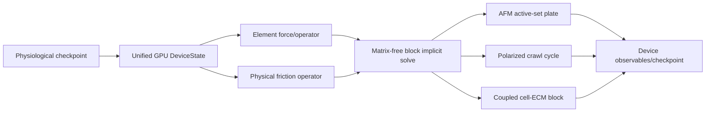

# FF Single-Cell Engine Optimization Plan

## Crawl · AFM · resting mechanics · ECM-coupled assays

**문서 상태:** IMPLEMENTATION PLAN — 코드 변경 전 계약서

**작성일:** 2026-07-14

**기준 브랜치 / 커밋:** `dcm/main` / `9fb1bd9`

**범위:** `aleph/laws/`의 native full-compartment single-cell workloads

**우선 목표:** RTX A5000 이상 단일 GPU에서 AFM과 rigid-substrate crawl의 time-to-solution을 구조적으로 단축

**확장 목표:** collagen-coupled crawl과 independent seed/rate/material sweeps의 multi-GPU throughput 최적화

**관계 문서:** `FF_N1000_FLEET_ENGINE_PLAN_2026-07-14.md`의 fleet data/distribution보다 먼저 재사용 가능한 single-cell solver core를 완성한다.

---

## 0. 결론

Single-cell FF는 N=1000 fleet보다 훨씬 직접적으로 최적화할 수 있다. native cell 한 개는 현재 A5000
한 장에서 이미 실행되고 HBM에도 들어간다. 따라서 우선순위는 multi-GPU domain decomposition이 아니라
**한 GPU 안에서 불필요한 synchronization, 재조립, stiffness-limited stepping을 제거하는 것**이다.

1. **AFM/compression은 가장 큰 구조적 가속 후보다.** 현재 explicit stiffness-CFL loop를 physical-time
   implicit solve + rigid-plate active-set으로 바꾸면 수만 step의 relaxation을 accuracy-limited step으로
   전환할 수 있다.
2. **Rigid-substrate crawl은 real-time 가능성이 높다.** 현재 workload에 따라 wall/sim ratio가 대략
   1.6–20 범위다. 중복 force sweep, per-step CSR assembly, CG scalar sync, Warp↔CuPy copy를 제거하면
   real-time 목표에 접근할 수 있다.
3. **Collagen-coupled crawl이 가장 어렵다.** cell implicit solve 옆에서 ECM을 매 step 20회 explicit
   substep하는 현재 구조를 coupled block implicit solve로 바꿔야 한다.
4. **Multi-GPU는 한 cell을 쪼개는 용도보다 independent AFM rates/strains, crawl seeds, ECM conditions를
   병렬 실행하는 용도로 먼저 사용한다.**

성능 때문에 physics를 줄이지 않는다. 모든 filament, motor, crosslink, clutch, membrane/nucleus/MT,
ECM element와 kinetic state는 유지한다.

---

## 0.5 착수 전 정정 (2026-07-14 다중-에이전트 감사 반영)

이 문서의 v1을 코드-대조 + 6-차원 독립 감사한 결과, 계획의 **문제 진단(§2.3 병목 표, §2.1 AFM baseline)은
전부 코드/로그로 확증**되고 solver 기법 선택(§4.4 deflation, §5.3 active-set, §7.2 coupled block)은 실제
연산자 구조(op ≠ 조립 M: `k_vol·g·gᵀ` osmotic rank-1 + `a_com` modal rank-3, `implicit_ff.py:281-290`)에
정확히 조준돼 있음이 확인됐다. 착수 전 아래 5개를 정정·명시한다.

1. **Integrator "conflict"는 doc-hygiene로 강등** (§1.4·SC0·§17.1). HOOMD/BAOAB vs implicit-FF는 CLAUDE.md
   Engine 항목이 이미 "Warp going-forward, HOOMD archived"로 ratify했고 `AGENTS.md`가 restructure-이전 stale
   미러일 뿐이다. **물리 ratification이 아니라 `AGENTS.md`를 CLAUDE.md에 맞추는 문서 정정**으로 처리한다.
   (native 38k vs 70,686 정의 통일은 실재 항목으로 유지 — §17.4.)
2. **Friction operator(§4.3)를 SC1.5로 전진 배치.** blocker(1a) grid-drag Σγ∝Nc의 유일한 물리적 해법이자
   crawl mechanism과 무관한 공통 dissipation이므로, matrix-free 전면교체(SC2)에 묶지 말고 device-residency(SC1)
   직후 독립 mini-단계로 검증한다(§1.4 말미가 이미 허용).
3. **Matrix-free operator는 fleet과 공유해 한 번만 짓는다.** 이 §4.2와 `FF_N1000_FLEET_ENGINE_PLAN` §5.4가
   같은 컴포넌트다. `ff/solver/operator*.py`를 SoT로 두고 fleet이 재사용한다(중복 구축 금지).
   **⚠️ SC0 실측(2026-07-14)이 §4.2의 우선순위를 뒤집었다** — 아래 §0.6 참조.

## 0.6 SC0 실측 결과 (native NF=70686, A5000 — `outputs/ff_single_opt/sc0_profiles/REPORT.md`)

착수 첫 단계로 native single-cell implicit step을 assemble/CG/force로 분해했다(도구:
`scripts/ff_sc0_profile.py`, production 코드 무수정). **결과가 §2.3의 핵심 전제를 반증하고 SC2 우선순위를
확정한다.**

| config | CG iters | full step | assemble | **CG** | force |
|---|---:|---:|---:|---:|---:|
| com-drag OFF | 71 | 228 ms | 22.7% | **69.6%** | 7.8% |
| com-drag ON (crawl) | 135 (peak 143) | 504 ms | 10.7% | **85.7%** | 3.6% |

- **implicit step은 CG-DOMINATED(70–86%)**, assembly는 10.7–22.7%뿐. → §2.3 "assembly/allocator 지배" 전제는
  native에서 **거짓**, 직전 `ENGINE_ACCELERATION_PLAN`의 "CG가 real lever"가 **확증**.
- **⇒ §4.2 matrix-free는 SC2 선두가 아니다.** assembly(10.7%)만 공격하므로 Amdahl 상한 ≈1.12×이고, 매 matvec
  element 재계산이 dominant CG(86%)를 오히려 부풀린다 → **native에서 net-negative 가능**. 추진 시엔 "CSR
  sparsity 패턴 1회 캐시 + 값 refill" 중간해와 벤치(§2.3 병목의 assembly는 이 중간해로 해소).
- **⇒ §4.4 deflation/block preconditioner가 THE lever, 그리고 #1 타깃이 실측됐다:** `a_com` modal rigid-COM
  drag가 CG iters를 **71→135(peak 143), wall을 228→504 ms로 정확히 2배** 부풀린다(rigid-translation 고유값을
  `a=γ/dt`→`a_com=6πηR/Nc/dt≪a`로 near-singular하게 끌어내림). 이 mode는 §4.4 deflation의 대상이자 **닫힌형으로
  알려져** coarse solve가 exact·저렴. **a_com rigid mode deflation만으로 crawl 경로 ~71-iter 회복 → ~2×**, 위에
  bulk preconditioner. → **SC2는 deflation+block preconditioner를 선두로, matrix-free를 후순위/게이트로.**
- HBM 39–84 MB/cell(사소) — native가 A5000 한 장에 여유. 제약은 memory가 아니라 CG throughput.
- **보강(PI 요청, doc-native NF=38000 + full clutch/substrate diag):** CG-domination은 **해상도(38k·70k)와
  full diag 전반에서 robust(CG 86–89%)** — verdict는 config 아티팩트가 아니다. **정직한 반전:** clutch/substrate
  diag가 iter를 낮추지 않고 **올린다**(70k 135→**210**, 38k 119→**181**) — stiff·이질적 basal diagonal(k_plane on
  ~7–13k dof)이 스펙트럼을 넓혀 무전처리 CG 조건수를 악화. → 실제 crawl 경로는 **더 CG-bound(~181–210 iter)**이고,
  이 basal diagonal은 a_com rigid mode에 더한 **두 번째 preconditioning 타깃**(단 diagonally-dominant →
  crosslink rank-1과 달리 selective-Jacobi가 먹힘 = 값싼 별도 lever). SC2 preconditioner의 가치는 native·full-diag에서
  오히려 커진다(iter가 N에 따라 증가). 근거: `outputs/ff_single_opt/sc0_profiles/REPORT.md` + figure.
4. **"real-time" ≠ "생리속도" 명시(§6·§15.3).** §11.3의 real-time(wall/sim≥1)은 **compute 성능**이고 SC1-SC2로
   달성 가능하나, native migration ~50–500× sub-physiological은 **force-generation 물리(blocker 1b: net
   propulsion 부족, traction~0.01nN)**로 이 계획이 닫지 못한다. **"crawl DONE"은 "생리속도 crawl"을 함의하지
   않는다** — C-gate는 emergence·resolution·kill-control이지 literature speed-band가 아니다(§6.4:398 유지).
5. **Internal-mode drag는 유도 근거를 요구(§4.3·SC2).** `Γ_internal`은 rigid의 6πηR 같은 whole-cell anchor가
   없다. 이를 crawl 속도 목표에 맞춰 낮추면 결과-튜닝 위반이다. SC2 계약은 `Γ_internal`의 물리적 유도
   근거를 요구하고, `test_resolution_drag`/C8은 **rigid-body 단위테스트**(full crawling cell 아님)로 한정해
   drag operator의 SPD/mode 성질만 증명한다(coarse full-cell은 구조 붕괴로 confound — CLAUDE.md 2026-07-09).

---

## 0.7 SC2 실측 결과 (deflated PCG 프로토타입 — 정직한 BREAK-EVEN)

SC0가 지목한 lever(CG iteration)를 공략하는 2-level deflated PCG(`ff/solver/deflated_pcg.py`, CPU gate 5 tests
PASS)를 실제 native 연산자에서 측정했다. 상세: `outputs/ff_single_opt/sc0_profiles/REPORT.md` §SC2.

- **iteration은 1.72–1.87× 줄고 정확하다**(parity 1e-6~1e-7; a_com rigid-mode 페널티를 정확히 제거: 142→76 ≈
  no-a_com baseline 71). deflation 수학은 검증됨.
- **그러나 wall-time은 BREAK-EVEN(0.99–1.06×)이다.** deflated iter가 plain iter의 ~1.76배 비용(coarse
  apply + smoother의 대역폭)이라 iteration 절감을 상쇄. 이 연산자가 **memory-bandwidth-bound**라, 대역폭을
  더하는 어떤 preconditioner도 iteration만 줄여선 이기기 어렵다.
- ⚠️ **예측 실패 정직 기록:** SC2 v1 REPORT가 "구조적 apply → ~1.5–1.8× wall"이라 예측했으나 **틀렸다(break-even).**
- → 계획 §11.3의 go/no-go("microbenchmark speedup이 아니라 end-to-end wall-time")가 이 preconditioner를
  **올바르게 미채택**시킨 사례. "preconditioner로 2–3×" 가설은 실측으로 **기각**.
- **남은 lever(각각 측정 대상, 가정 금지):** (a) uniform smoother 제거(a_com-only에선 `1/a`가 무의미 오버헤드),
  (b) rigid-only(dense g 열 제거), (c) fused single-kernel `apply_Minv`(Warp). 이들로 apply 비용을 SpMV보다
  훨씬 낮추면 1.8× iteration 절감이 ~1.3–1.5× wall로 surface할 수 있으나 **측정 후에만** 주장한다.
- **SC1(device-residency)이 더 큰 보편 win일 수 있다:** 연산자가 매 matvec `float(g@v)` host sync
  (implicit_ff.py:284)를 하며 plain·deflated CG 둘 다 매 iteration 페널티를 받는다 — 이건 preconditioning과
  독립이고 baseline 자체를 빠르게 한다. → **§0.8에서 측정: 이 가설도 틀림.**

## 0.8 SC1 실측 + 최적화 라인 종합 verdict

- **`float(g@v)` sync 제거 = 무효(0.97× = 노이즈).** cupy `cg`가 이미 파이프라인 — "이 sync가 병목"
  가설은 **틀림.** (변경은 무해·정확하니 유지, win 아님.)
- **device-scalar plain CG(residual를 10 iter마다 체크) = ~1.09%(9%) 빠름**(parity 1e-8). 유일한 실제(작은) win.

| lever | 결과 | 채택 |
|---|---|---|
| §4.2 matrix-free | assembly 9-23%만(SC0), Amdahl ≤1.12×, dominant CG 부풀림 | **NO** |
| §4.4 deflated PCG | iter −1.7-1.9×이나 **wall break-even**(bandwidth-bound; SC2) | **NO**(올바른 go/no-go) |
| §4.1 float sync 제거 | no-op(SC1) | 유지, win 아님 |
| §4.1 device-scalar CG(cadence) | **~1.09×(9%)** wall, parity 1e-8(SC1) | **YES** — 유일한 modest win |

**종합(정직): native FF single-cell implicit solve는 memory-bandwidth-bound이고 A5000에서 이미 효율점 근처다.**
알고리즘적 solver 최적화의 실현 이득은 **≈9%**(device-scalar CG)이지 2-3×가 아니다. preconditioner는 per-iter
대역폭에 상쇄되고, matrix-free는 잘못된 타깃. 더 큰 이득은 **다른 축** — timestep 수/크기(integrator·dt 정확도)
또는 ~10× HBM 대역폭(B200) — 이 필요하다. measure-first 규율(SC0 프로파일 + SC2/SC1 wall go/no-go)이
matrix-free(Amdahl 상한)와 preconditioner(break-even)에 수 주 낭비하는 것을 막았다.

## 1. 변경 불가 계약

### 1.1 Fidelity

- native full-compartment state를 유지한다. stripped/coarse run은 profiler bring-up과 unit test에만 쓴다.
- stiffness-CFL을 implicit solver로 제거하는 것은 허용하지만 force law, state variable 또는 event를
  제거하지 않는다.
- DCM/CBM force term, continuum crawl velocity, prescribed COM translation을 FF runtime에 넣지 않는다.
- KMC batch, multirate, matrix-free operator는 동일 event probability와 coupled residual을 보존해야 한다.
- mixed precision은 별도 gate 전에는 force, position, contact, CG operator에 적용하지 않는다.

### 1.2 Physiological baseline

- 모든 assay는 validated resting full-compartment checkpoint에서 시작한다.
- cytoplasm viscosity, turgor, membrane reservoir, cortex prestress, nucleus, MT, FA/clutch, substrate/ECM
  state를 assay 시작 전에 켠다.
- AFM은 실제 loading rate와 dwell protocol을 사용한다. 빠른 수치 ramp를 equilibrium stiffness로
  해석하지 않는다.
- crawl은 shape change와 adhesion/contraction cycle에서 COM movement가 emergent해야 한다.

### 1.3 Numerical integrity

- 새 solver/contact/mobility module의 첫 실행 전 Sanity Gate를 작성한다.
- tolerance는 existing reference residual, machine precision, measurement uncertainty 또는 사전 등록한
  stochastic uncertainty에서 유도한다.
- CG iteration을 고정해 CUDA graph에 넣지 않는다. convergence/divergence/non-finite guard를 유지한다.
- fixed subcycle count, output cadence, residual cadence는 임의 상수가 아니라 error/cost model에서 유도한다.
- 성능 변경 전후에 같은 measurement protocol을 사용한다.

### 1.4 먼저 닫아야 하는 architecture conflict

상위 `AGENTS.md`에는 HOOMD/BAOAB runtime이 hard contract로 남아 있고, active `ff/ENGINE.md`와 현재
single-cell code는 Warp/CuPy implicit filament-FEM을 사용한다. 이 계획은 후자를 vNext로 제안한다.
production 승격 전 PI ratification이 필요하다.

또한 crawl에는 다음 두 방향이 공존한다.

| 방향 | 현재 상태 | 계약 문제 |
|---|---|---|
| slip-traction + modal COM drag | current driver와 최신 ECM commits에 존재 | rigid translation을 crawl로 오인할 위험 |
| polarized shape-change cycle | `FF_POLARIZED_CRAWL_DESIGN_2026-07-09.md`가 요구 | 현재 runtime orchestration과 완전히 일치하지 않음 |

성능 최적화는 authoritative crawl physics를 먼저 고정한 뒤 수행한다. 단, 해상도 독립 friction operator는
어느 crawl mechanism에도 필요한 물리적 dissipation이므로 공통 solver 작업으로 먼저 구현할 수 있다.

---

## 2. 현재 계측과 코드상 병목

### 2.1 AFM baseline

- native 38k-filament cortex는 A5000에서 약 38.5 ms/step으로 계측됐다.
- small-strain equilibrium은 500→64,000 step 동안 apparent modulus가 계속 내려가며, 64k step에서야
  soft regime에 도달했다.
- 64k step은 약 2,464 s, 즉 한 strain point에 약 41분이다. 세 strain의 slope fit은 순수 mechanics만
  약 2시간 규모다.
- current physical-speed ramp는 native에서 per-node drag가 resolution에 따라 작아져 millions of steps가
  필요하므로 실용적이지 않다고 기록돼 있다.

근거: `FF_RESULTS_LOG.md`의 2026-07-08 native confirmation과
`simulate_whole_cell_compression_on_device()`.

### 2.2 Crawl baseline

committed artifacts의 대표 wall/sim ratio:

| artifact | simulated horizon | wall | wall/sim |
|---|---:|---:|---:|
| `hour1.json` | 약 3,600 s | 5,871 s | 1.63 |
| `ff_ecm_s6_twoway.json` | 약 100 s | 568 s | 5.68 |
| `ff_dev_S1_native.json` | 약 100 s | 1,971 s | 19.7 |

simulated horizon은 stored displacement와 reported velocity 및 driver dt에서 교차 확인한다. 이 표는
현재 branch의 모든 mode를 대표하는 benchmark가 아니라 real-time 목표에 필요한 개선 폭을 나타내는
baseline이다. SC0에서 동일 config를 다시 profile한다.

### 2.3 코드상 확정 병목

| 병목 | 현재 위치 | 영향 |
|---|---|---|
| duplicate force sweep | crawl main loop가 force를 계산한 뒤 implicit `force_fn`이 재계산 | GPU force work 최대 약 2회/step |
| Warp↔CuPy copy/sync | `pos_d.assign`, `wp.synchronize_device`, `.copy()` | stream drain와 device memory traffic |
| per-step COO→CSR | `assemble_K_current_cupy()` | allocator + sparse assembly + CSR conversion |
| CG matvec host scalar | `float(g @ v)` | CG iteration마다 device synchronization |
| unpreconditioned CG | native MT 포함 113→171 iterations 관측 | crawl implicit solve 지배 가능 |
| per-step allocations | `cpx.zeros`, `diag.copy`, `vol_g` 등 | allocator/zero-fill overhead |
| host volume/geometry | scalar `.numpy()`와 AFM `ConvexHull` | global sync + CPU geometry |
| host KMC/regrip/MMP | full array `.numpy()` + SciPy `cKDTree` | native state D2H 및 CPU serial work |
| ECM fixed 20 substeps | `_Ensub=20` Python loop | cell step당 다수의 launch, 근거 없는 fixed partial relax |
| output-side CPU stress | recorded frame마다 virial/strain host 계산 | production cadence에서 wall-time spike |

---

## 3. 목표 single-cell core



공통 core는 한 cell의 모든 arrays를 GPU-resident 상태로 유지하며 Warp kernels와 CuPy solver가 같은
memory를 zero-copy view로 공유한다. workload script는 build/config/protocol/measurement만 담당한다.

---

## 4. 공통 코드 변경

새 디렉터리 `aleph/laws/solver/`를 만들고 한 파일 한 개념을 지킨다.

### 4.1 Unified device state

| 새 파일 | 책임 |
|---|---|
| `ff/solver/device_state.py` | position/force/topology/kinetics의 persistent device ownership |
| `ff/solver/interop.py` | Warp↔CuPy zero-copy view와 explicit stream/event ordering |
| `ff/solver/workspace.py` | CG/operator/reduction scratch buffers와 allocation-free reuse |

변경 내용:

- position의 authoritative allocation을 한 번만 만든다.
- Warp와 CuPy가 DLPack/array interface view로 같은 memory를 본다.
- `wp.synchronize_device()` 대신 producer event→consumer stream dependency를 사용한다.
- force, diagonal, volume gradient, CG vectors, reductions를 step마다 allocate하지 않는다.
- topology generation이 바뀔 때만 관련 buffers/index를 rebuild한다.

### 4.2 Matrix-free operator

| 새 파일 | 책임 |
|---|---|
| `ff/solver/operator.py` | full `A·p` dispatch와 term registry |
| `ff/solver/bending_operator.py` | Cytosim bending `K·p` |
| `ff/solver/link_operator.py` | crosslink/myosin/ERM/FA link `K·p` |
| `ff/solver/surface_operator.py` | membrane, volume, turgor rank terms |
| `ff/solver/compartment_operator.py` | nucleus/MT/LINC block terms |

- current assembled CSR는 reference/parity path로 남긴다.
- fixed bending/mesh topology index는 build 시 한 번 준비한다.
- dynamic crosslink/clutch topology는 generation counter로 갱신한다.
- each term은 force Jacobian-vector 또는 energy Hessian-vector를 analytic/device kernel로 제공한다.
- WLC/active terms의 nonlinearity는 outer Newton residual에서 다룬다.

### 4.3 Physical friction/mobility operator

| 새 파일 | 책임 |
|---|---|
| `ff/solver/friction.py` | translation/rotation/internal/compartment dissipation operator |
| `ff/solver/modes.py` | orthogonal rigid and internal mode projections |

현재 scalar `gamma_rep` 또는 사후 COM shift를 다음 SPD friction으로 대체한다.

```text
Γ = Γ_trans P_trans + Γ_rot P_rot + Γ_internal P_internal + Γ_compartments
```

- `P_trans`: cortex/whole-cell rigid translation modes;
- `P_rot`: rigid rotation modes;
- `P_internal`: filament/cortex deformation modes;
- `Γ_compartments`: nucleus, MT, membrane/ERM, ECM의 실제 drag.

translation drag는 free-sphere `6πηR`을 자동 default로 고정하지 않는다. adherent cell의 wall correction과
shape dependence를 literature/derivation으로 정하고, unknown이면 PI에 surface한다. 핵심은 총 drag가 node
count에 따라 변하지 않는 것이다.

기존 `com_drag` rank-3 correction은 reference prototype으로 남길 수 있으나 production crawl driver로
승격하지 않는다. 새 operator는 propulsion이 아니라 dissipation만 정의한다.

### 4.4 Deflated/block-preconditioned PCG

| 새 파일 | 책임 |
|---|---|
| `ff/solver/pcg.py` | device-scalar PCG, guard, final residual check |
| `ff/solver/preconditioner.py` | cortex/link/nucleus/MT/FA block preconditioner |
| `ff/solver/deflation.py` | rigid translation/rotation 및 rank-volume modes의 exact coarse solve |

- `float(g @ v)`를 제거하고 dot/reduction을 device scalar로 유지한다.
- residual readback cadence는 error bound로 정하고 final residual은 반드시 확인한다.
- pAp floor, non-finite, residual growth, maxiter guard를 유지한다.
- Jacobi는 기본 후보가 아니다. 이미 crosslink rank-1 blocks에서 iteration inflation이 관측됐다.
- 후보는 IC(0), block incomplete factorization, additive Schwarz, rigid-mode deflation 순으로 비교한다.
- iteration count가 아니라 동일 final residual까지의 wall-time과 HBM으로 선택한다.

### 4.5 Device reductions와 observables

| 새 파일 | 책임 |
|---|---|
| `ff/solver/reductions.py` | volume, area, COM, radius, force/torque, energy device reductions |
| `ff/solver/observables.py` | AFM/crawl 공통 scalar observables와 sampled field output |

- fixed membrane/cortex triangulation에서 signed volume와 area를 계산한다.
- CPU ConvexHull은 initialization/reference measurement에만 사용한다.
- scalar gate는 device에서 평가하고 failure flag만 host로 보낸다.
- full position/stress field는 record cadence에만 host로 보낸다.
- output computation은 simulation stream을 불필요하게 drain하지 않도록 별도 stream/buffer를 사용한다.

### 4.6 Device kinetic scheduler

| 새 파일 | 책임 |
|---|---|
| `ff/solver/rng.py` | object/event keyed counter RNG |
| `ff/solver/events.py` | crosslink, clutch, FA, polymerization, MMP event scheduling |
| `ff/solver/multirate.py` | mechanics/event/slow-field error-controlled cadence |

- KMC는 `p=1-exp(-kΔt)`의 physical tick을 유지한다.
- clutch regrip는 GPU spatial hash로 nearest/capture candidate를 찾는다.
- MMP field와 ECM degradation은 device에서 계산한다.
- cadence는 event hazard와 mechanical residual로 정한다.
- rank/GPU 배치가 달라도 object ID 기반 random stream은 동일해야 한다.

---

## 5. AFM/compression 최적화

### 5.1 현재 문제

현재 `simulate_whole_cell_compression_on_device()`는 내부 force를 explicit CFL step으로 적분한다. turgor
refresh 때 전체 cortex를 CPU로 가져와 ConvexHull을 만든다. 물리적인 press speed가 느리면 native에서
millions of numerical steps가 필요하다.

이는 AFM의 rate dependence가 틀렸다는 뜻이 아니라, **physical dissipation을 explicit stability timestep으로
샘플링하는 numerical representation이 비효율적**이라는 뜻이다.

### 5.2 목표 방정식

각 physical step에서 다음 coupled system을 푼다.

```text
(Γ/Δt + K_internal + K_volume + K_contact) Δx = F_internal + F_active + F_external
```

- `Γ`: physical friction operator;
- `K_internal`: filament, crosslink, membrane, nucleus, MT;
- `K_volume`: osmotic/turgor rank term과 drained-solid response;
- `K_contact`: rigid plate active-set constraint의 tangent coupling.

loading-rate observable이므로 `Δt`는 무한 quasi-static step이 아니다. plate displacement accuracy,
poroelastic drainage, crosslink turnover, nonlinear residual에서 physical step을 선택한다.

### 5.3 Rigid plate active-set

| 새 파일 | 책임 |
|---|---|
| `ff/afm/plate_contact.py` | top/bottom gap, active set, complementarity, reaction multipliers |
| `ff/afm/implicit_step.py` | plate-constrained Newton/Krylov step |
| `ff/afm/protocol.py` | loading rate, dwell, continuous ramp, measurement timestamps |
| `ff/afm/measurement.py` | force–indentation, Hertz/Sneddon inversion, tension channels |

- penalty stiffness 대신 rigid inequality constraint를 유지한다.
- active node는 plate normal penetration을 허용하지 않는다.
- reaction force는 hard clamp의 removed displacement proxy가 아니라 Lagrange multiplier 합으로 측정한다.
- entering/leaving contact를 active-set iteration으로 갱신한다.
- non-penetration, complementarity, force balance를 최종 residual에 포함한다.

### 5.4 Poroelastic/kinetic time integration

- membrane water flux의 analytic exponential update는 유지한다.
- drained solid와 osmotic pressure를 device volume에서 갱신한다.
- crosslink turnover는 physical event time을 사용한다.
- mechanical step이 event/flux error bound를 넘으면 substep한다.
- `turgor_every`, `reshape_every` 같은 정수 cadence는 physical time/error contract로 변환한다.

### 5.5 Protocol-aware reuse

- 실제 실험이 continuous ramp라면 한 번의 0→최대 strain trajectory에서 2%, 2.5%, 3% force를 읽는다.
- 실험이 독립 indent/retract protocol이면 독립 checkpoint fork를 유지한다.
- path dependence를 없애기 위한 편의상 continuation을 사용하지 않는다.
- 같은 architecture realization 비교는 한 resting checkpoint를 fork한다.
- ensemble uncertainty를 평가할 때에는 독립 cortex seeds를 사용한다.

### 5.6 AFM gates

1. **A1 operator parity:** matrix-free termwise `K·p` vs assembled/FD reference.
2. **A2 rigid contact:** zero penetration, complementarity, top/bottom reaction sign-sense.
3. **A3 force balance:** plate reaction + internal/external force balance.
4. **A4 volume/area:** GPU fixed-mesh reduction vs reference geometry; topology orientation invariant.
5. **A5 rate protocol:** explicit fine-step reference와 force–time/indentation curve 일치.
6. **A6 poroelastic:** fast/slow loading limits와 existing 12 poroelastic tests PASS.
7. **A7 restart:** mid-ramp checkpoint/restart 후 force curve continuity.
8. **A8 native:** native full-compartment strain/rate sweep 완료, existing qualitative conclusions 보존.

Hertz band를 맞추기 위해 dt/residual을 조정하지 않는다. band comparison은 measurement oracle이며 solver
gate는 independent reference residual/trajectory로 닫는다.

---

## 6. Crawl 최적화

### 6.1 SC0 physics freeze

최적화 전에 production crawl mechanism을 하나로 고정한다.

권장 production 계약:

- front barbed-end polymerization이 leading edge를 COM 대비 전진시킨다;
- front nascent adhesion/maturation이 새 front를 고정한다;
- myosin contraction이 body를 anchored front 방향으로 당긴다;
- rear catch-slip release + depolymerization이 rear를 회수한다;
- MTOC/nucleus가 cell-relative polarity를 형성한다;
- imposed COM force와 moving floor는 없다.

current `clutch_slip_traction`은 molecular traction experiment/control로 보존할 수 있으나, polarized shape
change 없이 crawl completion을 선언하는 production driver에서는 제거한다.

### 6.2 Rigid-substrate crawl solver

| 새 파일 | 책임 |
|---|---|
| `ff/crawl/state.py` | polarity, front/rear regions, live geometry state |
| `ff/crawl/polarity.py` | live leading-edge frame와 MTOC/nucleus polarity coupling |
| `ff/crawl/mechanics.py` | common operator에 crawl-specific forces/events 연결 |
| `ff/crawl/adhesion_events.py` | clutch catch-slip, nascent adhesion, FA maturation |
| `ff/crawl/protocol.py` | cue, assay horizon, perturbation/kill controls |
| `ff/crawl/measurement.py` | COM-relative front/rear, shape, polarity, traction observables |

구현 순서:

1. duplicate outer force sweep을 제거하고 implicit force evaluation 하나만 사용한다.
2. GPU position/force를 zero-copy shared state로 통일한다.
3. volume/COM/radius를 device scalar로 유지한다.
4. physical friction + deflated PCG로 node-count-independent dissipation을 만든다.
5. front growth/rear depoly/FA events를 device scheduler로 옮긴다.
6. output stress/shape field를 sampled cadence로 분리한다.

### 6.3 Friction은 propulsion이 아니다

grid-independent translation/rotation friction은 필요하지만, 이를 COM 이동을 만드는 force로 사용하지 않는다.

- propulsion source는 polymerization + adhesion + contraction + rear release다.
- friction operator는 이 힘과 shape change가 만들어내는 velocity를 결정한다.
- node resolution을 바꿔도 whole-cell translation/rotation dissipation이 수렴해야 한다.
- near-wall/adherent drag law는 literature/geometry에서 유도한다.
- 기존 post-hoc COM shift는 clutch extension과 desynchronize되어 runaway를 만들었으므로 금지한다.

### 6.4 Rigid-substrate crawl gates

1. **C1 shape:** translating sphere가 아니라 front extension/rear retraction이 관측된다.
2. **C2 front-relative:** leading edge가 COM 대비 전진한다.
3. **C3 rear-relative:** rear가 COM 대비 회수되고 mass balance가 맞는다.
4. **C4 polarity:** MTOC/nucleus/cell axis의 relative polarity가 형성된다.
5. **C5 emergent:** imposed COM force가 0이며 myosin 또는 front polymerization OFF에서 crawl이 사라진다.
6. **C6 traction:** clutch OFF에서 sustained translocation이 사라진다.
7. **C7 force/torque:** substrate reaction을 포함한 global balance.
8. **C8 resolution:** physical velocity, shape, traction이 filament/node resolution에 단조 drift하지 않는다.
9. **C9 native:** physiological baseline의 full-compartment native cell에서 stable trajectory와 visualization.
10. **C10 performance:** all-on native path에서 real-time 목표를 계측하며 physics gate와 분리 보고.

aspect ratio 또는 속도의 acceptance band는 literature/measurement protocol에서 등록하기 전에는 임의 숫자로
고정하지 않는다.

---

## 7. Collagen/ECM-coupled crawl

### 7.1 현재 문제

현재 cell은 implicit, ECM은 explicit이며 cell step당 `_Ensub=20`으로 부분 relaxation한다. 이 숫자는
physical interval이나 error estimator에서 유도되지 않았고, launch 수와 wall-time을 크게 늘린다.

### 7.2 Coupled block system

```text
[ A_cell   C_FA ] [Δx_cell] = [F_cell]
[ C_FA^T   A_ECM] [Δx_ECM ]   [F_ECM ]
```

- `A_cell`: common FF implicit operator;
- `A_ECM`: collagen bending/axial/crosslink/friction operator;
- `C_FA`: explicit clutch–actin–ECM node coupling;
- off-diagonal blocks는 equal/opposite action–reaction을 보존한다.

| 새 파일 | 책임 |
|---|---|
| `ff/crawl/ecm_operator.py` | ECM matrix-free force/Jacobian terms |
| `ff/crawl/ecm_coupling.py` | FA off-diagonal action–reaction blocks |
| `ff/crawl/ecm_preconditioner.py` | cell/ECM block Schur or additive Schwarz |
| `ff/crawl/ecm_neighbors.py` | GPU clutch regrip spatial hash |
| `ff/crawl/mmp_field.py` | GPU MMP field/degradation events |

첫 구현은 monolithic operator 또는 residual-converged partitioned iteration 중 profile상 유리한 쪽을
채택한다. partitioned 방식이라도 fixed 20회가 아니라 coupled residual까지 반복한다.

### 7.3 ECM gates

1. clutch force의 cell/ECM equal-and-opposite parity.
2. no-clutch와 no-ECM boundary cases.
3. fine explicit substep reference와 coupled trajectory/energy parity.
4. timestep refinement에서 cell displacement, ECM recruitment, traction convergence.
5. regrip candidate brute-force parity at small N.
6. MMP mass/stiffness update와 zero-MMP limit.
7. pinned boundary invariance와 global force balance.
8. collagen material parameter가 `ecm_library`와 일치.
9. production native cell + physical-extent ECM에서 real-time ratio와 HBM 보고.

---

## 8. 다른 single-cell workloads에 재사용

### 8.1 Resting checkpoint / loaded shell

- common device state와 reductions를 사용한다.
- equilibrium은 matrix-free block solve로 가속한다.
- turgor, membrane area, cortex tension channels를 유지한다.
- resting checkpoint는 schema-versioned full-state artifact로 저장한다.

### 8.2 Cortical tension / γ-floor ensembles

- small/mesoscale ensemble은 block-diagonal batching이 유효하다.
- native 한 realization이 GPU를 포화하면 한 realization/GPU로 배치한다.
- RNG와 state block은 realization 간 완전히 분리한다.
- γ estimator와 turgor/passive/active channel 정의는 변경하지 않는다.

### 8.3 Stiffness sensing, contact guidance, ECM assays

- cell relaxation에는 common solver를 사용한다.
- ECM-only modulus/indentation에는 ECM operator를 사용한다.
- material/seed/orientation sweep은 independent GPU jobs로 병렬화한다.
- stress propagation처럼 large ECM가 cell보다 큰 경우에만 ECM domain decomposition을 별도 검토한다.

### 8.4 Visualization/export

- viewer 생성이 simulation hot path를 막지 않게 raw sampled state와 rendering을 분리한다.
- native HTML은 postprocess에서 만든다.
- camera/cut plane은 live COM/polarity frame을 따라야 한다.

---

## 9. 구현 phase

### SC0 — Contract freeze + production profile

**작업**

- HOOMD/BAOAB vs implicit FF runtime을 PI-ratify한다.
- crawl production mechanism을 polarized shape-change 또는 다른 명시 계약으로 고정한다.
- native 38k vs 70,686 filament definition을 결정 항목으로 유지한다.
- AFM, rigid crawl, ECM crawl을 동일 config/commit에서 Nsight/Warp/CuPy profile한다.
- kernel, assembly, solve, sync, event, ECM, output 시간을 분리한다.

**gate**

- benchmark manifest에 commit/config/seed/device/physical horizon 기록.
- current outputs를 재현.
- host synchronization과 allocation count를 기록.

### SC1 — Exact device residency cleanup

**작업**

- duplicate crawl force sweep 제거.
- zero-copy Warp/CuPy state와 stream events.
- persistent buffers와 device scalar reductions.
- output path 분리.

**gate**

- force/state/observable parity.
- no new host copy in hot step.
- current reference보다 time-to-solution이 나빠지면 원인을 profile하고 default 전환 중단.

### SC2 — Matrix-free operator + friction + PCG

**작업**

- termwise matrix-free `K·p`.
- physical modal friction.
- rigid-mode deflation과 block preconditioner.
- device-scalar PCG.

**gate**

- assembled operator parity와 final residual.
- deformation/translation/rotation boundary cases.
- resolution-independent rigid drag.
- failure guards PASS.

### SC3 — AFM implicit active-set

**작업**

- rigid plate constraints, reaction multipliers, protocol-aware time steps.
- device volume/area, poroelastic/turnover multirate.
- continuous/independent protocol selection.

**gate**

- A1–A8 PASS.
- native full-compartment force–indentation/rate sweep와 restart.

### SC4 — Polarized rigid-substrate crawl

**작업**

- authoritative crawl cycle orchestration.
- live front/rear/polarity state, device adhesion/polymerization events.
- shape/polarity observables와 tracking viewer.

**gate**

- C1–C10 PASS.
- real-time 여부를 native all-on path에서 보고.

### SC5 — Coupled cell–ECM implicit crawl

**작업**

- ECM operator, FA block coupling, regrip hash, MMP device path.
- fixed `_Ensub=20` 제거.

**gate**

- ECM gates 1–9 PASS.
- physical collagen production trajectory와 restart.

### SC6 — Ensemble/multi-GPU throughput

**작업**

- one process/GPU independent job launcher.
- AFM rate/strain/seed, crawl seed/cell type, ECM material/alignment sweep.
- shared read-only checkpoint cache와 sharded outputs.

**gate**

- result independence from GPU assignment/order.
- object-keyed RNG reproducibility.
- cost/throughput scaling report.

### SC7 — Production consolidation

**작업**

- old scripts를 thin CLI로 전환.
- rejected/legacy path는 explicit legacy flag와 문서로 격리.
- full regression, figures, REPORT, Notion Contract-Graph mappings.

**gate**

- Definition of Done 충족.

---

## 10. 테스트 계획

새 테스트 경로는 `aleph/tests/ff/solver/`, `tests/ff/afm/`, `tests/ff/crawl/`이다.

| test | 검증 |
|---|---|
| `test_interop.py` | zero-copy alias, stream event ordering, no stale reads |
| `test_workspace.py` | repeated step allocation-free reuse |
| `test_operator_terms.py` | each `K·p` vs assembled/FD reference |
| `test_friction_modes.py` | translation/rotation/internal eigenmodes와 SPD |
| `test_resolution_drag.py` | total drag가 node count에 독립 |
| `test_pcg.py` | residual, pAp/non-finite/divergence guards |
| `test_device_reductions.py` | volume/area/COM/force vs reference |
| `test_event_rng.py` | device/assignment independent RNG |
| `test_plate_active_set.py` | contact enter/leave, complementarity, reaction |
| `test_afm_rate_reference.py` | fine explicit vs implicit force-time curve |
| `test_afm_restart.py` | mid-ramp state continuity |
| `test_crawl_kill_controls.py` | myosin/polymerization/clutch OFF controls |
| `test_crawl_shape.py` | COM-relative front/rear/polarity metrics |
| `test_ecm_action_reaction.py` | FA coupling Newton pair |
| `test_ecm_coupled_reference.py` | fine explicit vs coupled implicit |
| `test_regrip_neighbors.py` | GPU hash vs brute force |

CPU tests는 small-N reference/geometry만 담당한다. production gate는 RTX A5000 이상 CUDA에서 닫는다.

---

## 11. 성능 측정 계약

### 11.1 공통 지표

- simulated seconds / wall second;
- wall/step 및 physical time/step;
- force/operator/CG/event/ECM/output wall fraction;
- CG iterations, final residual, preconditioner cost;
- host sync count와 sync wall-time;
- GPU allocations/step와 peak HBM;
- kernel launches/step, occupancy, memory bandwidth;
- full-state D2H/H2D bytes;
- checkpoint/rendering wall-time;
- GPU-hour/assay 및 GPU-hour/ensemble.

### 11.2 Workload-specific 지표

AFM:

- physical ramp/dwell time per wall second;
- force–indentation sample당 wall-time;
- contact active-set iterations;
- rate/strain/seed sweep throughput.

Crawl:

- real-time ratio;
- mechanical step, KMC, ECM coupling separately;
- shape/polarity/traction observable overhead;
- all-on vs kill-control throughput.

### 11.3 목표와 go/no-go

- rigid crawl의 explicit 성능 목표는 `simulated_seconds / wall_seconds >= 1`이다.
- ECM crawl도 real-time을 목표로 하지만 physics/validation gate를 성능 때문에 완화하지 않는다.
- AFM은 physical protocol completion time을 최소화하되 rate curve가 fine reference와 맞아야 한다.
- 각 변경의 채택은 microbenchmark speedup이 아니라 end-to-end time-to-solution으로 결정한다.
- fixed speedup 숫자는 SC0 profile 전 acceptance contract로 만들지 않는다.

---

## 12. GPU와 병렬화 전략

### 12.1 한 cell은 우선 한 GPU

- native 0.27–0.50 million-node cell은 현재 A5000에서 실행된다.
- one-cell spatial multi-GPU는 communication/solver complexity 대비 우선순위가 낮다.
- B200/H200에서는 HBM과 bandwidth 여유를 solver workspace와 independent batches에 사용한다.

### 12.2 Multi-GPU는 ensemble parallel

- AFM: rate × strain/protocol × architecture seed;
- crawl: seed × cell type × perturbation/kill control;
- ECM: material × concentration × alignment × seed.

한 GPU에 native case 하나를 기본으로 두고, profile에서 GPU underfill이 확인된 small/mesoscale case만
block-diagonal batching한다.

### 12.3 CUDA graph와 precision

- fixed-topology force windows는 host launch overhead가 실제 병목일 때만 graph capture한다.
- CG 전체를 fixed iteration graph로 capture하지 않는다.
- FP32 force streaming은 γ, AFM reaction, contact, crawl velocity의 FP64 parity gate 전에는 production에
  넣지 않는다.
- position, reductions, solver residual, contact geometry는 FP64을 유지한다.

---

## 13. 산출물과 visualization

```text
aleph/outputs/ff_single_opt/
├── sc0_profiles/
├── sc1_device_residency/
├── sc2_solver/
├── sc3_afm/
├── sc4_crawl_rigid/
├── sc5_crawl_ecm/
└── sc6_ensembles/
```

각 milestone은 config, commit/device manifest, raw profile, validation results, `REPORT.md`, `figs/`를 갖는다.
기존 `aleph/scripts/h1_h2_vis.py`를 single-cell optimization mode로 확장해 figures를 재생성한다.

필수 figures:

- AFM force–indentation and force–time, explicit reference overlay;
- apparent modulus vs loading rate with per-seed lines;
- AFM deformation/plate contact/nucleus/cortex snapshots;
- crawl COM-relative front/rear trajectories and shape/polarity metrics;
- MTOC/nucleus relative position;
- traction map, clutch bound/load distribution;
- cell–ECM displacement/action–reaction and remodeling;
- wall-time breakdown before/after;
- CG iterations/residual and resolution-drag convergence;
- restart continuity.

축 truncation 금지, units 표시, reference/band overlay, ensemble thin lines + mean을 지킨다.

---

## 14. 위험과 중단 조건

| 위험 | 대응 | 중단 조건 |
|---|---|---|
| rejected crawl path 최적화 | SC0 physics freeze | authoritative mechanism 미결정 시 SC4 production 중단 |
| friction law datum 부족 | TAG/literature로 wall/shape correction 확인 | 임의 prefactor 금지 |
| matrix-free parity 실패 | termwise localization | tolerance 완화 금지 |
| deflated PCG instability | explicit coarse-mode solve + residual guards | post-hoc COM shift 금지 |
| AFM implicit가 rate를 지움 | physical-time fine reference gate | quasi-static 결과를 rate assay로 보고 금지 |
| active-set reaction bias | multiplier/force-balance cross-check | force curve fitting 금지 |
| fixed mesh geometry drift | ConvexHull/reference comparison + topology check | invalid/inverted surface에서 production 중단 |
| ECM block solve nonconvergence | residual-converged split/monolithic fallback | fixed 20 partial relax로 회귀 금지 |
| host KMC statistical drift | device distributional gate | visual single trajectory만으로 승인 금지 |
| output이 hot path 지배 | async sampled output | observables 삭제로 해결 금지 |
| native definition 충돌 | Parameter/ModelContract 통일 | authoritative native claim 중단 |

---

## 15. Definition of Done

### 15.1 Common solver DONE

- unified zero-copy GPU state와 persistent workspace;
- matrix-free full operator와 assembled reference parity;
- physical, resolution-independent friction operator;
- deflated/block-preconditioned device PCG;
- device volume/area/COM/energy reductions;
- full restartable state와 regression suite.

### 15.2 AFM DONE

- native full-compartment physical-rate ramp/dwell을 implicit active-set으로 실행;
- rigid contact, force balance, poroelastic/turnover, explicit fine-reference gates PASS;
- force–indentation/rate curves와 cortical tension channels 기록;
- independent/continuous protocol을 실험 측정 방식과 일치시킴;
- 이전 native conclusions와 차이를 정량 보고.

### 15.3 Rigid crawl DONE

- imposed COM force 없이 polarized shape-change cycle이 작동;
- front extension, rear retraction, adhesion, myosin, MTOC/nucleus polarity가 명시적으로 관측;
- kill controls와 traction/force balance PASS;
- native full-compartment resolution convergence;
- **compute real-time**(wall/sim≥1) 달성 여부를 정직하게 보고 — 단 이것은 **생리속도 crawl을 함의하지
  않는다**. native migration speed deficit(blocker 1b)은 이 계획이 닫지 못하는 별도 physics gap이며,
  "crawl DONE"을 "physiological velocity crawl"로 선언하지 않는다(§0.5-4).

### 15.4 ECM crawl DONE

- fixed 20-substep 제거;
- cell–ECM coupled residual과 action–reaction gate PASS;
- device regrip/KMC/MMP;
- physical collagen extent의 restartable native trajectory;
- real-time ratio와 cost report.

### 15.5 Ensemble DONE

- independent GPU assignment에 결과가 의존하지 않음;
- AFM rate/seed와 crawl seed/material sweeps 자동 실행;
- figures/REPORT/Notion RunResult·CodeMapping 업데이트.

---

## 16. 바로 시작할 순서

1. SC0에서 crawl authoritative physics와 implicit FF runtime을 PI-ratify한다.
2. A5000에서 AFM/rigid crawl/ECM crawl의 동일-config profile을 고정한다.
3. CG `float(g@v)`와 hot-loop global sync를 제거하는 device-scalar prototype을 만든다.
4. crawl duplicate force sweep과 per-step allocations를 제거한다.
5. device volume/area reductions를 AFM과 crawl에 공통 적용한다.
6. matrix-free bending/link/volume operator parity를 닫는다.
7. friction modes + deflation/block preconditioner를 닫는다.
8. AFM rigid active-set implicit solver를 먼저 production화한다.
9. polarized rigid crawl을 production화한다.
10. coupled cell–ECM block solve와 device KMC/regrip/MMP를 닫는다.
11. independent multi-GPU sweep launcher를 추가한다.
12. full native regression, figures, REPORT, Notion closeout을 수행한다.

---

## 17. PI 결정 필요사항

1. **Runtime:** HOOMD/BAOAB hard contract와 current Warp/CuPy implicit FF 중 authoritative direction.
2. **Crawl:** slip-traction/modal-translation line을 control로만 남기고 polarized shape-change line을
   production으로 고정할지.
3. **Hydrodynamic drag:** adherent near-wall MCF7의 translation/rotation drag anchor와 적용 geometry.
4. **Native density:** historical 약 38k filament/cell과 current 70,686 중 authoritative 값.
5. **AFM protocol:** authoritative experimental loading rate, continuous vs independent indent, dwell/retract sequence.
6. **Performance hardware:** A5000을 production performance gate로 유지할지, B200/H200을 목표 hardware로
   승격할지.

미결정 값을 임의로 채우지 않는다. SC1–SC2 prototype은 진행할 수 있으나 관련 production 완료 선언은
각 결정 전까지 막는다.
