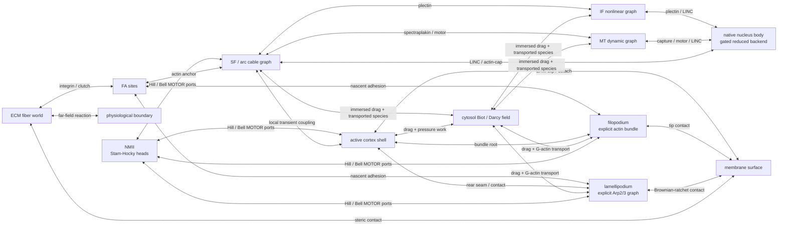

# FF-AC real-time cell-engine architecture

Status: **architecture contract — 2026-07-22**
Owner: Lead session
Purpose: replace the monolithic all-particle mental model with a component, connector, and actuator engine.

## 1. Product definition

FF-AC is a dynamically connected multiphysics cell engine.  Its primary state is not one flat particle array;
it is the tuple

```
(component states, connector graph, actuator states, physical fields, accepted physical time).
```

A visually deforming but one-way or frozen assembly is not a dynamic cell.  A valid outer step must allow a
load to change geometry, geometry to change binding opportunities, and the changed connections to alter the
next load path.  Every component advances on one accepted physical clock even when its solver subcycles.

## 2. Cell composition



The diagram defines possible connector families, not permanent bonds.  A runtime connector exists only while
its own geometry, state, and kinetics say that it is bound.

## 3. Component contracts

| Component | Numerical representation | Globally solved state | Local/internal state |
|---|---|---|---|
| membrane | fluid Helfrich/area surface FEM | surface position/velocity | area reservoir, curvature state |
| cortex | production baseline: explicit crosslinked F-actin; optimisation candidate: condensed active-viscoelastic surface FEM | filament/network or condensed surface kinematics relative to membrane | filament IDs, crosslinks, NMII, turnover; condensation modes only after mapping gates |
| cytosol | Biot/Darcy finite-volume field; Brinkman only where a resolved boundary layer is required | pressure, relative fluid flux, transported concentrations | constitutive permeability/storage |
| nucleus | production baseline: native lamina/chromatin shell or volume FEM; optimisation candidate: reduced basis | native nodes or retained deformation modes / interface nodes | chromatin relaxation and damage state |
| SF/arcs | active one-dimensional rod/cable graph | junction and retained rod DOFs | NMII, polarity, polymerization, turnover, prestress |
| FA | discrete clutch/joint graph | anchor reactions | catch/slip state, maturation, integrin occupancy |
| MT | dynamic rod graph | retained rod/endpoint DOFs | growth, catastrophe/rescue, motors, capture state |
| IF | nonlinear cable graph | junction and retained cable DOFs | strain-stiffening branch, turnover, crosslink state |
| lamellipodium | local adaptive explicit Arp2/3 branched F-actin | active network nodes/branches | branching, polymerisation, capping, severing, refinement identity |
| filopodium | local adaptive explicit bundled F-actin | bundle nodes/crosslinks | polymerisation, capping, severing, bundling, refinement identity |
| NMII | explicit Stam-Hocky bipolar backbone + individual heads | minifilament/head geometry | per-head Hill stepping, Bell bind/unbind, ATP and population epochs |
| ECM | explicit fiber/crosslink world, locally reduced when inactive | contact and anchor DOFs | alignment, crosslink, damage/remodelling |

"Local/internal" does not mean frozen or passive.  It means the state is updated locally without becoming a
global mechanical unknown.  Thermodynamic activity is reserved for ATP/GTP-consuming force or remodelling;
all components nevertheless participate dynamically and bidirectionally.

## 4. Five engine interfaces

Every component implementation must expose the equivalent of these five capabilities.  Python names are an
API target; the production implementation remains device-resident Warp.

1. **State** — owns authoritative device arrays, capacities, active counts, and snapshot/restore storage.
2. **Geometry provider** — exposes attachment manifolds, collision/query geometry, and interpolation stencils.
3. **Mechanics contributor** — adds residual, tangent/operator action, constraints, and diagnostic work.
4. **Kinetics/actuator** — proposes reversible state changes for the candidate step and commits irreversible
   events only under the final accepted predicate.
5. **Ledger contributor** — reports force, work, mass, topology, and population terms without owning the global
   acceptance decision.

Components must not call one another's private kernels.  All inter-component mechanics goes through connector
or field-coupling objects.

## 5. Connector graph

A connector is a first-class dynamic joint with:

```
connector type
endpoint A = (component, entity, local/barycentric coordinate)
endpoint B = (component, entity, local/barycentric coordinate)
bound state and kinetic epoch
constitutive/force law
on/off/capture/remodelling law
equal-and-opposite reaction scatter
candidate snapshot and accepted-step commit
```

Required connector families are ERM, FA clutch, LINC, plectin/spectraplakin, transient actin/SF-to-cortex,
motor-to-filament, and ECM crosslinks.  The graph is sparse and changes on physical time.  Concatenating two
components into one array is not a connection.

The membrane and nuclear envelope each expose a moving, impermeable `FLUID_BOUNDARY`; cortex, SF, MT, and IF
use conservative `IMMERSED_TRANSFER` couplers to exchange porous drag and transported species.  A non-kinetic
connector still snapshots and rolls back its reversible candidate state: `commit_on_accept=False` only means
that it has no separate irreversible KMC commit.

The connector interpolation and scatter operators must be adjoints so that the same discrete pair satisfies

```
work delivered at endpoint A + work delivered at endpoint B = connector dissipation / stored-energy change.
```

## 6. Accepted physical-step transaction

One outer physical step has the following fixed order:

1. snapshot every authoritative component and connector state on device;
2. evaluate geometry-dependent capture candidates and actuator loads without committing irreversible events;
3. solve the coupled surface/solid/network mechanics and porous-fluid response to the registered convergence
   and conservation criteria; solver subiterations do not advance physical time;
4. refresh geometry, field transfers, and connector forces until the coupled candidate is consistent;
5. evaluate global finite-state, force/work, mass, constraint, and topology invariants;
6. atomically accept or restore all states;
7. only on acceptance, commit KMC, motor stepping, turnover, remodelling, and the physical clock.

Partitioned solvers and component-specific subcycling are allowed.  One-way prescribed loads and post-hoc
geometry updates are not a coupled engine.

## 7. Resolution and LOD policy

The engine keeps a high-fidelity production/reference representation and optional optimisation backends.
The initial authoritative baseline is always the full native population, including 70,686 active cortical
F-actin filaments and the density-by-geometry populations of every other compartment.  A condensed backend is
not an alternative initial truth and cannot be used to draw a production conclusion before native validation.

- membrane remains a separate live mesh; cortex and nucleus first run at native mechanistic resolution;
- reduced surface/nuclear solves are opt-in optimisation candidates only after their response, force, work,
  topology, and physiological-baseline mappings close against the native implementation;
- SF, FA, MT, IF, and active ECM junctions remain explicit where their topology carries information;
- inactive graph islands may sleep while retaining their state;
- local refinement promotes a surface/cable patch to explicit filaments near a leading edge, bleb neck,
  adhesion, rupture, high connector-event probability, or a posteriori condensation error;
- coarsening restores a reduced patch only after the reverse mapping closes force, work, mass, and topology
  ledgers;
- thresholds come from error estimators or event probabilities, not frame-rate tuning.

The 70,686-filament cortex is the first production baseline and the mapping oracle.  A later real-time profile
may replace quiet regions with validated condensed coordinates, but biological density and unique active IDs
remain represented in the population/identity ledger and are never deleted merely to fit memory.

## 8. Existing-code disposition

| Existing area | Disposition |
|---|---|
| `ac/fluid` scheduler, Biot field, IBM transfers, transaction/ledger | reuse and generalise as the world clock and field coupler |
| `ac/cell` monolithic composed position/force arrays | compatibility adapter during migration; not the target ownership model |
| `ac/cell` membrane, ERM, pressure, live mesh | reuse laws and kernels behind Surface Body and connector interfaces |
| explicit full cortex / `ff.weave` | reference backend and adaptive-refinement backend |
| `ac/motor` segment NMII and accepted-step KMC | reuse as an actuator/connector implementation |
| `ac/weave` region arrays | migrate useful SF/arc/lamellipodium topology into graph components; concatenation alone is insufficient |
| `ac/solid/{microtubule,intermediate_filament,adhesion_clutch}` | promote from isolated force contributors to graph components/connectors |
| nucleus lamina/chromatin/LINC kernels | retain laws; replace full global DOF where a reduced body closes the same response gates |

No existing runtime is deleted during the vertical-slice migration.  The compatibility path remains available
for A/B response and mapping tests.

## 9. Parallel build waves

The three waves below are the first architecture decomposition only. They are not a terminal roadmap. The
continuing R0–R15+ implementation, native validation, optimisation, and deployment sequence is maintained in
`ROLLING_ROADMAP.md`.

### Wave 1 — minimum connected cell

1. Surface Body: membrane + native active cortex + ERM connector; condensed surface backend tested in parallel.
2. Fluid/Core: Darcy/Biot cytosol + native nucleus + conservative FSI/LINC sockets; reduced Core is a gated
   optimisation backend.
3. Load Path: one dynamic `ECM <-> FA <-> SF` path with an NMII actuator.
4. World: component registry, connector registry, accepted-step transaction, and ledgers.

The wave closes when a motor-driven SF changes FA/ECM traction, drives the surface/fluid/nucleus response, and
a rejected step restores every component and joint bit-exactly.

### Wave 2 — connectivity skeleton

1. MT dynamic-instability graph + cortex/nucleus capture connectors.
2. IF nonlinear graph + plectin/LINC connectors.
3. transverse-arc/dorsal/ventral SF assembly paths and local surface coupling.
4. component sleeping, multirate scheduling, and first adaptive refinement seam.

### Wave 3 — biological regions and performance

Lamellipodium/filopodium local refinement, ECM remodelling, reaction/advection/diffusion fields, multi-GPU
partitioning, and real-time profiling land only after the Wave-1/2 force paths close.

## 10. Global acceptance gates

- a connector permutation cannot change physics;
- every connector applies equal-and-opposite reactions and closes discrete work;
- a rejected outer candidate restores geometry, fields, connector states, actuator epochs, and time;
- no component can mutate another component's state except through a registered connector/coupler;
- a load-path ablation changes only downstream connected reactions predicted by the graph;
- surface/cytosol/nucleus reductions reproduce their reference frequency response over the declared operating
  band;
- refinement/coarsening round-trips close force, work, mass, and active-object identity;
- wall-time and memory are reported per component, connector family, and solver phase.
