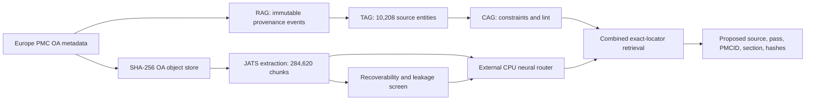

# External literature overnight run — final measured report

**Date:** 2026-08-05  
**Branch:** `codex/external-training-corpus`  
**Authority:** `proposed` external evidence only

This run built a provenance-preserving literature corpus and an external neural retrieval layer. It
did not change Aleph physics, unseal `aleph/learn` or `aleph/represent`, promote a paper to Aleph
truth, or infer a physical parameter.

## Final inventory

| Measure | First pass | Second pass | Combined |
|---|---:|---:|---:|
| Raw candidate rows | 7,218 | 3,000 | 10,218 |
| Unique candidate source families | 7,213 | 3,000 | **10,208** |
| OA acquisition receipts | 2,713 | 3,000 | **5,713** |
| Valid OA XML payloads | 2,701 | 2,974 | **5,675** |
| Explicit HTTP 404 failures | 12 | 26 | **38** |
| Validated XML bytes | 445,899,949 | 404,754,837 | **850,654,786** |
| Retrieval chunks | 139,573 | 145,047 | **284,620** |
| Sections | 79,071 | 82,918 | **161,989** |
| Figure locators | 17,173 | 21,143 | **38,316** |
| Table locators | 2,213 | 2,237 | **4,450** |

The two candidate sets overlap in five normalized source families. The successful OA/derived sets
overlap in zero families. All 5,675 objects are unique by SHA-256; the ignored local object store is
822 MiB. No PDF, XML, JATS, derived chunk text, or `data/external_training` path is tracked by Git.

## Implemented data path



The combined RAG–TAG–CAG run contains 10,208 events and 10,208 TAG entities, 21,596
content-addressed objects, and 21 explicit retraction-marked entities. Missing objects, corrupt
objects, CAG lint violations, and second-run appended events are all zero. The deterministic
combined receipts are:

- ledger head: `662cea6bcf553d441b622de5a9c3d34745453f3586b8b187b7878728ea9e146d`
- TAG manifest: `f2de469010ce8de4bd234767d08fcbfb7c3c9676c1cbabfda28f2a65c9e9f203`
- semantic projection: `15ff31f6719ed3df70a71556eb00a695eedb94d654f84dc326a178162aca963a`

## Quality and leakage routing

The automated screen measures whether evidence details are recoverable, not whether a study is
true or adequate.

| Proposed manual route | Articles |
|---|---:|
| Manual priority | **1,043** |
| Explicit exception candidate | **74** |
| Hold | **4,558** |
| Automatic Tier A promotion | **0** |

Exact relevant figure/table observations were located for 5,063 articles. Signals were recoverable
for sample size in 4,275, biological replication in 1,198, calibration in 1,218, units in 5,270,
uncertainty in 4,557, exclusions in 1,762, and source/data availability in 2,404 articles. The
accession graph found 120 potential shared-dataset groups, including 70 cross-pass groups. These are
conservative split constraints and manual-review leads, not proof that processed datasets are
identical.

## Neural routing result

V3 uses bounded abstract/methods/results/conclusion text from **5,669** usable families. It maps the
incompatible 29-label first pass and 12-label second pass into an explicit 12-route coarse taxonomy.
The 120 accession groups form 27 transitive split components covering 140 usable families; no
component crosses train/validation/test.

| Metric on the same 3,980 / 855 / 834 split | Title metadata | OA content + metadata | Delta |
|---|---:|---:|---:|
| Macro-F1 | 0.5677 | **0.6518** | +0.0842 |
| Accuracy | 0.6091 | **0.6990** | +0.0899 |
| Retrieval hit@5 | 0.7218 | **0.7638** | +0.0420 |
| Retrieval precision@5 | 0.5700 | **0.6904** | +0.1204 |

The final CPU run trained the title model in 6.96 seconds and the content model in 9.37 seconds;
the pipeline took 21.06 seconds. Two complete runs reproduced identical weights and split hashes.
V2's 29-label F1 and V3's 12-label F1 are not directly comparable. The weakest V3 route remains
`organelle_general_mechanics` at F1 0.3600, so the model is a routing baseline, not a solved
classifier.

## Usable combined retrieval

The text-free combined index covers all **5,675** local OA families and **284,620** exact-locator
chunks; 5,669 families are neural-routable. Its SHA-256 is
`ede8d2aff2a8786efa8e01bba6fbb398f46bdfdcc34eda0ef2662bdefe7a5887`.

```bash
/Users/sw1/miniconda3/envs/aleph/bin/python \
  corpus/external_training/retrieval/combined/bridge.py \
  --query "cortical tension actomyosin membrane mechanics" --source-k 5
```

A measured smoke query returned one first-pass and four second-pass sources with exact JATS
locators. Warm median CPU latency was 280–392 ms for cortical tension, TFM, IF/WB/PCR, and PIV/cell
state query families; cold initialization was 5.113 seconds. Returned snippets are at most 280
characters and appear only after local file, text, and canonical record digest checks.

The bridge refuses parameter estimation/fitting/calibration/prediction, training, authority claims,
empty input, and unknown input with typed results. The adversarial query `fit cortical tension
parameter 0.5 nN per um` returns `physical_parameter_estimation_refused` with process exit code 2;
`methods measuring cortical tension` remains an allowed literature query.

## Independent verification and tests

An independent verifier recomputed counts from raw candidate manifests, receipts, every object and
both derived stores rather than copying producer summaries. It found zero missing, corrupt,
unreferenced, hash-mismatched, orphaned, or above-`proposed` records. Manifest-set hashes reproduced
as `cf618563...ac069` and `9627db89...bcf0f`.

- default `pytest corpus/external_training -q`: **74 passed**
- safe public harness core: **81 passed**
- combined retrieval/model/RAG/extraction integration: **29 passed**
- first-pass retrieval adversarial allow/refuse audit: **12/12 passed**
- Git tracked or reachable-history payload/full-text paths: **0**

No GPU or Slurm allocation was available on this host. The external models therefore use a small,
deterministic NumPy MLP. This result does not claim GPU training, core Aleph MTG-PN training, physics
validation, journal-impact verification across the whole corpus, or permission to use held evidence
as parameter truth.

## Commits

- `af5aa21` — second-pass OA discovery/acquisition
- `cf454d5` — second-pass JATS extraction
- `736153b` — combined RAG–TAG–CAG ingest
- `c9c6d76` / `dbc413d` — second-pass quality screen and test isolation
- `5336672` — combined OA-content neural router
- `3dbb3aa` — combined exact-locator retrieval bridge
- `97d8313` / `bde2a3e` — independent corpus and combined-retrieval verification
