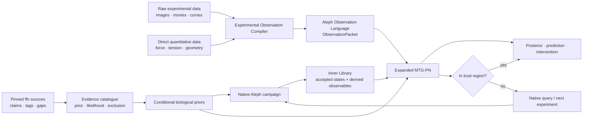
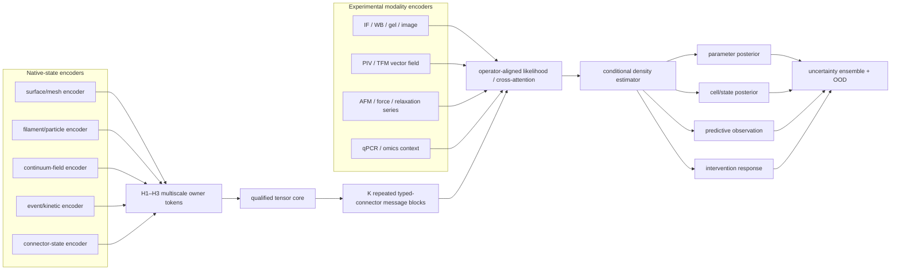

# Project Aleph 다중모달 Outer Library와 MTG-PN 통합 설계 보고서

> **Status: AGENT-PROPOSED**
>
> **작성일:** 2026-08-04 KST
>
> **문서 성격:** 현황 정리와 연구·구현 제안. PI 결정 기록이 아니며 `decided_by` 필드를
> 갖지 않는다. 이 문서는 코드, 물리 법칙, evidence status, gate 또는 training seal을
> 변경하지 않는다.

## 0. 요약

Project Aleph의 장기 목표는 하나의 파라미터 조합을 찾는 것이 아니다. 문헌, 실험,
Aleph native simulation을 결합해 다음 질문에 확률적으로 답하는 **세포종·세포상태 역학
라이브러리**를 구축하는 것이다.

> 특정 species, cell type, cell state, perturbation, environment와 assay가 주어졌을 때,
> 어떤 Aleph 파라미터 조합과 기전이 관측과 양립하는가? 무엇이 구분되지 않는가? 다음에
> 어떤 simulation 또는 experiment가 불확실성을 가장 많이 줄이는가?

이를 위해 세 계층을 분리한다.

1. **Experimental Observation Compiler**

   IF, WB, PCR, PIV, TFM, AFM, FRET, FRAP, microscopy와 직접 force/tension 데이터를
   단위·좌표·불확실성·protocol이 있는 Aleph 관측 언어로 변환한다.
2. **Mechanistic Inference Network — expanded MTG-PN**

   Aleph native state와 관측 likelihood를 결합해 parameter/state posterior, prediction,
   intervention response, uncertainty와 OOD verdict를 출력한다.
3. **Native Aleph simulator**

   학습기가 대신하지 않는 물리 기준이다. OOD 또는 정보 부족 시 새로운 native run을
   수행하고, 수렴하고 accepted digest를 가진 상태만 Inner Library와 training evidence에
   들어간다.

ffn 자료는 학습 정답이 아니라 **출처가 붙은 prior·관측 후보·negative evidence**로
사용한다. ffn tags와 lenses는 review routing에 유용하지만 Aleph의 물리 권위를 부여하지
않는다.

현재 MTG-PN은 구조와 거부 규칙만 선언되어 있다. 학습된 weight, hidden width, rank,
tensor dimension은 모두 없다. 따라서 본 보고서의 확장 신경망은 현재 코드를 설명하는
부분과 향후 제안을 명확히 구분한다.

관련 연구 비교에서 확인한 장점은 아래 설계에 흡수했다. 다만 논문의 신경망이나 코드를
가져온 것이 아니라, **반드시 비교해야 할 baseline, 보존해야 할 구조, 검증해야 할 실패
조건**으로 번역했다. 이 변경도 제안 상태이며 R5 seal을 해제하지 않는다.

### 0.1 약어

| 약어 | 의미 |
|---|---|
| IF | immunofluorescence microscopy |
| WB | Western blot |
| PCR | polymerase chain reaction; qPCR/RT-qPCR을 별도 표기 |
| PIV | particle image velocimetry 또는 실험 영상의 대응 velocity-field reconstruction |
| TFM | traction force microscopy |
| AFM | atomic force microscopy |
| FRET | Förster resonance energy transfer |
| FRAP | fluorescence recovery after photobleaching |
| SBI | simulation-based inference |
| OOD | out of distribution |

---

## 1. 현재 저장소에서 확인되는 사실

### 1.1 Axis Registry

현재 canonical 문서는 [`AXIS_REGISTRY.md`](./AXIS_REGISTRY.md)다.

| 항목 | 현재 값 |
|---|---:|
| 전체 numeric rows | 172 |
| 실제 sweep axes | 125 |
| log axes | 103 |
| linear axes | 17 |
| integer axes | 5 |
| unsourced carrier 위의 axes | 78 |
| default가 없어 prior 전에는 sweep 불가능한 axes | 70 |

과거 대화에서 사용된 “177개 파라미터 축”은 현재 registry의 수가 아니다. 현행 설계와
모든 coverage 계산은 125개 axis를 기준으로 해야 한다. Population axes, context axes와
discrete law switches는 registry와 별도 계층이다.

### 1.2 ffn evidence corpus

`ffn_cellsim`은 read-only이며, ingest source pin은
`be0e58760baaddc04460bb6b34b0476b5d8aa6c5`다. 현재 inventory는 562개 intake file,
12,705,033 bytes를 기록한다.

| Intake | Files | 역할 |
|---|---:|---|
| P1 parameters | 33 | provenance gaps, candidate values, convenience labels |
| P2 dossiers | 77 | paper-level extraction candidates |
| P2b lenses | 231 | predecessor-engine transfer verdicts |
| P3 paper notes | 63 | source identity and synthesis |
| P4 ontology | 72 | vocabulary candidates |
| P5 measurement | 61 | assay/observable candidates |
| P6 corpus metadata | 13 | collection lineage |
| P8 theory | 12 | relations and mechanism candidates |

현재 ingest session 기록상 316개가 `proposed`로 landed됐고 하나도 promoted되지 않았다.
상세한 ingest 및 학습 계획은
[`2026-08-04-outer-library-ffn-evidence-training.md`](../superpowers/plans/2026-08-04-outer-library-ffn-evidence-training.md)에
있다.

### 1.3 MTG-PN

현행 신경망 언어는 [`ALEPH-TN-LANGUAGE-SPEC.md`](./ALEPH-TN-LANGUAGE-SPEC.md)와
`aleph/learn/`에 선언돼 있다.

- `numpy`, PyTorch, JAX, SciPy, Warp import 금지;
- weight와 model instance 없음;
- `build`, `instantiate`, `forward`, `fit`, `train`, `predict`는 `TrainingSealed`로 거부;
- R5 통과와 PI의 unseal 결정이 필요;
- current stage registry는 `H1/H2/H3/C/G/L/P/V`의 8단계;
- SIM, EXP, HYBRID의 세 provenance lane을 가짐;
- experiment-only lane은 영구적으로 non-native authority ceiling을 가짐.

현재 training precondition 8개 가운데 frozen state schema만 `SATISFIED`다. Representation
plan과 leakage-safe split은 진행 중이며, accepted native transaction/trace와 qualification은
R3/R5 gated, tolerance와 loss weights는 미착수다.

### 1.4 Sweep performance는 선행조건

사용자가 2026-08-04 제공한 측정에서 level 1은 약 158 ms/step, level 3은 약
4.25 s/step, level 4는 약 18.9 s/step이었다. Level 4의 construction memory는 dense
Exterior Stokes matrices가 지배했다. 이 수치는 본 보고서가 새로 측정한 결과가 아니며,
성능 주장에 사용하려면 별도의 reproducible benchmark가 필요하다.

Neural inference는 native campaign 비용을 사라지게 하지 않는다. 먼저 native engine이
level 5를 포함한 목표 resolution에서 반복 실행 가능해야 하며, surrogate training cost도
총비용에 포함해야 한다.

---

## 2. 목표와 비목표

### 2.1 목표

1. 문헌과 실험의 provenance를 잃지 않는 conditional biological prior 구축.
2. 원자료를 Aleph가 비교할 수 있는 observation으로 변환.
3. 세포종·상태를 하나의 대표 vector가 아니라 posterior distribution으로 표현.
4. multi-modal observation으로 parameter identifiability 개선.
5. native simulation budget을 active learning으로 배분.
6. OOD에서는 거짓 예측 대신 native query 또는 typed refusal 반환.
7. accepted native state를 저장하고 새 observable은 재실행 없이 파생.
8. 방법론, biological discovery와 data/resource paper로 이어지는 검증 가능 연구 프로그램.

### 2.2 비목표

- ffn runtime parameter file을 Aleph 정답으로 복사;
- cortical tension 하나에 맞춘 library;
- raw image에서 바로 125개 physics parameter를 회귀하는 black box;
- 문헌 숫자와 simulation output을 독립 sample로 이중 계산;
- non-converged run 또는 surrogate extrapolation을 library entry로 저장;
- omics abundance를 힘·stiffness·rate의 직접 측정으로 해석;
- 신경망이 native physics를 대체하거나 물리 법칙 모듈을 수정;
- “quantum”이라는 이름으로 기존 불확실성을 물리적으로 양자화했다고 주장.

---

## 3. 전체 시스템



### 3.1 Proposed Inner/Outer Library boundary

이 명칭과 경계는 아직 PI decision이 아니다. 본 보고서의 작업 정의는 다음과 같다.

| Library | 역할 | 권위 |
|---|---|---|
| Inner Library | accepted native state, simulation context, convergence report, derived observable views | native trace가 허용하는 범위 |
| Outer Library | literature/experiment-conditioned priors, likelihoods, posterior, cell/state distributions, query planning | source와 lane ceiling이 허용하는 범위 |

Outer Library는 Inner Library 위에 올라가는 “더 높은 진실”이 아니다. Native state와 외부
관측을 연결하는 확률·검색 계층이다.

---

## 4. Evidence layer — ffn에서 무엇을 가져오는가

### 4.1 가져오는 것

- source identity와 immutable digest;
- 정량 claim, unit, uncertainty, sample size와 evidence coordinates;
- cell type, state, assay, perturbation, environment context;
- primary/review/simulation/derived/convenience 구분;
- transferability rationale와 negative evidence;
- conflict, supersession, retraction와 missing supplement;
- analytic relation과 mechanism candidate.

### 4.2 가져오지 않는 것

- predecessor runtime authority;
- engine-specific default를 universal biological constant로 보는 해석;
- 동일 논문의 dossier와 lenses를 독립 sample로 세는 방식;
- circular validation;
- wrong-scale 또는 wrong-cell 값을 target cell의 직접 label로 쓰는 방식.

### 4.3 필요한 evidence records

본 보고서는 다음 역할을 제안한다. 실제 class와 module 위치는 별도 ownership review가
필요하다.

1. `SourceRecord`
2. `QuantitativeClaimRecord`
3. `BiologicalContextRecord`
4. `AssayRecord`
5. `TransferAssessment`
6. `AlephBinding`

핵심 규칙은 다음과 같다.

> Tags route review. Claims train priors and likelihoods. Bindings connect claims to Aleph.

---

## 5. Experimental Observation Compiler

실험 입력은 두 갈래로 분리한다.

### 5.1 Branch A — raw/visual data

```text
raw pixels / frames / curves
    → modality-specific decoding
    → calibration and physical reconstruction
    → Aleph visual semantics
    → ObservationPacket
```

#### A1. Modality-specific decoding

- cell/nucleus/filament segmentation;
- lane and band detection;
- particle/bead tracking;
- optical flow/PIV window inference;
- contour, landmark and focal-adhesion detection;
- fluorescence/background correction;
- time-series event detection;
- curve baseline, threshold and kinetic feature extraction.

일반적 cell segmentation의 starting point로 Cellpose와 같은 모델이 존재하지만, Aleph가
필요로 하는 filament topology, focal adhesion endpoint, cortex shell과 protocol-specific
calibration까지 자동으로 해결하지는 않는다.

#### A2. Physical/biological reconstruction

영상 feature를 scientific quantity로 변환한다.

```text
IF pixels      → mask/orientation/intensity → structural field
PIV frames     → displacement              → velocity field
TFM bead movie → substrate displacement    → traction field
WB image       → corrected band intensity  → relative abundance
qPCR curve     → efficiency-corrected Cq   → relative target quantity
FRAP movie     → recovery curve             → turnover observable
FRET channels  → corrected ratio field      → calibrated tension proxy
```

#### A3. Aleph visual semantic layer

이 서브레이어가 “우리의 시각 데이터를 우리 언어로 해석”한다.

| Extracted object | Aleph language |
|---|---|
| cell or nucleus contour | `MESH_SURFACE + SPATIAL` observation |
| actin filament skeleton | `ENTITY + SPATIAL + orientation/topology` |
| fluorescence density | `FIELD + SPATIAL` |
| focal adhesion sites | endpoint/entity set with spatial support |
| PIV velocity | vector `FIELD + SPATIAL + TIME` |
| TFM traction | vector `FIELD + SPATIAL + TIME`, force/area |
| FRAP/FRET series | `FIELD + TIME` with calibration |
| division, binding or rupture | `EVENT + ENTITY + TIME` |
| WB abundance | condition-level scalar observation |
| qPCR target quantity | context-conditioned molecular abundance |

출력은 opaque embedding만이어서는 안 된다. 사람이 읽을 수 있는 quantity, unit, coordinate
frame, mask, covariance와 provenance를 함께 가져야 한다.

### 5.2 Branch B — direct quantitative data

Force, tension, geometry, AFM curves, concentration table와 이미 계산된 time series는 visual
reconstruction을 건너뛸 수 있다. 그러나 “가공 없음”을 의미하지 않는다.

필수 adapter 항목:

- unit와 dimension;
- instrument frame와 sample frame;
- calibration과 baseline;
- geometry;
- sampling cadence;
- uncertainty/covariance;
- quality mask;
- protocol and biological context;
- source digest.

예를 들어 `0.5 mN/m`만으로는 Aleph observation이 아니다. Cell line, state, assay,
radius source, uncertainty와 protocol이 있어야 한다.

### 5.3 공통 출력 — proposed `ObservationPacket`

```text
ObservationPacket
├── observation_id
├── quantity_id
├── value | field | curve | samples
├── unit and dimension
├── spatial_support and coordinate_frame
├── temporal_support and sampling
├── owner/entity association
├── modality and assay_id
├── protocol_hash
├── calibration_hash
├── uncertainty / covariance
├── quality_mask
├── biological_context_hash
├── provenance
└── observation_operator_id and version
```

Missing modality는 zero가 아니다. `ABSENT`, `NOT_APPLICABLE`, `NOT_RECORDED`를 구분하고
각각 다른 hash와 likelihood semantics를 가져야 한다.

---

## 6. Modality별 역할

| Modality | Raw input | Aleph observable | 직접 알려주는 것 | 직접 알려주지 않는 것 |
|---|---|---|---|---|
| Cortical tension | scalar/curve + protocol | tension likelihood | integrated contractility | single motor parameter |
| TFM | bead images/displacement | traction vector field | substrate force transfer | internal force source alone |
| PIV/optical flow | image pairs/movie | velocity vector field | flow and deformation | force without constitutive model |
| AFM indentation | force–indentation curve | apparent response curve | composite stiffness/rate response | unique compartment modulus |
| Force relaxation/creep | force/time | relaxation spectrum | viscosity/poroelastic/turnover groups | single viscosity without model |
| Micropipette | pressure, aspiration length | deformation/tension response | envelope mechanics | isolated membrane law alone |
| Parallel plate | force, geometry | cortical response | tension + geometry relation | pressure if not independently known |
| IF | multichannel images | structure/intensity fields | localisation, density, orientation | mechanical force directly |
| WB | lane/band image | relative abundance | protein abundance/state | spatial distribution or force |
| qPCR/RT-qPCR | amplification curve/Cq | relative transcript quantity | expression context | protein amount/activity/force |
| FRET tension sensor | channel images | calibrated local proxy field | local molecular tension proxy | whole-cell stress without mapping |
| FRAP | recovery movie | recovery curve/field | turnover/mobility group | unique molecular rate without model |
| Live morphology | 2D/3D movie | mesh and shape time series | deformation and phenotype | force source alone |
| Particle microrheology | tracked particles | displacement spectrum | local rheology | whole-cell structure alone |
| Omics/proteomics | counts/abundance | context/state evidence | identity and abundance prior | mechanical parameter directly |

### 6.1 IF

IF는 구조를 직접 관측하는 데 가장 유용하다.

- cortex thickness and intensity;
- actin filament density/orientation;
- myosin localisation;
- focal adhesion location/size;
- lamin/chromatin spatial organisation;
- marker colocalisation.

분할 정확도는 cell/lab/batch hold-out으로 평가해야 한다. 동일 plate의 random crop split은
generalisation 검증이 아니다.

### 6.2 Western blot

WB pipeline은 lane/band segmentation, local background, molecular-weight alignment, saturation
check, loading-control 또는 total-protein normalization과 uncertainty를 기록한다. Band
intensity는 abundance evidence이며 `motor force = intensity`로 직접 매핑하지 않는다.

### 6.3 PCR series

Endpoint PCR gel은 visual branch에 가깝다. qPCR/RT-qPCR은 raw amplification curve와 numerical
branch가 만나는 사례다. Cq만 저장하지 않고 efficiency, melting curve, reference targets,
replicates, dynamic range와 detection limits를 기록해야 한다. MIQE 2.0은 efficiency-corrected
quantity, prediction interval과 raw data export를 강조하므로 protocol schema의 외부 기준으로
활용할 수 있다.

### 6.4 PIV and TFM

PIV는 velocity를, TFM은 traction을 관측한다.

\[
\mathbf v(\mathbf x,t), \qquad \mathbf t(\mathbf x,t)
\]

둘을 함께 사용하면 force generation과 force transmission을 분리하는 데 도움이 된다.

| Observation | 가능한 해석 |
|---|---|
| high flow, low traction | clutch slip or weak transmission |
| low flow, high traction | strong/static coupling or prestress |
| both low | weak active generation or suppressed architecture |
| direction mismatch | topology, calibration or reconstruction issue |

여기에 IF의 actin/myosin/adhesion structure가 추가되면
`structure + motion + force` 삼각 측량이 된다.

TFM은 substrate modulus, Poisson ratio, gel thickness, bead density, reconstruction regularisation,
2D/2.5D/3D geometry와 uncertainty를 함께 가져야 한다. 공개 도구와 방법론은 출발점이지
Aleph evidence authority가 아니다.

---

## 7. Expanded MTG-PN

### 7.1 Current declared skeleton

```text
H1  leaf entity encoder
H2  local topology pooling
H3  one token per owner
C   representation-qualified tensor core
G   typed connector graph
L   observation likelihood factors
P   posterior/predictive/intervention heads
V   uncertainty/OOD/native-query verdict
```

이 구조는 헌법적 skeleton이다. 실제 layer count, width, rank, repeated block 수와 density
estimator family를 정하지 않는다.

### 7.2 Proposed production architecture



### 7.3 Native-state encoders

모든 state를 같은 GNN 입력에 바로 넣지 않는다.

- membrane/nuclear envelope: surface/mesh equivariant encoder;
- actin, MT, IF, ECM: filament or rod graph encoder;
- cytosol: continuum/particle-field encoder;
- adhesion: bipartite endpoint and event encoder;
- turnover/motor kinetics: marked temporal-event encoder.

각 branch가 local representation을 만든 후 H3 owner token으로 pooling한다.

### 7.4 Repeated connector GNN

Current `G`는 논리적 stage 하나지만 실제 모델에서는 symbolic 횟수 `K`의 repeated block이
필요할 수 있다.

```text
owner update
→ typed connector message
→ endpoint force/power-aware update
→ owner update
→ ...
```

`K`, hidden width와 receptive field는 accepted pilot에서 측정한다. Message는 실제 connector
edge로만 이동한다. 공간적 근접은 edge를 만들지 않는다.

Flat message passing의 장거리 병목은 topology-preserving multiscale block으로 다룬다.
Coarsening은 Aleph owner hierarchy와 connector reachability를 보존해야 하며, Euclidean
nearest-neighbour로 가짜 edge를 만들 수 없다. Candidate multiscale block은 다음 계약을
동시에 만족해야 한다.

- fine/coarse/fine round trip에서 owner identity와 typed endpoint 보존;
- passive connector action–reaction residual 변화 0;
- active power ledger의 source/sink identity 보존;
- flat generic GNN, MeshGraphNet-style processor, multiscale processor의 동일-budget 비교;
- native rollout 밖에서는 surrogate가 아니라 OOD refusal 또는 native query 반환.

### 7.5 Experimental modality encoders

- image/IF/gel: spatial encoder plus semantic objects;
- PIV/TFM: vector-field mesh/GNN encoder;
- AFM/force/relaxation: irregular time-series encoder;
- WB/qPCR/omics: abundance/context encoder;
- protocol and calibration: conditioning, not an optional metadata footer.

Modality를 하나의 긴 vector로 concatenate하지 않는다. 각 modality는 resolution, unit,
noise model과 missingness가 다르며 먼저 독립 likelihood factor를 만든다.

각 modality에는 두 표현을 병렬로 유지한다.

1. reviewed Aleph semantic quantities: 방향, 밀도, 두께, traction, velocity, curve parameter;
2. learned residual summary: semantic vocabulary가 놓친 정보를 담는 task-trained 또는
   self-supervised embedding.

둘 중 하나만 쓰지 않는다. Semantic-only, learned-only, dual representation을 ablation하고,
learned branch가 microscope/lab/batch를 생물학으로 분류하지 않는지 group hold-out으로
검사한다. Missing value를 0으로 채우는 경우 반드시 별도 presence mask를 제공하며,
`absent`, `below detection`, `not acquired`, `reconstruction failed`를 서로 다른 상태로 둔다.

Cross-attention은 실제로 같은 cell/sample/time window에서 co-assayed된 modality에만 사용한다.
서로 다른 논문이나 donor에서 온 IF와 TFM을 paired token처럼 결합하지 않는다. Unpaired
자료는 context-conditioned likelihood factor 또는 population prior로만 합쳐진다.

### 7.6 Output density model

125-axis MSE regression은 식별 불가능성을 평균으로 숨긴다. Production head는 multimodal
posterior를 표현해야 한다.

후보 family:

- normalizing flow;
- neural posterior estimator;
- mixture density model;
- 조건에 따라 diffusion posterior.

Family 선택은 pilot과 calibration 결과에 따른다. 현재 설계는 어느 것도 결정하지 않는다.

Posterior는 sample별 분포와 population/state-level 분포를 동시에 표현해야 한다. 먼저
식별 가능한 mechanism coordinate를 sensitivity와 conditional dependence로 축소하고,
나머지 125축은 임의 point estimate로 채우지 않는다. Posterior-mean regression은 정확도가
좋아 보여도 multimodality와 보상관계를 지울 수 있으므로 density estimator의 대체물이
아니라 negative baseline이다. 새로운 관측에 재학습 없이 적용되는 amortized inference의
장점과 초기 native corpus 비용을 모두 별도로 보고한다.

### 7.7 Exact constraints and refusal

Loss weight로 거래하지 않는 제약:

- one owner per entity;
- typed endpoints;
- passive action–reaction;
- active power ledger separation;
- one accepted state/clock;
- accepted state digest;
- absent modality mask;
- evidence authority ceiling;
- OOD native-query fallback.

---

## 8. 두 학습 계층을 분리하는 이유

### Layer 1 — Observation Foundation Layer

Raw data를 reproducible scientific observation으로 변환한다.

검증 질문:

- segmentation이 맞는가?
- calibration이 맞는가?
- field reconstruction uncertainty가 맞는가?
- protocol/batch가 결과를 지배하지 않는가?
- Aleph semantic binding이 맞는가?

### Layer 2 — Mechanistic Inference Layer

ObservationPacket을 Aleph native state와 비교해 posterior를 만든다.

검증 질문:

- posterior가 calibrated됐는가?
- parameter combinations를 식별하는가?
- held-out perturbation을 예측하는가?
- OOD에서 거부하는가?
- active query가 native budget을 줄이는가?

처음부터 raw image → physics parameter end-to-end로 학습하면 현미경, 염색 강도, plate,
lab와 batch를 기계 파라미터로 학습하는 shortcut이 생긴다. 먼저 두 계층을 독립 검증하고,
충분한 controls 뒤에만 제한적 joint fine-tuning을 고려한다.

---

## 9. Cortical tension 스윕의 구체적 동작

Cortical tension은 전체 library가 아니라 end-to-end control이다.

### 9.1 비교할 네 조건

1. control;
2. myosin inhibition;
3. actin disruption;
4. osmotic perturbation.

가능하면 각 조건에서 다음을 동시 측정한다.

- cortical tension;
- cell/nucleus geometry;
- TFM traction;
- PIV/actin flow;
- IF actin/myosin/focal adhesion;
- relaxation time series;
- WB/qPCR as abundance/state context.

### 9.2 Candidate mechanism groups

모든 axis를 독립 sweep하지 않고 관측에 보이는 mechanism group을 사용한다.

| Group | Examples |
|---|---|
| active generation | myosin force, duty, attachment/detachment kinetics |
| cortex architecture | filament length, connectivity, crosslink stiffness/turnover |
| passive envelope | membrane/cortex tension and bending groups |
| pressure/geometry | osmotic pressure, radius, volume constraints |
| force transmission | cortex–membrane, adhesion/clutch, substrate coupling |
| hydrodynamics | cytosol/exterior drag and relaxation groups |

`Cortical tension`이라는 이름이 같은 input parameter에 자동 binding되지 않는다. 대부분은
emergent observable likelihood다.

### 9.3 Sweep loop

```text
1. ffn/external evidence → target-context prior
2. wiring/load-path audit → disconnected axes 제거
3. sensitivity/identifiability screen → visible groups 선택
4. constrained design in prior mass
5. native Aleph relaxation
6. converged + accepted digest만 Inner Library admission
7. observation operators → tension, traction, flow, image features
8. four-condition likelihood → joint posterior
9. posterior predictive check on held-out perturbation
10. broad/OOD이면 information-gain native query
11. repeat until declared stopping criterion
```

### 9.4 무엇을 분리하려는가

같은 낮은 tension에도 여러 원인이 있다.

```text
A. low myosin force
B. normal force + poor cortex connectivity
C. normal cortex force + clutch slip
D. altered pressure/radius relation
E. experimental calibration or wrong state
```

Tension scalar만으로는 이들을 구분하기 어렵다.

- IF는 structure를 추가;
- PIV는 motion을 추가;
- TFM은 transmitted force를 추가;
- WB/qPCR은 abundance와 perturbation context를 추가;
- AFM/relaxation은 passive and temporal response를 추가.

### 9.5 Acceptance

- synthetic ground truth에서 simulation-based calibration;
- 한 perturbation family 완전 hold-out;
- native rerun으로 posterior mode와 credible-region samples 검증;
- parameter group coverage와 identifiable dimension 보고;
- OOD false-confidence rate 보고;
- prior-blind design 대비 동일 정확도까지의 total native-equivalent cost 비교;
- non-converged simulation은 library와 training set에서 제외.

---

## 10. 세포종·세포상태 라이브러리

Library entry는 “MCF7.yaml 하나”가 아니다.

\[
\theta_{sample}
= \theta_{global}
+ \Delta_{species/tissue}
+ \Delta_{cell\ type}
+ \Delta_{state}
+ \Delta_{perturbation}
+ \Delta_{environment}
+ \Delta_{study}
+ \epsilon
\]

상호작용은 evidence와 sensitivity가 있을 때만 추가한다. 모든 context label의 Cartesian
product를 만들지 않는다.

### 10.1 Context dimensions

- species and tissue;
- primary/immortalised cell and cell line;
- disease/subtype;
- cell-cycle and differentiation/activation state;
- suspension, spreading, migration, mitosis, quiescence;
- genetic/pharmacological/mechanical perturbation;
- medium, temperature, substrate, ECM and dimensionality;
- observation timescale and assay.

### 10.2 Broad initial coverage

초기 vertical slice도 cortex-only가 아니어야 한다.

1. membrane/cortex;
2. actin/myosin/crosslink kinetics;
3. cytosol rheology/poroelasticity;
4. nucleus/chromatin/lamina;
5. adhesion/substrate/spreading;
6. MT/IF mechanics;
7. ECM and cell–ECM transfer;
8. osmotic/exterior medium and drag.

각 영역은 supported evidence 또는 explicit lacuna 중 하나를 가져야 한다.

---

## 11. Parameter sweep 비용을 줄이는 방법

노드 위치를 실제 quantum wavefunction으로 바꾸는 것은 이 문제의 우선 해법이 아니다.
불확실성을 wavefunction처럼 표현한다는 비유는 posterior와 tensor representation으로
구현할 수 있지만, 세포 노드를 양자 상태로 취급할 물리 근거는 없다.

비용 절감 stack은 다음이다.

1. evidence-conditioned prior contraction;
2. derived-axis elimination and physical constraints;
3. load-path audit;
4. sensitivity screening;
5. identifiability grouping;
6. constrained Sobol/LHS or equivalent in prior mass;
7. multi-fidelity ranking with native target-resolution confirmation;
8. surrogate inside measured trust regions;
9. active learning/information gain;
10. accepted-state reuse for new observation operators;
11. hierarchical transfer across related cell states.

총비용은 다음을 모두 포함한다.

```text
failed runs
+ converged native runs
+ fidelity confirmation
+ surrogate training runs
+ retraining
+ observation processing
+ human review
```

ffn ac 대비 몇 배 빠르다는 주장은 동일 physics, accuracy, hardware와 convergence criterion의
benchmark 전에는 할 수 없다.

---

## 12. Data acquisition strategy

### 12.1 Four evidence sources

1. pinned ffn literature corpus;
2. public raw/supplementary experimental datasets;
3. newly generated local experiments;
4. accepted Aleph synthetic/native campaigns.

문헌 note가 raw IF/TFM/PIV training data를 자동으로 제공하는 것은 아니다. Source paper,
repository accession, raw bytes, licence와 protocol을 별도로 확보해야 한다.

### 12.2 Dataset manifest requirements

- accession/DOI and retrieval date;
- immutable content digest;
- licence and redistribution status;
- donor/lab/batch/plate/cell identifiers;
- biological context;
- protocol manifest;
- calibration and units;
- modality-specific QC;
- preprocessing version;
- train/validation/test lineage group;
- axes/observables informed;
- exclusion and retraction status.

### 12.3 Leakage rules

- same DOI/source family in one split only;
- same donor/lab/batch/perturbation grouped;
- adjacent frames of one cell never random-split;
- a parameter source and its generated simulation remain together;
- several ffn summaries of one paper count once;
- preprocessing model training data lineage is also recorded.

---

## 13. Validation programme

### 13.1 Observation Compiler

| Branch | Required controls |
|---|---|
| segmentation | cell/lab/batch hold-out, boundary and object metrics |
| IF structure | orientation/density/thickness against reviewed annotations |
| WB | lane/band/background/loading controls and saturation detection |
| qPCR | efficiency, reference targets, replicates, LOD/dynamic range |
| PIV | synthetic displacement and calibrated flow controls |
| TFM | synthetic traction/displacement, substrate uncertainty propagation |
| AFM/force | calibration, geometry and curve reconstruction controls |
| semantic binding | exact quantity/unit/frame/operator review |

영상 branch는 handcrafted/semantic features, 일반 pretrained encoder, domain self-supervised
encoder와 dual semantic+learned encoder를 같은 lineage split에서 비교한다. TFM branch는
classical inverse solver와 learned inverse solver를 모두 두고 synthetic ground truth의 field
error뿐 아니라 net force, net moment, noise robustness와 uncertainty coverage를 비교한다.
Learned TFM output이 빨라도 force conservation 또는 substrate-domain transfer가 나빠지면
채택하지 않는다.

자동 numeric admission에는 reviewed gold set에서 100% precision을 요구한다. 그보다 낮으면
모든 candidate는 review-only로 유지한다.

### 13.2 Mechanistic inference

- simulation-based calibration;
- posterior predictive checks;
- held-out perturbation and assay family;
- held-out cell type/state;
- OOD detection and false acceptance;
- parameter coverage and multimodality;
- ablation by each modality and compartment encoder;
- prior-only, grid/random search, ABC, posterior-mean regression and standard NPE baseline;
- handcrafted summaries versus inference-trained summaries;
- MLP, generic flat GNN, MeshGraphNet-style and topology-preserving multiscale processors;
- semantic-only, learned-only and dual observation representations;
- unpaired likelihood fusion versus paired-only cross-attention;
- native-query efficiency and total campaign cost;
- exact-constraint violation count must remain zero.

모든 비교는 같은 prior, simulation set, split, observation budget와 target accuracy를 사용한다.
Posterior mode만 재실행하지 않고 mode, random credible-region samples와 deliberately
low-probability samples를 native simulator로 확인한다. Calibration은 aggregate 하나가 아니라
parameter/mechanism group, assay, cell/state, lab/batch와 mismatch distance별로 보고한다.

### 13.3 Biology

- pre-registered prediction on an unused perturbation;
- competing mechanism comparison;
- posterior-informed experiment that distinguishes mechanisms;
- independent experimental confirmation where feasible;
- failure and non-identifiability reported as results.

---

## 14. 논문 가능성

### 14.1 현재만으로 가능한 것

현재 declaration과 report만으로는 full methods/biology paper가 아니다. Design/protocol 또는
workshop contribution은 가능하지만, 주요 주장은 실행 evidence를 필요로 한다.

### 14.2 Methods paper

Proposed thesis:

> Provenance-aware, structure-preserving, multimodal simulation-based inference for whole-cell
> mechanics reduces native simulation demand while preserving calibrated uncertainty and physical
> refusal boundaries.

필요 결과:

- accepted native corpus;
- multi-modal compiler benchmarks;
- calibrated posterior;
- generic baseline 대비 data efficiency;
- OOD/native-query benefit;
- exact physical constraint preservation;
- total cost reduction.

### 14.3 Biological discovery paper

더 강한 형태는 unseen experiment를 예측하고 확인하는 것이다.

Example thesis:

> Cell-state differences in cortical tension are explained by separable contributions of active
> generation, cortex connectivity and adhesion-mediated force transmission.

필요 결과:

- four-condition or broader perturbation dataset;
- TFM/PIV/IF plus tension;
- competing mechanism posterior;
- prospective intervention prediction;
- independent validation.

### 14.4 Data/resource paper

- provenance-aware cell mechanics claim graph;
- protocol/calibration manifests;
- raw-to-Aleph observation benchmark;
- accepted simulation corpus;
- leakage-safe splits;
- reproducible query API.

문헌 정리만으로는 약하며 최소한 observation/compiler 또는 inference benchmark가 필요하다.

### 14.5 관련 연구에서 채택한 교훈과 Aleph 차별점

| 연구 계열 | 검증된 장점 | Aleph에 넣는 것 | 그대로 쓰지 않는 것 | 필수 비교/반증 |
|---|---|---|---|---|
| Heyn et al., cell-mechanical SBI | 실험 trajectory에서 해석 가능한 mechanical posterior와 perturbation effect 추론 | sample posterior → cell-line/state population posterior, synthetic truth 선검증, 기전 좌표 축소 | 1D trajectory와 소수 축을 whole-cell 보편 모델로 일반화 | 125축 직접 회귀 대비 6–15 identifiable coordinates; held-out perturbation |
| Arruda et al., spatial migration SBI | inference-tailored learned summaries, amortized NPE, SBC | semantic summary와 learned residual summary의 dual path, missingness mask, SBC | posterior mean만으로 uncertainty 대체 | handcrafted, posterior-mean, joint-summary NPE의 동일-budget 비교 |
| Doorn et al., disease-mechanism SBI | 여러 관측 feature에서 parameter landscape, batch-matched comparison, pharmacological mechanism test | 동일 plate/batch 또는 명시적 batch hierarchy, posterior compensation map, intervention validation | 서로 다른 batch posterior의 직접 차이 해석 | batch-hold-out, within-batch contrast, posterior predictive native rerun |
| MeshGraphNets | mesh graph 전방 rollout surrogate | native-cost 절감용 forward-surrogate baseline과 rollout error 측정 | surrogate를 물리 oracle 또는 posterior로 승격 | one-step/rollout/native cost, conservation drift, OOD refusal |
| Bi-Stride multiscale GNN | 장거리 상호작용과 large mesh의 효율적 multiscale processing | owner/connector topology 기반 coarsening, fine/coarse identity controls | 공간 근접으로 connector edge 생성 | flat, MeshGraphNet-style, multiscale의 accuracy-memory-time 비교 |
| mechanism-organised networks | 기전별 branch가 black-box보다 해석 가능한 구조를 제공 | owner/connector/mechanism group별 encoder와 typed message | “mechanism-based” 명칭 자체를 novelty로 주장 | shuffled topology, generic GNN, typed topology ablation |
| ML traction-force microscopy | synthetic forward solutions로 inverse traction reconstruction 가속·강건화 | synthetic TFM compiler training, noise curriculum, force/moment controls, uncertainty propagation | TFM reconstruction만으로 Aleph 기전 추론을 주장 | classical TFM 대비 field/net-force/net-moment/noise/domain-shift |
| Cell Painting self-supervision | label이 적을 때 transferable morphology representation | IF/phenotype learned residual branch와 external-dataset transfer test | opaque embedding을 quantity/force/authority로 취급 | CellProfiler/semantic, generic pretrained, domain SSL, dual branch |
| CAPTAIN-style paired multimodality | co-assayed modality의 cross-attention과 shared representation | paired IF/omics/force가 실제 존재할 때만 cross-attention, modality dropout | 수백만 co-assayed cell 규모의 foundation-model 주장을 소규모 자료에 적용 | late likelihood fusion, paired cross-attention, missing-modality robustness |

이 표에서 독립 novelty로 주장할 수 없는 것은 SBI, GNN surrogate, multiscale, self-supervised
image encoder, TFM inverse network, cross-attention과 mechanism-shaped branch 각각이다. Aleph의
논문 기여 후보는 이들을 묶는 다음 계약이다.

1. whole-cell owner/typed-connector ontology가 network topology와 exact constraint를 결정한다;
2. 영상·field·curve·직접 수치를 provenance가 있는 공통 observation language로 컴파일한다;
3. literature는 prior, experiment는 likelihood, accepted native simulation은 mechanistic
   ancestry로 역할이 분리된다;
4. parameter posterior뿐 아니라 cell/state distribution, intervention prediction, OOD refusal와
   다음 native/experimental query를 함께 낸다;
5. source에서 posterior와 native confirmation까지 lineage를 끊지 않는다.

첫 논문은 foundation model이 아니라 **cortical contractility와 force transmission의
multimodal SBI**로 제한하는 것이 강하다. Tension, TFM, PIV, actin/adhesion IF를 사용해
6–15개 식별 가능한 mechanism coordinate를 추론하고, 한 perturbation family를 완전
hold-out한다. 전 125축과 전 세포종은 후속 library programme이며 첫 논문의 필수 주장이
아니다.

---

## 15. 구현 단계

### Phase 0 — authority and baseline

- ingest/axis live sessions 종료와 snapshot freeze;
- source pin/digest verification;
- current runtime and sweep benchmark;
- Outer/Inner boundary decision.

**Gate:** zero unpinned source reads; inventory and current counts reproducible.

### Phase 1 — evidence and dataset identity

- source-family deduplication;
- claim/context/assay/transfer/binding records;
- public raw dataset inventory;
- protocol/calibration manifests.

**Gate:** every candidate has source identity, lineage and status.

### Phase 2 — ObservationPacket and visual semantics

- raw/visual and direct adapters;
- unit/frame/uncertainty schema;
- IF/WB/qPCR/PIV/TFM pilot converters;
- semantic binding controls.

**Gate:** round-trip equality; negative controls reject missing unit, calibration, context and source.

### Phase 3 — gold set and independent modality validation

- stratified reviewed gold set;
- modality-specific performance;
- lab/batch hold-out;
- uncertainty calibration;
- semantic/handcrafted, generic pretrained, domain-SSL and dual-representation image baselines;
- classical and learned TFM reconstruction with force/moment/noise controls.

**Gate:** numeric auto-admission precision 100%; otherwise review-only.

### Phase 4 — first prior/likelihood compiler

- conditional priors;
- direct parameter versus emergent observable separation;
- conflict/mixture handling;
- explicit lacunae.

**Gate:** every compiled sample resolves to claims and transformations; no silent average.

### Phase 5 — Baseline-v0 after R5

- one accepted trace;
- one block/family/cut/loss;
- representation error by all channels;
- no full architecture yet.

**Gate:** representation qualified without exact-constraint violation.

### Phase 6 — modular MTG-PN

- native block encoders;
- repeated connector GNN;
- experiment modality encoders;
- conditional density head;
- OOD/native query;
- topology-preserving multiscale candidate and flat/MeshGraphNet-style baselines;
- paired-only cross-attention and unpaired likelihood-fusion control;
- sample-to-population hierarchical posterior and batch conditioning.

**Gate:** calibrated held-out performance and baseline superiority.

### Phase 7 — cortical-tension control

- four conditions;
- tension + geometry + IF/PIV/TFM where available;
- held-out perturbation;
- active-query comparison.

**Gate:** same declared accuracy with lower total native-equivalent cost than prior-blind design.

### Phase 8 — cell/state release

- PI-ratified taxonomy/TopologyAtlas;
- multi-compartment coverage;
- versioned release cards;
- reproducible posterior query.

**Gate:** unsupported context returns refusal; all released numbers trace to evidence and model.

---

## 16. Work packages

| Package | Deliverable |
|---|---|
| W1 corpus lineage | DOI/source-family graph and duplicate report |
| W2 evidence schema | claim/context/assay/transfer/binding records |
| W3 dataset registry | raw source manifests and protocol/calibration |
| W4 visual compiler | IF/WB/gel/image semantic conversion |
| W5 vector/force compiler | PIV/TFM/AFM/direct data conversion |
| W6 observation language | ObservationPacket and operator registry |
| W7 prior compiler | hierarchical priors, likelihoods, conflict models |
| W8 native corpus | accepted states, observables and convergence records |
| W9 MTG-PN pilot | Baseline-v0 and qualification |
| W10 multimodal model | modular encoders, posterior and OOD |
| W11 cortical control | four-condition end-to-end study |
| W12 library release | cell/state query and coverage cards |
| W13 benchmark pack | frozen splits, prior/ABC/NPE/graph/image/TFM baselines and ablations |

각 package는 현재 active ownership가 끝난 뒤 경로를 다시 등록해야 한다.

---

## 17. 주요 위험과 대응

| Risk | Consequence | Control |
|---|---|---|
| batch shortcut | biology 대신 microscope/lab 분류 | lab/batch hold-out, protocol conditioning |
| parameter–observable confusion | wrong physics binding | explicit target kind and reviewed operator |
| review inflation | secondary source가 primary로 승격 | source-family graph and evidence ceiling |
| circular validation | prior가 자기 validation을 통과 | lineage grouping and held-out source |
| missing modality as zero | false confident factor | typed absence and mask |
| overlarge end-to-end net | scarce-data overfit | modular training and ablation |
| posterior collapse to mean | mechanism mixture loss | multimodal density estimator |
| surrogate extrapolation | plausible wrong physics | OOD refusal and native query |
| non-converged training data | invalid native ancestry | accepted digest admission only |
| TFM inverse uncertainty ignored | false traction precision | calibration and uncertainty propagation |
| expression treated as mechanics | wrong causal mapping | abundance as context/prior, not direct force |
| raw data licence failure | unreproducible release | accession, digest and licence manifest |
| speed claim without full cost | misleading paper | total native-equivalent accounting |
| learned summary hides protocol | accurate batch classifier, wrong biology | semantic+learned dual path and grouped hold-out |
| false pairing across modalities | invented single-cell correlation | co-assay identity gate; otherwise likelihood fusion |
| multiscale graph invents edges | nonphysical long-range coupling | owner/connector reachability-preserving coarsening |

---

## 18. Open PI decisions

1. Outer Library와 Inner Library의 production name과 exact boundary.
2. 첫 canonical cell/state taxonomy와 `TopologyAtlas`.
3. mandatory biological context dimensions.
4. extracted claim을 `proposed` 이상으로 review할 authority.
5. structured child claim과 ingest entity kinds.
6. richer claim/context/assay/ObservationPacket의 module ownership.
7. canonical observable/operator registry.
8. 첫 raw experimental datasets와 redistribution policy.
9. 첫 release의 cell states, perturbations와 assays.
10. R5 이후 training unseal 조건 충족 여부와 결정 기록.
11. loss/tolerance pilot와 preregistration process.
12. native campaign GPU budget와 authorisation.

---

## 19. Definition of Done

프로그램은 다음이 수치로 확인될 때 완료된다.

- 모든 training datum이 immutable source와 Aleph binding으로 resolve;
- visual/direct branch가 동일 ObservationPacket language로 합류;
- convenience, circular, wrong-scale와 simulation-origin 값이 direct experimental label로 0건;
- IF/WB/qPCR/PIV/TFM 등 포함 modality마다 protocol/calibration manifest 존재;
- lineage-safe held-out calibration이 declared threshold 통과;
- exact physical constraints violation 0;
- unsupported/OOD context가 typed refusal 또는 native query 반환;
- multi-modal posterior가 synthetic truth를 calibrated coverage로 포함;
- standard NPE와 graph/image/TFM baseline pack이 같은 split과 budget에서 재현 가능;
- paired cross-attention에 co-assay identity 없는 sample 0건;
- graph pooling/unpooling 뒤 owner/endpoint identity 및 exact-constraint violation 0건;
- at least one named held-out perturbation prediction 검증;
- prior-blind campaign보다 동일 목표 정확도에서 total native-equivalent cost 감소;
- 모든 library entry가 converged accepted state 또는 명시적 non-native evidence record;
- 물리 law output은 evidence ingestion/training으로 변경되지 않음.

그 전의 정확한 명칭은 **provenance-aware multimodal evidence and inference prototype**이며,
완성된 universal cell library가 아니다.

---

## 20. 관련 내부 문서

- [`AXIS_REGISTRY.md`](./AXIS_REGISTRY.md)
- [`ALEPH-TN-LANGUAGE-SPEC.md`](./ALEPH-TN-LANGUAGE-SPEC.md)
- [`ALEPH-TRAINING-ON-THE-LANGUAGE.md`](./ALEPH-TRAINING-ON-THE-LANGUAGE.md)
- [`EXP_LANE_GATES.md`](./EXP_LANE_GATES.md)
- [`2026-08-04-inner-aleph-library-criteria.md`](../superpowers/specs/2026-08-04-inner-aleph-library-criteria.md)
- [`2026-08-04-outer-library-ffn-evidence-training.md`](../superpowers/plans/2026-08-04-outer-library-ffn-evidence-training.md)
- [`CLAUDE.md`](../../CLAUDE.md)

## 21. 외부 방법론 참고자료

다음은 tool 또는 architecture authority가 아니라, dataset processing와 연구 설계의 참고다.

- [Cellpose: generalist cellular segmentation](https://www.nature.com/articles/s41592-020-01018-x)
- [pyTFM: traction force and monolayer stress microscopy](https://doi.org/10.1371/journal.pcbi.1008364)
- [PIVlab accuracy and enhanced algorithms](https://openresearchsoftware.metajnl.com/articles/10.5334/jors.334)
- [MIQE 2.0 qPCR reporting and analysis guidelines](https://academic.oup.com/clinchem/article/71/6/634/8119148)
- [Mechanism-based organisation of neural networks for systems models](https://www.nature.com/articles/s41598-024-59378-9)
- [Simulation-based inference of cell migration dynamics](https://www.nature.com/articles/s41540-026-00648-9)
- [Cell-mechanical parameter estimation from 1D trajectories using SBI](https://journals.plos.org/plosone/article?id=10.1371/journal.pone.0310669)
- [Automated inference of disease mechanisms in patient-hiPSC neuronal networks](https://www.nature.com/articles/s42003-025-08209-2)
- [MeshGraphNets: learning mesh-based simulation with graph networks](https://arxiv.org/abs/2010.03409)
- [Bi-Stride multiscale GNN for mesh-based physical simulation](https://proceedings.mlr.press/v202/cao23a.html)
- [Machine-learning traction force microscopy](https://pmc.ncbi.nlm.nih.gov/articles/PMC10502481/)
- [Self-supervised Cell Painting morphology representations](https://pubmed.ncbi.nlm.nih.gov/39929956/)
- [CAPTAIN paired RNA–protein multimodal foundation model](https://www.nature.com/articles/s41467-026-72882-y)
