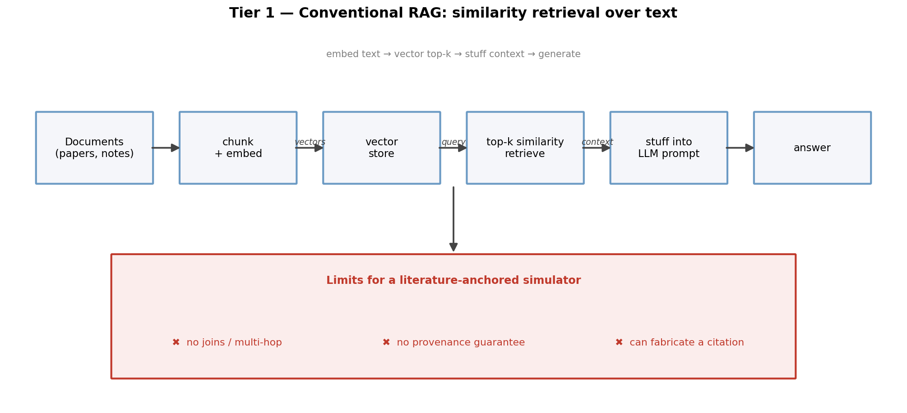
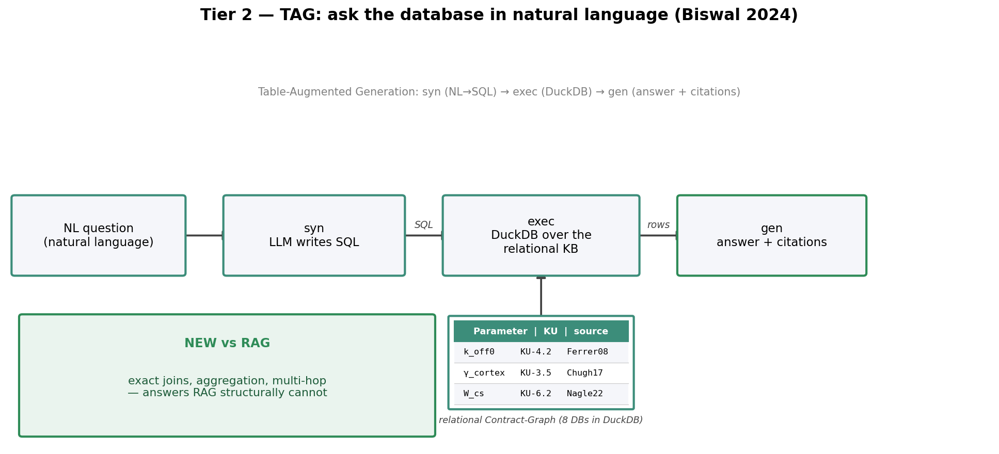
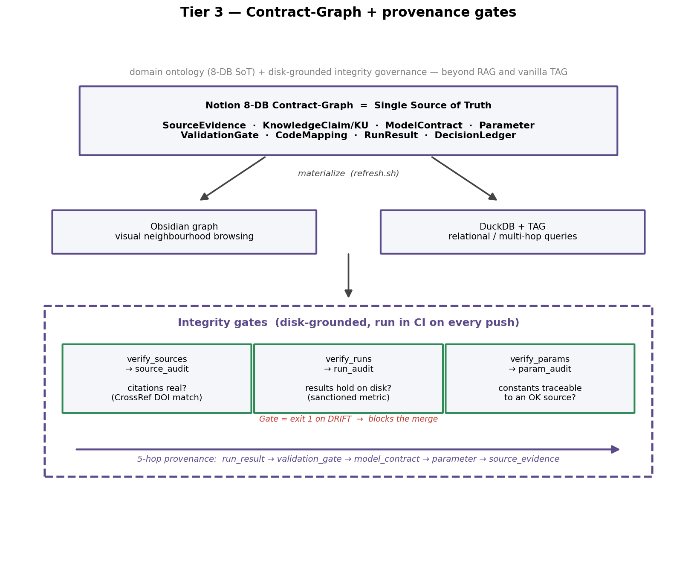
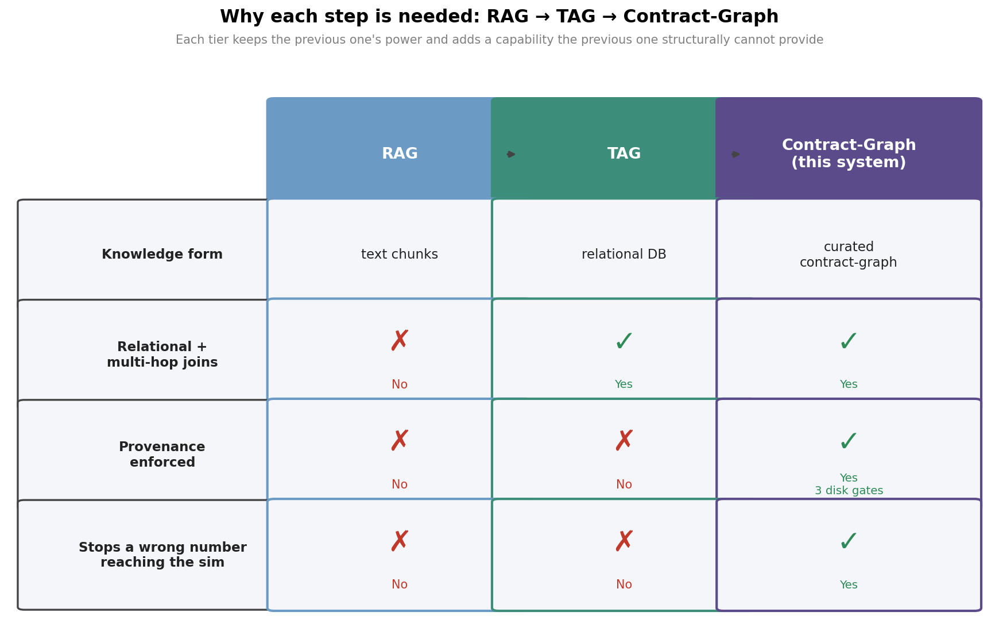
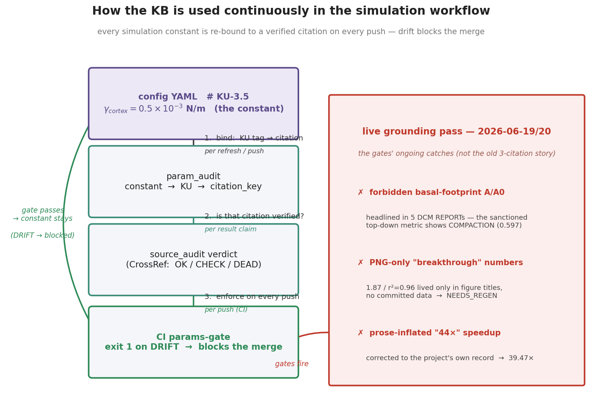

# From Search Box to Self-Auditing Knowledge: Three Tiers

*A talk for biophysics / wet-lab researchers. The running problem: we are building a fine-grained cell-mechanics simulator (`ffn_cellsim`) in which every constant and every result is supposed to be traceable back to a real paper. The talk is about how we make a machine answer questions about that knowledge **without lying to us** — and prove its answers back to the paper they came from.*

*Delivering this? See [`SPEAKER_NOTES.md`](./SPEAKER_NOTES.md) for a slide-by-slide script (~10–12 min) + Q&A prep. One-file slides: `KB_PRESENTATION.html` (run `make kb-figs`).*

---

## Executive hook

A conventional AI search box over your PDFs is a brilliant assistant who has skimmed everything — but it can't count, can't follow a chain of relationships, and will happily invent a citation to fill a gap. The fix is to make knowledge **relational** (a database the AI queries exactly) and then, the real point, to make it **self-auditing** — three automated gates that check every cited paper, every headline result, and every simulation constant against what is actually on disk, on every code push. The result is a knowledge base that **refuses to call a number "validated" unless a disk-grounded auditor agrees**, and traces it five hops back to the source paper.

---

## Tier 1 — Keyword search / conventional RAG: the natural first idea

You have hundreds of PDFs and a pile of notes. The obvious move is a smart search box. Modern **RAG** (Retrieval-Augmented Generation) does exactly this: it chops every document into paragraph-sized chunks, turns each into a string of numbers capturing roughly *what it's about* (an **embedding** — think of it as a GPS coordinate for meaning, so similar sentences sit near each other), finds the chunks nearest to your question, pastes them into a language model, and lets the model write the answer. It's wonderful for "remind me what this paper said about α-actinin." It reads like a brilliant research assistant who has skimmed everything.



*Conventional RAG retrieves text chunks by vector similarity and stuffs them into the prompt — fast for lookup, but it cannot do joins or multi-hop, guarantees no provenance, and can fabricate a citation.*

But it only ever does *similarity matching over loose text*. It can't count, can't cross-reference, and — critically — has no built-in notion of whether a citation it produces is real.

**The failure that forces the next step:** Ask *"which simulation parameter feeds a validation test that is currently failing?"* and the search box returns chunks that merely *sound* relevant — it cannot follow the chain of relationships, and it will happily invent a plausible-looking citation to fill the gap.

---

## Tier 2 — TAG (relational): the next step

If the killer questions are about *relationships and counts*, then knowledge should live in a **relational database** — a set of linked tables, like a well-designed lab spreadsheet where "parameters," "papers," and "tests" are separate sheets joined by shared IDs. **TAG** (Table-Augmented Generation, Biswal et al. 2024, arXiv:2408.14717) is the recipe: the model translates your plain-English question into a precise database query (SQL), the database (DuckDB) executes it exactly, and the model writes the answer *from the rows it got back*.



*Tier 2 — TAG (Biswal 2024): a natural-language question is turned into SQL by the LLM (syn), executed against the relational Contract-Graph in DuckDB (exec), and answered with citations (gen) — adding the exact joins, aggregation, and multi-hop lookups that conventional RAG structurally cannot do.*

Now "how many parameters trace to Smith 2019?" or "list every test that touches the cortical-tension constant" return exact, joinable, multi-step answers — the very things the search box couldn't do. The answer is grounded in real rows, not in vibes.

**The failure that forces the next step:** TAG assumes the database is *correct*. It will faithfully report "this constant is sourced to Yao 2011" — even if Yao 2011 never existed, or the number in the table no longer matches the number actually running in the code. TAG guarantees the *query* is exact; it guarantees nothing about whether the *contents are true*.

---

## Tier 3 — This system: contract-graph + provenance integrity gates

Two things are added on top of TAG.

**First, a domain ontology.** Instead of generic tables we use eight purpose-built, cross-linked Notion databases — *SourceEvidence → KnowledgeClaim (KU) → ModelContract → Parameter → ValidationGate → CodeMapping → RunResult → DecisionLedger* — so a question can travel the *whole* causal chain in one hop. The signature capability is a **5-hop join** `run_result → validation_gate → model_contract → parameter → source_evidence`: from "this result" all the way back to "this paper," in a single query.

**Second, and the real point: governance gates that check the knowledge against reality on disk.** Three auditors run automatically:

- **`verify_sources.py` → `source_audit`** — does each cited paper actually exist and match (CrossRef-checked)? Of **329** sources: **OK 177 / CHECK 93 / NO_DOI 46 / MISMATCH 7 / DEAD 6**.
- **`verify_runs.py` → `run_audit`** — does each headline result still hold in the actual output files, measured with the *sanctioned* metric (top-down silhouette, **not** the PI-forbidden basal footprint)? Verdicts: `RETRACT < NEEDS_REGEN < GPU_UNREPRODUCED < VERIFIED`.
- **`verify_params.py` → `param_audit`** — does each simulation constant match its config value *and* trace constant → KU → citation → verdict=OK? Of 8 declared: **5 VERIFIED / 3 SOURCE_UNVERIFIED / 0 UNSOURCED** — every constant now traces to a literature source (the unsourced backlog was resolved from the Notion Contract-Graph); the 3 SOURCE_UNVERIFIED ride a citation whose audit verdict is only CHECK, surfaced honestly rather than hidden.



*Tier 3 — a Notion 8-DB Contract-Graph as single source of truth, materialized to an Obsidian graph and a DuckDB+TAG query layer, and governed by three disk-grounded integrity gates (sources, runs, params) that run in CI and trace a 5-hop run→gate→contract→parameter→source provenance chain.*

These gates run in continuous integration on **every code push**; a gate set to fail (exit 1) **blocks the merge** when the disk is worse than the claim.



*Each tier inherits the previous one's strengths and adds what it structurally cannot do — RAG retrieves text, TAG adds relational multi-hop joins over a database, and the Contract-Graph adds enforced provenance via 3 disk-grounded integrity gates that block a wrong number from ever reaching the simulation.*

---

## Continuous use in the simulation

This is **ongoing enforcement, not a one-time cleanup.** Every simulation constant is bound through a closed loop, and that loop fires on every push, every KB refresh, and every natural-language query to the engine.



*Every simulation constant (e.g. `gamma_cortex`) is bound through a closed loop — config YAML `# KU-3.5` → param_audit → source_audit → CI params-gate — that fires on every push, refresh, and result claim, blocking the merge on drift.*

**When each mechanism fires:**

| Mechanism | Fires | What it blocks |
|---|---|---|
| results-integrity gate (`verify_runs --gate`) | every push / PR | over-claimed result, forbidden metric, value drift — exit 1 blocks merge |
| parameter-provenance gate (`verify_params --gate`) | every push / PR | constant drifted off its sourced value or claimed-sourced-but-isn't — machine enforcement of the "no magic numbers" rule |
| CPU-test + import/collection gates | every push / PR | suite that won't import or whose CPU tests fail |
| `refresh.sh` 6-check sanity block | every KB refresh | prints drift across TAG summary, supersession, citation integrity, results integrity, parameter provenance, ops-linkage |
| `tag_query` GEN rules | every NL query | forbids the LLM from reporting any result as "done/validated" or any constant as "literature-anchored" unless its audit verdict is VERIFIED/OK |

**Headline scope (all disk-verified):** **4 disk-grounded gates** run on every push · **329 citations** continuously audited (177 OK) · **53 KU-tagged numeric-constant lines** across **6 config files** referencing **31 unique KU ids**, each bound constant → config → KU → citation → verdict.

### The 2026-06-19/20 grounding pass — the gates catching live drift

The gates were not just built; they immediately caught real drift and encoded it so it can't recur:

- **`69f0d91`** — flagged a **PI-forbidden basal-footprint A/A0 metric headlined in 5 DCM REPORTs**; the only sanctioned top-down-silhouette metric shows the cell **COMPACTING, A/A0 → 0.597**, not the ~20× "spreading" that was claimed → claim **RETRACTED**.
- **`0cc18a6`** — the gate's first CI run caught **"breakthrough" numbers that lived only in PNG figure titles** with no committed data (cleanball **1.87**, fit **r² = 0.96**) → down-declared to **NEEDS_REGEN**; a result `.pkl` that was gitignored → likewise NEEDS_REGEN.
- **`754ec56`** — corrected a **prose-inflated "44×" integrator speedup → 39.47×**, the project's own committed record.
- **`19c9fc3` / `b2f49f5`** — added the results-integrity and parameter-provenance gates to CI.

A forbidden-metric REPORT, a PNG-title number, and an inflated prose speedup are exactly the failures a RAG vector-similarity layer or a vanilla TAG SQL engine **cannot** catch — they aren't citation errors, they're disk-vs-claim integrity errors.

---

## How it's wired to keep being used — and what we improved

**What fires today on each path a researcher uses:**

- **`git push` / open PR** → results-gate + params-gate fire in CI and **block the merge** on drift.
- **`git commit` (local)** → with `make hooks` enabled, the `.githooks/pre-commit` runs the two blocking gates *before* the commit lands — drift is caught without a GitHub round-trip.
- **`make kb-check` (any time)** → the one-command local check a researcher runs before pushing.
- **`bash refresh.sh`** → runs all verifiers (informational `--check`); the citation audit's full CrossRef re-verification stays an explicit `verify_sources.py` run.

**The gaps we found (wiring audit):**

1. **Citation/source integrity is the one gate with no enforcement path** — results and params are blocking in CI; sources runs only as a non-fatal manual `--check`, and has no `--gate` mode. The highest-value gap, since the headline "catches hallucinated sources" capability has the weakest ongoing teeth.
2. **No local catch** — drift is only seen after a push round-trips through GitHub Actions; no pre-commit hook, no Makefile.
3. **No one-command local check** — a researcher must remember two script paths and two flags to self-check before pushing.
4. **Closeout protocol doesn't mention the gates** — the "am I done?" ritual is Notion + figures + receipt only.

**What we fixed this pass (commit `548dad1`):**

1. ✅ **`Makefile` with `make kb-check`** — single canonical entrypoint running the blocking gates (`verify_runs --gate`, `verify_params --gate`) + the citation audit, so CI, the hook, and the docs never drift apart. Plus `make kb-figs` (regenerate these figures) and `make hooks`.
2. ✅ **Tracked `.githooks/pre-commit`** (opt-in via `make hooks`) — runs the gates before each commit, catching drift *before* the GitHub round-trip; sub-second pure-Python, fails open on env problems so it never wrongly blocks a commit.
3. ✅ **Robustness fix** — `verify_sources.py --check` no longer hard-crashes where `kb.duckdb` isn't materialized (fresh clone / CI / dev machine); it skips with a clear message, so `make kb-check` and `refresh.sh` run anywhere.

**Deliberately NOT done, with reason:**

- **Separate `source-integrity` CI gate** — *redundant*. The production-cited subset of sources is already enforced by `verify_params`: a fabrication-risk citation (`DOI_DEAD`/`MISMATCH`) on a constant declared `verified` becomes `SOURCE_SUSPECT` → a DRIFT → blocks the merge. A standalone gate over all 329 rows would only re-flag the metadata-drift/preprint backlog (noise).
- **CLAUDE.md closeout line** ("run `make kb-check` before the receipt") — left for PI: editing the project-instruction contract is a PI call, surfaced as a recommendation.

---

## What is genuinely novel here

The differentiator over RAG and plain TAG is **not a cleverer query engine** — query-wise it *is* TAG. It is two things:

1. **The domain contract-graph ontology** — eight purpose-built, cross-linked databases that let provenance be traversed end-to-end, so a result proves itself back to its paper in a single 5-hop join (`run_result → validation_gate → model_contract → parameter → source_evidence`).
2. **The provenance governance / integrity gates** — three disk-grounded auditors that make the system **refuse to call a number "validated" unless an auditor agrees**, running in CI on every push so a wrong number is blocked before it ever reaches the simulation.

> **Speaker takeaway:** RAG finds *what sounds relevant*; TAG answers *what is exactly related*; the contract-graph with integrity gates answers *what is actually true and still holds today* — and proves it back to the paper it came from. A knowledge base that audits itself, every push.

---

## Appendix — live demo (the 5-hop query, reproducible)

For the talk, a one-command live demo runs the signature query end-to-end on a faithful in-memory copy of the contract-graph (touches no real file):

```
python ffn_sim/outputs/tag_kb/presentation/demo_5hop_query.py
```

It answers the reviewer's real question — *"this run failed its gate; what constant is it testing and which paper does that number come from, and is that citation verified?"* — by walking `run_result → validation_gate → model_contract → parameter → source_evidence` in a single SQL statement, returning:

> RUN-H7-001 (FAIL) → VG-H7-gate-a → MC-U5-cortical-tension → **gamma_cortex = 0.5e-3 N/m** → **Chugh2017_NatCellBiol** (citation verdict **CHECK** — not yet confirmed-OK).

That single row — a red CI run traced in one hop-chain back to the exact paper, *and* flagged that the paper's citation is still unverified — is precisely what a RAG similarity search cannot produce. Full transcript: [`DEMO_5hop_query.md`](./DEMO_5hop_query.md).
